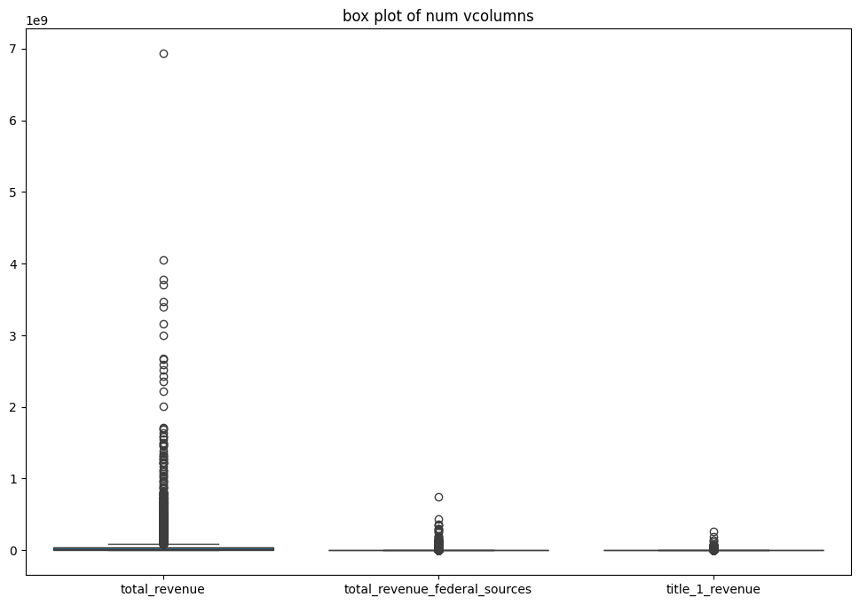

# Datasets Overview

## Public School Charachterstics Dataset:
The Public School Characteristics 2020-2021 dataset is provided by the National Center for Education Statistics. This dataset provides information on schools across the U.S and icnludes data on school identifiers, location details, enrollment information, grade leves, Title 1 funding status, and school types such as charter or magnent schools. This dataset also includes information surrounding student demopgraphics, and classifes schools based on their geographic location such as urban, suburban, town, or rual.


#### Link to Dataset:https://catalog.data.gov/dataset/public-school-characteristics-2020-21-6120a

## School Neighborhood Poverty Estimates, 2020-21 Dataset:

The 2020-2021 School Neighborhood Poverty Estimates are based on school locations from the 2020-2021 Common Core of Data (CCD) school file and income data from families with children ages 5 to 17 in the U.S. Census Bureau’s 2017-2021 American Community Survey (ACS) 5-year collection. The ACS is a continuous household survey that collects social, demographic, economic, and housing information from the population in the United States each month. The Census Bureau calculates the income-to-poverty ratio (IPR) based on money income reported for families relative to the poverty thresholds, which are determined based on the family size and structure. Noncash benefits (such as food stamps and housing subsidies) are excluded, as are capital gains and losses. The IPR is the percentage of family income that is above or below the federal poverty level. The IPR indicator ranges from 0 to a top-coded value of 999. A family with income at the poverty threshold has an IPR value of 100. The estimates in this file reflect the IPR for the neighborhoods around schools which may be different from the neighborhood conditions of students enrolled in schools.All information contained in this file is in the public domain. Data users are advised to review NCES program documentation and feature class metadata to understand the limitations and appropriate use of these data.


#### Link to Dataset: https://nces.ed.gov/programs/edge/docs/EDGE_SIDE_PUBSCH_FILEDOC.pdf

## Education's EDFacts initiative Dataset:

The dataset from ED Data Express includes comprehensive financial data from the U.S. Department of Education's EDFacts initiative, covering federal grant allocations, expenditures, and other financial metrics for public education. It spans multiple school years and includes data from all 50 states, the District of Columbia, and U.S. territories. The dataset is available for download and customization through the ED Data Express portal.


#### Link to Dataset: https://eddataexpress.ed.gov/download/data-builder/data-download-tool?f%5B0%5D=school_year%3A2022-2023&f%5B1%5D=state_name%3AALABAMA

# Research Topic:


Education funding and resource allocation may be influenced by disparities in student experiences across different school enviorments. This research explores how factors such as poverty levels, and racial demographics influence the level of which a district is supported and subsized by federal funds.

# Research Problem

Federal funding plays a significant role in addressing disparities in education, particularly for marginalized communities. This research aims to analyze how the allocation of federal funding, particularly Title I funding, correlates with socio-economic disparities, such as racial composition and poverty levels, in school districts. By focusing on the data available—such as Title I revenue, free and reduced-price lunch participation, and student demographics—this research will identify patterns–if any– in funding allocation and how these may relate to disparities across different communities.

This study is especially relevent in light of recent political and policy debates surrounding educational equity, school funding cuts, and the rollback of affirmative action programs.As public schools navigate this increase in economic pressures and the shifting of federal priorities,it isparamount to understand whether schools that serve Black and Hispanic communities are being equitably supported—or further marginalized.

# Reading My Data:


```python
import pandas as pd
import numpy as np
import matplotlib

import seaborn
import  plotly
import  scipy
import  statsmodels

#returns all the rows and columns for the dataframe

pd.set_option('display.max_rows', None)
pd.set_option('display.max_columns', None)

# Force pandas to display full numbers instead of scientific notation
# pd.options.display.float_format = '{:.0f}'.format

# Library to suppress warnings
import warnings
warnings.filterwarnings('ignore')
```


```python
file_path = "/Users/remi/Documents/Masters Fall 2024/Masters Spring 2025/Public Schooli Charachtertics/merg_data.csv"

df = pd.read_csv(file_path)  # Load CSV
```


```python
df.head()
```


<div>
<style scoped>
    .dataframe tbody tr th:only-of-type {
        vertical-align: middle;
    }

    .dataframe tbody tr th {
        vertical-align: top;
    }

    .dataframe thead th {
        text-align: right;
    }
</style>
<table border="1" class="dataframe">
  <thead>
    <tr style="text-align: right;">
      <th></th>
      <th>X_x</th>
      <th>Y_x</th>
      <th>OBJECTID_x</th>
      <th>NCESSCH</th>
      <th>NAME</th>
      <th>IPR_EST</th>
      <th>IPR_SE</th>
      <th>SCHOOLYEAR</th>
      <th>LAT</th>
      <th>LON</th>
      <th>X_y</th>
      <th>Y_y</th>
      <th>OBJECTID_y</th>
      <th>SURVYEAR</th>
      <th>STABR</th>
      <th>LEAID</th>
      <th>ST_LEAID</th>
      <th>LEA_NAME</th>
      <th>SCH_NAME</th>
      <th>LSTREET1</th>
      <th>LSTREET2</th>
      <th>LCITY</th>
      <th>LSTATE</th>
      <th>LZIP</th>
      <th>LZIP4</th>
      <th>PHONE</th>
      <th>CHARTER_TEXT</th>
      <th>MAGNET_TEXT</th>
      <th>VIRTUAL</th>
      <th>GSLO</th>
      <th>GSHI</th>
      <th>SCHOOL_LEVEL</th>
      <th>TITLEI</th>
      <th>STITLEI</th>
      <th>STATUS</th>
      <th>SCHOOL_TYPE_TEXT</th>
      <th>SY_STATUS_TEXT</th>
      <th>ULOCALE</th>
      <th>NMCNTY</th>
      <th>TOTFRL</th>
      <th>FRELCH</th>
      <th>REDLCH</th>
      <th>PK</th>
      <th>KG</th>
      <th>G01</th>
      <th>G02</th>
      <th>G03</th>
      <th>G04</th>
      <th>G05</th>
      <th>G06</th>
      <th>G07</th>
      <th>G08</th>
      <th>G09</th>
      <th>G10</th>
      <th>G11</th>
      <th>G12</th>
      <th>G13</th>
      <th>UG</th>
      <th>AE</th>
      <th>TOTMENROL</th>
      <th>TOTFENROL</th>
      <th>TOTAL</th>
      <th>MEMBER</th>
      <th>FTE</th>
      <th>STUTERATIO</th>
      <th>AMALM</th>
      <th>AMALF</th>
      <th>AM</th>
      <th>ASALM</th>
      <th>ASALF</th>
      <th>AS</th>
      <th>BLALM</th>
      <th>BLALF</th>
      <th>BL</th>
      <th>HPALM</th>
      <th>HPALF</th>
      <th>HP</th>
      <th>HIALM</th>
      <th>HIALF</th>
      <th>HI</th>
      <th>TRALM</th>
      <th>TRALF</th>
      <th>TR</th>
      <th>WHALM</th>
      <th>WHALF</th>
      <th>WH</th>
      <th>LATCOD</th>
      <th>LONCOD</th>
    </tr>
  </thead>
  <tbody>
    <tr>
      <th>0</th>
      <td>-86.206205</td>
      <td>34.260206</td>
      <td>1</td>
      <td>10000500870</td>
      <td>Albertville Middle School</td>
      <td>259</td>
      <td>87</td>
      <td>2020-2021</td>
      <td>34.2602</td>
      <td>-86.206200</td>
      <td>-86.206200</td>
      <td>34.2602</td>
      <td>1</td>
      <td>2020-2021</td>
      <td>AL</td>
      <td>100005</td>
      <td>AL-101</td>
      <td>Albertville City</td>
      <td>Albertville Middle School</td>
      <td>600 E Alabama Ave</td>
      <td>NaN</td>
      <td>Albertville</td>
      <td>AL</td>
      <td>35950</td>
      <td></td>
      <td>(256)878-2341</td>
      <td>No</td>
      <td>No</td>
      <td>Not Virtual</td>
      <td>07</td>
      <td>08</td>
      <td>Middle</td>
      <td>1-Yes</td>
      <td>1-Yes</td>
      <td>1</td>
      <td>Regular school</td>
      <td>Currently operational</td>
      <td>32-Town: Distant</td>
      <td>Marshall County</td>
      <td>332.0</td>
      <td>332.0</td>
      <td>0.0</td>
      <td>NaN</td>
      <td>NaN</td>
      <td>NaN</td>
      <td>NaN</td>
      <td>NaN</td>
      <td>NaN</td>
      <td>NaN</td>
      <td>NaN</td>
      <td>469.0</td>
      <td>439.0</td>
      <td>NaN</td>
      <td>NaN</td>
      <td>NaN</td>
      <td>NaN</td>
      <td>NaN</td>
      <td>NaN</td>
      <td>NaN</td>
      <td>NaN</td>
      <td>NaN</td>
      <td>908.0</td>
      <td>908.0</td>
      <td>42.0</td>
      <td>21.62</td>
      <td>1.0</td>
      <td>1.0</td>
      <td>2.0</td>
      <td>0.0</td>
      <td>4.0</td>
      <td>4.0</td>
      <td>18.0</td>
      <td>15.0</td>
      <td>33.0</td>
      <td>0.0</td>
      <td>0.0</td>
      <td>0.0</td>
      <td>239.0</td>
      <td>230.0</td>
      <td>469.0</td>
      <td>19.0</td>
      <td>10.0</td>
      <td>29.0</td>
      <td>187.0</td>
      <td>184.0</td>
      <td>371.0</td>
      <td>34.2602</td>
      <td>-86.206200</td>
    </tr>
    <tr>
      <th>1</th>
      <td>-86.204905</td>
      <td>34.262206</td>
      <td>2</td>
      <td>10000500871</td>
      <td>Albertville High School</td>
      <td>261</td>
      <td>92</td>
      <td>2020-2021</td>
      <td>34.2622</td>
      <td>-86.204900</td>
      <td>-86.204900</td>
      <td>34.2622</td>
      <td>2</td>
      <td>2020-2021</td>
      <td>AL</td>
      <td>100005</td>
      <td>AL-101</td>
      <td>Albertville City</td>
      <td>Albertville High School</td>
      <td>402 E McCord Ave</td>
      <td>NaN</td>
      <td>Albertville</td>
      <td>AL</td>
      <td>35950</td>
      <td>2322</td>
      <td>(256)894-5000</td>
      <td>No</td>
      <td>No</td>
      <td>Not Virtual</td>
      <td>09</td>
      <td>12</td>
      <td>High</td>
      <td>1-Yes</td>
      <td>1-Yes</td>
      <td>1</td>
      <td>Regular school</td>
      <td>Currently operational</td>
      <td>32-Town: Distant</td>
      <td>Marshall County</td>
      <td>456.0</td>
      <td>456.0</td>
      <td>0.0</td>
      <td>NaN</td>
      <td>NaN</td>
      <td>NaN</td>
      <td>NaN</td>
      <td>NaN</td>
      <td>NaN</td>
      <td>NaN</td>
      <td>NaN</td>
      <td>NaN</td>
      <td>NaN</td>
      <td>421.0</td>
      <td>427.0</td>
      <td>384.0</td>
      <td>374.0</td>
      <td>NaN</td>
      <td>NaN</td>
      <td>NaN</td>
      <td>NaN</td>
      <td>NaN</td>
      <td>1606.0</td>
      <td>1606.0</td>
      <td>82.0</td>
      <td>19.59</td>
      <td>1.0</td>
      <td>0.0</td>
      <td>1.0</td>
      <td>4.0</td>
      <td>2.0</td>
      <td>6.0</td>
      <td>33.0</td>
      <td>37.0</td>
      <td>70.0</td>
      <td>0.0</td>
      <td>0.0</td>
      <td>0.0</td>
      <td>414.0</td>
      <td>371.0</td>
      <td>785.0</td>
      <td>17.0</td>
      <td>21.0</td>
      <td>38.0</td>
      <td>368.0</td>
      <td>338.0</td>
      <td>706.0</td>
      <td>34.2622</td>
      <td>-86.204900</td>
    </tr>
    <tr>
      <th>2</th>
      <td>-86.220105</td>
      <td>34.273306</td>
      <td>3</td>
      <td>10000500879</td>
      <td>Albertville Intermediate School</td>
      <td>139</td>
      <td>61</td>
      <td>2020-2021</td>
      <td>34.2733</td>
      <td>-86.220100</td>
      <td>-86.220100</td>
      <td>34.2733</td>
      <td>3</td>
      <td>2020-2021</td>
      <td>AL</td>
      <td>100005</td>
      <td>AL-101</td>
      <td>Albertville City</td>
      <td>Albertville Intermediate School</td>
      <td>901 W McKinney Ave</td>
      <td>NaN</td>
      <td>Albertville</td>
      <td>AL</td>
      <td>35950</td>
      <td>1300</td>
      <td>(256)878-7698</td>
      <td>No</td>
      <td>No</td>
      <td>Not Virtual</td>
      <td>05</td>
      <td>06</td>
      <td>Middle</td>
      <td>1-Yes</td>
      <td>1-Yes</td>
      <td>1</td>
      <td>Regular school</td>
      <td>Currently operational</td>
      <td>32-Town: Distant</td>
      <td>Marshall County</td>
      <td>330.0</td>
      <td>330.0</td>
      <td>0.0</td>
      <td>NaN</td>
      <td>NaN</td>
      <td>NaN</td>
      <td>NaN</td>
      <td>NaN</td>
      <td>NaN</td>
      <td>439.0</td>
      <td>452.0</td>
      <td>NaN</td>
      <td>NaN</td>
      <td>NaN</td>
      <td>NaN</td>
      <td>NaN</td>
      <td>NaN</td>
      <td>NaN</td>
      <td>NaN</td>
      <td>NaN</td>
      <td>NaN</td>
      <td>NaN</td>
      <td>891.0</td>
      <td>891.0</td>
      <td>41.0</td>
      <td>21.73</td>
      <td>3.0</td>
      <td>1.0</td>
      <td>4.0</td>
      <td>4.0</td>
      <td>3.0</td>
      <td>7.0</td>
      <td>12.0</td>
      <td>12.0</td>
      <td>24.0</td>
      <td>0.0</td>
      <td>1.0</td>
      <td>1.0</td>
      <td>228.0</td>
      <td>253.0</td>
      <td>481.0</td>
      <td>17.0</td>
      <td>12.0</td>
      <td>29.0</td>
      <td>177.0</td>
      <td>168.0</td>
      <td>345.0</td>
      <td>34.2733</td>
      <td>-86.220100</td>
    </tr>
    <tr>
      <th>3</th>
      <td>-86.221811</td>
      <td>34.252706</td>
      <td>4</td>
      <td>10000500889</td>
      <td>Albertville Elementary School</td>
      <td>227</td>
      <td>110</td>
      <td>2020-2021</td>
      <td>34.2527</td>
      <td>-86.221806</td>
      <td>-86.221806</td>
      <td>34.2527</td>
      <td>4</td>
      <td>2020-2021</td>
      <td>AL</td>
      <td>100005</td>
      <td>AL-101</td>
      <td>Albertville City</td>
      <td>Albertville Elementary School</td>
      <td>145 West End Drive</td>
      <td>NaN</td>
      <td>Albertville</td>
      <td>AL</td>
      <td>35950</td>
      <td></td>
      <td>(256)894-4822</td>
      <td>No</td>
      <td>No</td>
      <td>Not Virtual</td>
      <td>03</td>
      <td>04</td>
      <td>Elementary</td>
      <td>1-Yes</td>
      <td>1-Yes</td>
      <td>1</td>
      <td>Regular school</td>
      <td>Currently operational</td>
      <td>32-Town: Distant</td>
      <td>Marshall County</td>
      <td>397.0</td>
      <td>397.0</td>
      <td>0.0</td>
      <td>NaN</td>
      <td>NaN</td>
      <td>NaN</td>
      <td>NaN</td>
      <td>435.0</td>
      <td>473.0</td>
      <td>NaN</td>
      <td>NaN</td>
      <td>NaN</td>
      <td>NaN</td>
      <td>NaN</td>
      <td>NaN</td>
      <td>NaN</td>
      <td>NaN</td>
      <td>NaN</td>
      <td>NaN</td>
      <td>NaN</td>
      <td>NaN</td>
      <td>NaN</td>
      <td>908.0</td>
      <td>908.0</td>
      <td>49.0</td>
      <td>18.53</td>
      <td>2.0</td>
      <td>2.0</td>
      <td>4.0</td>
      <td>4.0</td>
      <td>0.0</td>
      <td>4.0</td>
      <td>22.0</td>
      <td>26.0</td>
      <td>48.0</td>
      <td>0.0</td>
      <td>0.0</td>
      <td>0.0</td>
      <td>260.0</td>
      <td>237.0</td>
      <td>497.0</td>
      <td>7.0</td>
      <td>8.0</td>
      <td>15.0</td>
      <td>180.0</td>
      <td>160.0</td>
      <td>340.0</td>
      <td>34.2527</td>
      <td>-86.221806</td>
    </tr>
    <tr>
      <th>4</th>
      <td>-86.193305</td>
      <td>34.289806</td>
      <td>5</td>
      <td>10000501616</td>
      <td>Albertville Kindergarten and PreK</td>
      <td>373</td>
      <td>124</td>
      <td>2020-2021</td>
      <td>34.2898</td>
      <td>-86.193300</td>
      <td>-86.193300</td>
      <td>34.2898</td>
      <td>5</td>
      <td>2020-2021</td>
      <td>AL</td>
      <td>100005</td>
      <td>AL-101</td>
      <td>Albertville City</td>
      <td>Albertville Kindergarten and PreK</td>
      <td>257 Country Club Rd</td>
      <td>NaN</td>
      <td>Albertville</td>
      <td>AL</td>
      <td>35951</td>
      <td>3927</td>
      <td>(256)878-7922</td>
      <td>No</td>
      <td>No</td>
      <td>Not Virtual</td>
      <td>PK</td>
      <td>KG</td>
      <td>Elementary</td>
      <td>1-Yes</td>
      <td>1-Yes</td>
      <td>1</td>
      <td>Regular school</td>
      <td>Currently operational</td>
      <td>32-Town: Distant</td>
      <td>Marshall County</td>
      <td>181.0</td>
      <td>181.0</td>
      <td>0.0</td>
      <td>113.0</td>
      <td>443.0</td>
      <td>NaN</td>
      <td>NaN</td>
      <td>NaN</td>
      <td>NaN</td>
      <td>NaN</td>
      <td>NaN</td>
      <td>NaN</td>
      <td>NaN</td>
      <td>NaN</td>
      <td>NaN</td>
      <td>NaN</td>
      <td>NaN</td>
      <td>NaN</td>
      <td>NaN</td>
      <td>NaN</td>
      <td>NaN</td>
      <td>NaN</td>
      <td>556.0</td>
      <td>556.0</td>
      <td>30.0</td>
      <td>18.53</td>
      <td>3.0</td>
      <td>1.0</td>
      <td>4.0</td>
      <td>2.0</td>
      <td>0.0</td>
      <td>2.0</td>
      <td>16.0</td>
      <td>17.0</td>
      <td>33.0</td>
      <td>0.0</td>
      <td>0.0</td>
      <td>0.0</td>
      <td>151.0</td>
      <td>137.0</td>
      <td>288.0</td>
      <td>6.0</td>
      <td>7.0</td>
      <td>13.0</td>
      <td>108.0</td>
      <td>108.0</td>
      <td>216.0</td>
      <td>34.2898</td>
      <td>-86.193300</td>
    </tr>
  </tbody>
</table>
</div>


```python
df.tail()
```


<div>
<style scoped>
    .dataframe tbody tr th:only-of-type {
        vertical-align: middle;
    }

    .dataframe tbody tr th {
        vertical-align: top;
    }

    .dataframe thead th {
        text-align: right;
    }
</style>
<table border="1" class="dataframe">
  <thead>
    <tr style="text-align: right;">
      <th></th>
      <th>X_x</th>
      <th>Y_x</th>
      <th>OBJECTID_x</th>
      <th>NCESSCH</th>
      <th>NAME</th>
      <th>IPR_EST</th>
      <th>IPR_SE</th>
      <th>SCHOOLYEAR</th>
      <th>LAT</th>
      <th>LON</th>
      <th>X_y</th>
      <th>Y_y</th>
      <th>OBJECTID_y</th>
      <th>SURVYEAR</th>
      <th>STABR</th>
      <th>LEAID</th>
      <th>ST_LEAID</th>
      <th>LEA_NAME</th>
      <th>SCH_NAME</th>
      <th>LSTREET1</th>
      <th>LSTREET2</th>
      <th>LCITY</th>
      <th>LSTATE</th>
      <th>LZIP</th>
      <th>LZIP4</th>
      <th>PHONE</th>
      <th>CHARTER_TEXT</th>
      <th>MAGNET_TEXT</th>
      <th>VIRTUAL</th>
      <th>GSLO</th>
      <th>GSHI</th>
      <th>SCHOOL_LEVEL</th>
      <th>TITLEI</th>
      <th>STITLEI</th>
      <th>STATUS</th>
      <th>SCHOOL_TYPE_TEXT</th>
      <th>SY_STATUS_TEXT</th>
      <th>ULOCALE</th>
      <th>NMCNTY</th>
      <th>TOTFRL</th>
      <th>FRELCH</th>
      <th>REDLCH</th>
      <th>PK</th>
      <th>KG</th>
      <th>G01</th>
      <th>G02</th>
      <th>G03</th>
      <th>G04</th>
      <th>G05</th>
      <th>G06</th>
      <th>G07</th>
      <th>G08</th>
      <th>G09</th>
      <th>G10</th>
      <th>G11</th>
      <th>G12</th>
      <th>G13</th>
      <th>UG</th>
      <th>AE</th>
      <th>TOTMENROL</th>
      <th>TOTFENROL</th>
      <th>TOTAL</th>
      <th>MEMBER</th>
      <th>FTE</th>
      <th>STUTERATIO</th>
      <th>AMALM</th>
      <th>AMALF</th>
      <th>AM</th>
      <th>ASALM</th>
      <th>ASALF</th>
      <th>AS</th>
      <th>BLALM</th>
      <th>BLALF</th>
      <th>BL</th>
      <th>HPALM</th>
      <th>HPALF</th>
      <th>HP</th>
      <th>HIALM</th>
      <th>HIALF</th>
      <th>HI</th>
      <th>TRALM</th>
      <th>TRALF</th>
      <th>TR</th>
      <th>WHALM</th>
      <th>WHALF</th>
      <th>WH</th>
      <th>LATCOD</th>
      <th>LONCOD</th>
    </tr>
  </thead>
  <tbody>
    <tr>
      <th>99737</th>
      <td>-158.091096</td>
      <td>21.318520</td>
      <td>100678</td>
      <td>150003000302</td>
      <td>Kapolei Charter School by Goodwill Hawaii</td>
      <td>402</td>
      <td>76</td>
      <td>2020-2021</td>
      <td>21.318517</td>
      <td>-158.091082</td>
      <td>-158.09108</td>
      <td>21.318517</td>
      <td>26220</td>
      <td>2020-2021</td>
      <td>HI</td>
      <td>1500030</td>
      <td>HI-001</td>
      <td>Hawaii Department of Education</td>
      <td>Kapolei Charter School by Goodwill Hawaii</td>
      <td>2140 Lauwiliwili St</td>
      <td>NaN</td>
      <td>Kapolei</td>
      <td>HI</td>
      <td>96706</td>
      <td></td>
      <td>(808)690-9909</td>
      <td>Yes</td>
      <td>N</td>
      <td>Not Virtual</td>
      <td>09</td>
      <td>12</td>
      <td>High</td>
      <td>2-No</td>
      <td>N</td>
      <td>1</td>
      <td>Regular school</td>
      <td>Currently operational</td>
      <td>41-Rural: Fringe</td>
      <td>Honolulu County</td>
      <td>39.0</td>
      <td>39.0</td>
      <td>0.0</td>
      <td>NaN</td>
      <td>NaN</td>
      <td>NaN</td>
      <td>NaN</td>
      <td>NaN</td>
      <td>NaN</td>
      <td>NaN</td>
      <td>NaN</td>
      <td>NaN</td>
      <td>NaN</td>
      <td>48.0</td>
      <td>44.0</td>
      <td>43.0</td>
      <td>37.0</td>
      <td>NaN</td>
      <td>NaN</td>
      <td>NaN</td>
      <td>NaN</td>
      <td>NaN</td>
      <td>172.0</td>
      <td>172.0</td>
      <td>10.0</td>
      <td>17.20</td>
      <td>NaN</td>
      <td>1.0</td>
      <td>1.0</td>
      <td>8.0</td>
      <td>3.0</td>
      <td>11.0</td>
      <td>1.0</td>
      <td>NaN</td>
      <td>1.0</td>
      <td>57.0</td>
      <td>54.0</td>
      <td>111.0</td>
      <td>13.0</td>
      <td>11.0</td>
      <td>24.0</td>
      <td>4.0</td>
      <td>7.0</td>
      <td>11.0</td>
      <td>7.0</td>
      <td>6.0</td>
      <td>13.0</td>
      <td>21.318517</td>
      <td>-158.091082</td>
    </tr>
    <tr>
      <th>99738</th>
      <td>-158.015575</td>
      <td>21.501793</td>
      <td>100679</td>
      <td>150003000303</td>
      <td>Kamalani Academy</td>
      <td>327</td>
      <td>86</td>
      <td>2020-2021</td>
      <td>21.501790</td>
      <td>-158.015561</td>
      <td>-158.01556</td>
      <td>21.501790</td>
      <td>26221</td>
      <td>2020-2021</td>
      <td>HI</td>
      <td>1500030</td>
      <td>HI-001</td>
      <td>Hawaii Department of Education</td>
      <td>Kamalani Academy</td>
      <td>1403 California Ave</td>
      <td>NaN</td>
      <td>Wahiawa</td>
      <td>HI</td>
      <td>96786</td>
      <td></td>
      <td>(808)203-2992</td>
      <td>Yes</td>
      <td>N</td>
      <td>Not Virtual</td>
      <td>PK</td>
      <td>08</td>
      <td>Elementary</td>
      <td>1-Yes</td>
      <td>1-Yes</td>
      <td>1</td>
      <td>Regular school</td>
      <td>Currently operational</td>
      <td>21-Suburb: Large</td>
      <td>Honolulu County</td>
      <td>NaN</td>
      <td>NaN</td>
      <td>NaN</td>
      <td>0.0</td>
      <td>15.0</td>
      <td>29.0</td>
      <td>21.0</td>
      <td>20.0</td>
      <td>17.0</td>
      <td>21.0</td>
      <td>10.0</td>
      <td>20.0</td>
      <td>25.0</td>
      <td>NaN</td>
      <td>NaN</td>
      <td>NaN</td>
      <td>NaN</td>
      <td>NaN</td>
      <td>NaN</td>
      <td>NaN</td>
      <td>NaN</td>
      <td>NaN</td>
      <td>178.0</td>
      <td>178.0</td>
      <td>11.0</td>
      <td>16.18</td>
      <td>0.0</td>
      <td>0.0</td>
      <td>0.0</td>
      <td>10.0</td>
      <td>3.0</td>
      <td>13.0</td>
      <td>3.0</td>
      <td>3.0</td>
      <td>6.0</td>
      <td>21.0</td>
      <td>17.0</td>
      <td>38.0</td>
      <td>25.0</td>
      <td>23.0</td>
      <td>48.0</td>
      <td>19.0</td>
      <td>22.0</td>
      <td>41.0</td>
      <td>17.0</td>
      <td>15.0</td>
      <td>32.0</td>
      <td>21.501790</td>
      <td>-158.015561</td>
    </tr>
    <tr>
      <th>99739</th>
      <td>-159.478274</td>
      <td>21.962166</td>
      <td>100680</td>
      <td>150003000304</td>
      <td>Alaka'i O Kaua'i Charter School</td>
      <td>339</td>
      <td>105</td>
      <td>2020-2021</td>
      <td>21.962163</td>
      <td>-159.478260</td>
      <td>-159.47826</td>
      <td>21.962163</td>
      <td>26222</td>
      <td>2020-2021</td>
      <td>HI</td>
      <td>1500030</td>
      <td>HI-001</td>
      <td>Hawaii Department of Education</td>
      <td>Alaka'i O Kaua'i Charter School</td>
      <td>2-4035 Kaumualii Hwy</td>
      <td>NaN</td>
      <td>Koloa</td>
      <td>HI</td>
      <td>96756</td>
      <td></td>
      <td>(808)635-5110</td>
      <td>Yes</td>
      <td>N</td>
      <td>Not Virtual</td>
      <td>KG</td>
      <td>06</td>
      <td>Elementary</td>
      <td>2-No</td>
      <td>N</td>
      <td>1</td>
      <td>Regular school</td>
      <td>Currently operational</td>
      <td>41-Rural: Fringe</td>
      <td>Kauai County</td>
      <td>61.0</td>
      <td>50.0</td>
      <td>11.0</td>
      <td>NaN</td>
      <td>22.0</td>
      <td>28.0</td>
      <td>28.0</td>
      <td>17.0</td>
      <td>27.0</td>
      <td>25.0</td>
      <td>17.0</td>
      <td>NaN</td>
      <td>NaN</td>
      <td>NaN</td>
      <td>NaN</td>
      <td>NaN</td>
      <td>NaN</td>
      <td>NaN</td>
      <td>NaN</td>
      <td>NaN</td>
      <td>NaN</td>
      <td>NaN</td>
      <td>164.0</td>
      <td>164.0</td>
      <td>8.0</td>
      <td>20.50</td>
      <td>NaN</td>
      <td>NaN</td>
      <td>NaN</td>
      <td>1.0</td>
      <td>2.0</td>
      <td>3.0</td>
      <td>NaN</td>
      <td>NaN</td>
      <td>NaN</td>
      <td>9.0</td>
      <td>5.0</td>
      <td>14.0</td>
      <td>12.0</td>
      <td>9.0</td>
      <td>21.0</td>
      <td>19.0</td>
      <td>26.0</td>
      <td>45.0</td>
      <td>43.0</td>
      <td>38.0</td>
      <td>81.0</td>
      <td>21.962163</td>
      <td>-159.478260</td>
    </tr>
    <tr>
      <th>99740</th>
      <td>-158.020298</td>
      <td>21.326886</td>
      <td>100681</td>
      <td>150003000305</td>
      <td>DreamHouse Ewa Beach</td>
      <td>438</td>
      <td>40</td>
      <td>2020-2021</td>
      <td>21.326883</td>
      <td>-158.020284</td>
      <td>-158.02028</td>
      <td>21.326883</td>
      <td>26223</td>
      <td>2020-2021</td>
      <td>HI</td>
      <td>1500030</td>
      <td>HI-001</td>
      <td>Hawaii Department of Education</td>
      <td>DreamHouse Ewa Beach</td>
      <td>Laulani Village Shopping Center</td>
      <td>91-1121 Keaunui Dr</td>
      <td>Ewa Beach</td>
      <td>HI</td>
      <td>96706</td>
      <td></td>
      <td>(808)437-7771</td>
      <td>Yes</td>
      <td>N</td>
      <td>Not Virtual</td>
      <td>06</td>
      <td>07</td>
      <td>Middle</td>
      <td>2-No</td>
      <td>N</td>
      <td>1</td>
      <td>Regular school</td>
      <td>Currently operational</td>
      <td>21-Suburb: Large</td>
      <td>Honolulu County</td>
      <td>39.0</td>
      <td>39.0</td>
      <td>0.0</td>
      <td>NaN</td>
      <td>NaN</td>
      <td>NaN</td>
      <td>NaN</td>
      <td>NaN</td>
      <td>NaN</td>
      <td>NaN</td>
      <td>93.0</td>
      <td>99.0</td>
      <td>NaN</td>
      <td>NaN</td>
      <td>NaN</td>
      <td>NaN</td>
      <td>NaN</td>
      <td>NaN</td>
      <td>NaN</td>
      <td>NaN</td>
      <td>NaN</td>
      <td>NaN</td>
      <td>192.0</td>
      <td>192.0</td>
      <td>21.5</td>
      <td>8.93</td>
      <td>NaN</td>
      <td>NaN</td>
      <td>NaN</td>
      <td>16.0</td>
      <td>11.0</td>
      <td>27.0</td>
      <td>NaN</td>
      <td>1.0</td>
      <td>1.0</td>
      <td>26.0</td>
      <td>29.0</td>
      <td>55.0</td>
      <td>23.0</td>
      <td>31.0</td>
      <td>54.0</td>
      <td>21.0</td>
      <td>17.0</td>
      <td>38.0</td>
      <td>9.0</td>
      <td>8.0</td>
      <td>17.0</td>
      <td>21.326883</td>
      <td>-158.020284</td>
    </tr>
    <tr>
      <th>99741</th>
      <td>-158.048007</td>
      <td>21.344637</td>
      <td>100682</td>
      <td>150003000306</td>
      <td>Honouliuli Middle School</td>
      <td>354</td>
      <td>55</td>
      <td>2020-2021</td>
      <td>21.344634</td>
      <td>-158.047993</td>
      <td>-158.04799</td>
      <td>21.344634</td>
      <td>26224</td>
      <td>2020-2021</td>
      <td>HI</td>
      <td>1500030</td>
      <td>HI-001</td>
      <td>Hawaii Department of Education</td>
      <td>Honouliuli Middle School</td>
      <td>91-559 Maunakapu St</td>
      <td>NaN</td>
      <td>Ewa Beach</td>
      <td>HI</td>
      <td>96706</td>
      <td></td>
      <td>(808)307-7800</td>
      <td>No</td>
      <td>N</td>
      <td>Not Virtual</td>
      <td>06</td>
      <td>06</td>
      <td>Middle</td>
      <td>2-No</td>
      <td>N</td>
      <td>3</td>
      <td>Regular school</td>
      <td>New school</td>
      <td>41-Rural: Fringe</td>
      <td>Honolulu County</td>
      <td>80.0</td>
      <td>65.0</td>
      <td>15.0</td>
      <td>NaN</td>
      <td>NaN</td>
      <td>NaN</td>
      <td>NaN</td>
      <td>NaN</td>
      <td>NaN</td>
      <td>NaN</td>
      <td>184.0</td>
      <td>NaN</td>
      <td>NaN</td>
      <td>NaN</td>
      <td>NaN</td>
      <td>NaN</td>
      <td>NaN</td>
      <td>NaN</td>
      <td>NaN</td>
      <td>NaN</td>
      <td>NaN</td>
      <td>NaN</td>
      <td>184.0</td>
      <td>184.0</td>
      <td>14.0</td>
      <td>13.14</td>
      <td>NaN</td>
      <td>NaN</td>
      <td>NaN</td>
      <td>13.0</td>
      <td>14.0</td>
      <td>27.0</td>
      <td>1.0</td>
      <td>3.0</td>
      <td>4.0</td>
      <td>23.0</td>
      <td>25.0</td>
      <td>48.0</td>
      <td>28.0</td>
      <td>19.0</td>
      <td>47.0</td>
      <td>17.0</td>
      <td>20.0</td>
      <td>37.0</td>
      <td>11.0</td>
      <td>10.0</td>
      <td>21.0</td>
      <td>21.344634</td>
      <td>-158.047993</td>
    </tr>
  </tbody>
</table>
</div>


### Aggregating my data based off of the district in order to merge it with the fiscal data


```python
# Load the dataset
file_path = "/Users/remi/Documents/Masters Fall 2024/Masters Spring 2025/Public School Charachtertics/merg_data.csv"
df = pd.read_csv(file_path) 

# Standardize the TITLEI values (Yes/No) if needed
def standardize_titlei(x):
    if isinstance(x, str) and ('yes' in x.lower()):
        return 'Yes'
    elif isinstance(x, str) and ('no' in x.lower()):
        return 'No'
    return x

# Apply the function to standardize the TITLEI column
df['TITLEI_standardized'] = df['TITLEI'].apply(standardize_titlei)

# Aggregating data by district (LEAID) and getting only the inforamtion I need
pub_char = df.groupby('LEAID').agg(
    total_poverty_estimate=('IPR_EST', 'mean'),
    school_count=('NAME', 'count'),
    total_title_1_yes=('TITLEI_standardized', lambda x: (x == 'Yes').sum()),
    total_title_1_no=('TITLEI_standardized', lambda x: (x == 'No').sum()),
    total_students_frl=('TOTFRL', 'sum'),
).reset_index()

# Display the head of the aggregated data
pub_char.head()

```


<div>
<style scoped>
    .dataframe tbody tr th:only-of-type {
        vertical-align: middle;
    }

    .dataframe tbody tr th {
        vertical-align: top;
    }

    .dataframe thead th {
        text-align: right;
    }
</style>
<table border="1" class="dataframe">
  <thead>
    <tr style="text-align: right;">
      <th></th>
      <th>LEAID</th>
      <th>total_poverty_estimate</th>
      <th>school_count</th>
      <th>total_title_1_yes</th>
      <th>total_title_1_no</th>
      <th>total_students_frl</th>
    </tr>
  </thead>
  <tbody>
    <tr>
      <th>0</th>
      <td>100005</td>
      <td>247.166667</td>
      <td>6</td>
      <td>6</td>
      <td>0</td>
      <td>2118.0</td>
    </tr>
    <tr>
      <th>1</th>
      <td>100006</td>
      <td>253.333333</td>
      <td>15</td>
      <td>12</td>
      <td>3</td>
      <td>2888.0</td>
    </tr>
    <tr>
      <th>2</th>
      <td>100007</td>
      <td>481.888889</td>
      <td>18</td>
      <td>6</td>
      <td>12</td>
      <td>3277.0</td>
    </tr>
    <tr>
      <th>3</th>
      <td>100008</td>
      <td>457.181818</td>
      <td>11</td>
      <td>4</td>
      <td>7</td>
      <td>1270.0</td>
    </tr>
    <tr>
      <th>4</th>
      <td>100009</td>
      <td>175.800000</td>
      <td>5</td>
      <td>0</td>
      <td>5</td>
      <td>0.0</td>
    </tr>
  </tbody>
</table>
</div>


### Adding the fiscal data 


```python

fiscal_data_path = "/Users/remi/Documents/Masters Fall 2024/Masters Spring 2025/Public School Charachtertics/2020-2021_Fiscal_Data.csv"
# Read the file, specifying encoding and replacing problematic characters
fiscal_data = pd.read_csv(fiscal_data_path, encoding='ISO-8859-1', on_bad_lines='skip')

# Replace the '†' symbol with an empty string
fiscal_data = fiscal_data.replace('†', '', regex=True)
```


```python
fiscal_data.head()
```


<div>
<style scoped>
    .dataframe tbody tr th:only-of-type {
        vertical-align: middle;
    }

    .dataframe tbody tr th {
        vertical-align: top;
    }

    .dataframe thead th {
        text-align: right;
    }
</style>
<table border="1" class="dataframe">
  <thead>
    <tr style="text-align: right;">
      <th></th>
      <th>Agency Name</th>
      <th>State Name [District] Latest available year</th>
      <th>Fall Membership (V33) [District Finance] 2019-20</th>
      <th>Total Revenue (TOTALREV) [District Finance] 2019-20</th>
      <th>Total Revenue - Local Sources (TLOCREV) [District Finance] 2019-20</th>
      <th>Total Revenue - State Sources (TSTREV) [District Finance] 2019-20</th>
      <th>Total Revenue - Federal Sources (TFEDREV) [District Finance] 2019-20</th>
      <th>Total Current Expenditures - El-Sec Education (TCURELSC) [District Finance] 2019-20</th>
      <th>Total Expenditures (TOTALEXP) [District Finance] 2019-20</th>
      <th>Total Revenue (TOTALREV) per Pupil (V33) [District Finance] 2019-20</th>
      <th>Total Revenue - Local Sources (TLOCREV) per Pupil (V33) [District Finance] 2019-20</th>
      <th>Total Revenue - State Sources (TSTREV) per Pupil (V33) [District Finance] 2019-20</th>
      <th>Total Revenue - Federal Sources (TFEDREV) per Pupil (V33) [District Finance] 2019-20</th>
      <th>Agency ID - NCES Assigned [District] Latest available year</th>
      <th>Long Term Debt - Outstanding Beginning of FY (_19H) [District Finance] 2019-20</th>
      <th>CSA ID [District] 2019-20</th>
      <th>Total Students, All Grades (Excludes AE) [District] 2019-20</th>
      <th>American Indian/Alaska Native Students [District] 2019-20</th>
      <th>Asian or Asian/Pacific Islander Students [District] 2019-20</th>
      <th>Hispanic Students [District] 2019-20</th>
      <th>Black or African American Students [District] 2019-20</th>
      <th>White Students [District] 2019-20</th>
      <th>Nat. Hawaiian or Other Pacific Isl. Students [District] 2019-20</th>
      <th>Two or More Races Students [District] 2019-20</th>
      <th>Total Race/Ethnicity [District] 2019-20</th>
      <th>Full-Time Equivalent (FTE) Teachers [District] 2019-20</th>
      <th>Pupil/Teacher Ratio [District] 2019-20</th>
      <th>Total Staff [District] 2019-20</th>
      <th>Total Current Expenditures - Salary (Z32) [District Finance] 2019-20</th>
      <th>Total Current Expenditures - Salary (Z32) per Pupil (V33) [District Finance] 2019-20</th>
      <th>Total Current Expenditures - Instruction (TCURINST) per Pupil (V33) [District Finance] 2019-20</th>
      <th>Total Current Expenditures - Benefits (Z34) per Pupil (V33) [District Finance] 2019-20</th>
      <th>Long Term Debt - Issued During FY (_21F) [District Finance] 2019-20</th>
      <th>Federal Rev. - Federal Title I Revenue (C14) [District Finance] 2019-20</th>
      <th>Instruction Expenditures - Total (E13) [District Finance] 2019-20</th>
      <th>Salary - Instruction Expenditures (Z33) [District Finance] 2019-20</th>
    </tr>
  </thead>
  <tbody>
    <tr>
      <th>0</th>
      <td>21ST CENTURY CHARTER SCH OF GARY</td>
      <td>Indiana</td>
      <td>1190</td>
      <td>15027000</td>
      <td>215000</td>
      <td>10768000</td>
      <td>4044000</td>
      <td>11961000</td>
      <td>13306000</td>
      <td>12628</td>
      <td>181</td>
      <td>9049</td>
      <td>3398</td>
      <td>1800046.0</td>
      <td>13160000</td>
      <td>294</td>
      <td>1190</td>
      <td>1</td>
      <td>0</td>
      <td>42</td>
      <td>1117</td>
      <td>2</td>
      <td>0</td>
      <td>28</td>
      <td>1190</td>
      <td>47.01</td>
      <td>25.31</td>
      <td>149.51</td>
      <td>5598000</td>
      <td>4704</td>
      <td>4977</td>
      <td>1156</td>
      <td>0</td>
      <td>1562000</td>
      <td>5923000</td>
      <td>4120000</td>
    </tr>
    <tr>
      <th>1</th>
      <td>21ST CENTURY CYBER CS</td>
      <td>Pennsylvania</td>
      <td>1270</td>
      <td>20790000</td>
      <td>20566000</td>
      <td>56000</td>
      <td>168000</td>
      <td>18551000</td>
      <td>21385000</td>
      <td>16370</td>
      <td>16194</td>
      <td>44</td>
      <td>132</td>
      <td>4200091.0</td>
      <td>3230000</td>
      <td>428</td>
      <td>1270</td>
      <td>4</td>
      <td>17</td>
      <td>103</td>
      <td>135</td>
      <td>920</td>
      <td>0</td>
      <td>91</td>
      <td>1270</td>
      <td>64.99</td>
      <td>19.54</td>
      <td>131</td>
      <td>8670000</td>
      <td>6827</td>
      <td>7552</td>
      <td>3928</td>
      <td>816000</td>
      <td>0</td>
      <td>9591000</td>
      <td>4907000</td>
    </tr>
    <tr>
      <th>2</th>
      <td>21ST CENTURY PUBLIC ACADEMY</td>
      <td>NEW MEXICO</td>
      <td></td>
      <td></td>
      <td></td>
      <td></td>
      <td></td>
      <td></td>
      <td></td>
      <td></td>
      <td></td>
      <td></td>
      <td></td>
      <td>3500187.0</td>
      <td></td>
      <td></td>
      <td></td>
      <td></td>
      <td></td>
      <td></td>
      <td></td>
      <td></td>
      <td></td>
      <td></td>
      <td></td>
      <td></td>
      <td></td>
      <td></td>
      <td></td>
      <td></td>
      <td></td>
      <td></td>
      <td></td>
      <td></td>
      <td></td>
      <td></td>
    </tr>
    <tr>
      <th>3</th>
      <td>A CENTER FOR CREATIVE EDUCATION (79457)</td>
      <td>Arizona</td>
      <td>67</td>
      <td>591000</td>
      <td>38000</td>
      <td>548000</td>
      <td>5000</td>
      <td>617000</td>
      <td>617000</td>
      <td>8821</td>
      <td>567</td>
      <td>8179</td>
      <td>75</td>
      <td>400328.0</td>
      <td>0</td>
      <td></td>
      <td>67</td>
      <td>1</td>
      <td>0</td>
      <td>20</td>
      <td>2</td>
      <td>40</td>
      <td>0</td>
      <td>4</td>
      <td>67</td>
      <td>0</td>
      <td></td>
      <td>Ð</td>
      <td>359000</td>
      <td>5358</td>
      <td>4881</td>
      <td>463</td>
      <td>0</td>
      <td>0</td>
      <td>327000</td>
      <td>284000</td>
    </tr>
    <tr>
      <th>4</th>
      <td>A E R O  SPEC EDUC COOP</td>
      <td>Illinois</td>
      <td>Ð</td>
      <td>35655000</td>
      <td>23202000</td>
      <td>6562000</td>
      <td>5891000</td>
      <td>28913000</td>
      <td>32806000</td>
      <td>Ð</td>
      <td>Ð</td>
      <td>Ð</td>
      <td>Ð</td>
      <td>1700024.0</td>
      <td>0</td>
      <td>176</td>
      <td>213</td>
      <td>0</td>
      <td>0</td>
      <td>64</td>
      <td>35</td>
      <td>109</td>
      <td>0</td>
      <td>5</td>
      <td>213</td>
      <td>69.1</td>
      <td>3.08</td>
      <td>197.71</td>
      <td>15358000</td>
      <td>Ð</td>
      <td>Ð</td>
      <td>Ð</td>
      <td>0</td>
      <td>0</td>
      <td>14478000</td>
      <td>8555000</td>
    </tr>
  </tbody>
</table>
</div>


```python
#renaming the fiscal data bc the headers are way too long
fiscal_data_renamed = {
    'Agency Name': 'agency_name',
    'State Name [District] Latest available year': 'state_name',
    'Fall Membership (V33) [District Finance] 2019-20': 'fall_membership',
    'Total Revenue (TOTALREV) [District Finance] 2019-20': 'total_revenue',
    'Total Revenue - Local Sources (TLOCREV) [District Finance] 2019-20': 'total_revenue_local_sources',
    'Total Revenue - State Sources (TSTREV) [District Finance] 2019-20': 'total_revenue_state_sources',
    'Total Revenue - Federal Sources (TFEDREV) [District Finance] 2019-20': 'total_revenue_federal_sources',
    'Total Current Expenditures - El-Sec Education (TCURELSC) [District Finance] 2019-20': 'total_expenditures_el_sec_education',
    'Total Expenditures (TOTALEXP) [District Finance] 2019-20': 'total_expenditures',
    'Total Revenue (TOTALREV) per Pupil (V33) [District Finance] 2019-20': 'total_revenue_per_pupil',
    'Total Revenue - Local Sources (TLOCREV) per Pupil (V33) [District Finance] 2019-20': 'total_revenue_local_sources_per_pupil',
    'Total Revenue - State Sources (TSTREV) per Pupil (V33) [District Finance] 2019-20': 'total_revenue_state_sources_per_pupil',
    'Total Revenue - Federal Sources (TFEDREV) per Pupil (V33) [District Finance] 2019-20': 'total_revenue_federal_sources_per_pupil',
    'Agency ID - NCES Assigned [District] Latest available year': 'LEAID',
    'Long Term Debt - Outstanding Beginning of FY (_19H) [District Finance] 2019-20': 'long_term_debt_outstanding',
    'CSA ID [District] 2019-20': 'CSA_ID',
    'Total Students, All Grades (Excludes AE) [District] 2019-20': 'total_students',
    'American Indian/Alaska Native Students [District] 2019-20': 'american_indian_students',
    'Asian or Asian/Pacific Islander Students [District] 2019-20': 'asian_students',
    'Hispanic Students [District] 2019-20': 'hispanic_students',
    'Black or African American Students [District] 2019-20': 'black_students',
    'White Students [District] 2019-20': 'white_students',
    'Nat. Hawaiian or Other Pacific Isl. Students [District] 2019-20': 'hawaiian_students',
    'Two or More Races Students [District] 2019-20': 'two_or_more_races_students',
    'Total Race/Ethnicity [District] 2019-20': 'total_race_ethnicity',
    'Full-Time Equivalent (FTE) Teachers [District] 2019-20': 'fte_teachers',
    'Pupil/Teacher Ratio [District] 2019-20': 'student_teacher_ratio',
    'Total Staff [District] 2019-20': 'total_staff',
    'Total Current Expenditures - Salary (Z32) [District Finance] 2019-20': 'total_spend_salary',
    'Total Current Expenditures - Salary (Z32) per Pupil (V33) [District Finance] 2019-20': 'total_spend_salary_per_pupil',
    'Total Current Expenditures - Instruction (TCURINST) per Pupil (V33) [District Finance] 2019-20': 'total_spend_instruction_per_pupil',
    'Total Current Expenditures - Benefits (Z34) per Pupil (V33) [District Finance] 2019-20': 'total_spend_benefits_per_pupil',
    'Long Term Debt - Issued During FY (_21F) [District Finance] 2019-20': 'long_term_debt',
    'Federal Rev. - Federal Title I Revenue (C14) [District Finance] 2019-20': 'title_1_revenue',
    'Instruction Expenditures - Total (E13) [District Finance] 2019-20': 'instruction_spend_total',
    'Salary - Instruction Expenditures (Z33) [District Finance] 2019-20': 'salary_instruction_spend'
}

# Rename the columns
fiscal_data_renamed = fiscal_data.rename(columns=fiscal_data_renamed)

fiscal_data_renamed.head()

fiscal_data=fiscal_data_renamed
```


```python

# Merge the two datasets on LEAID (district ID)
pub_school_fiscal = pd.merge(pub_char, fiscal_data, on='LEAID', how='inner')  # 'inner' make sure  only matching rows are kept

 
pub_school_fiscal.head()

```


<div>
<style scoped>
    .dataframe tbody tr th:only-of-type {
        vertical-align: middle;
    }

    .dataframe tbody tr th {
        vertical-align: top;
    }

    .dataframe thead th {
        text-align: right;
    }
</style>
<table border="1" class="dataframe">
  <thead>
    <tr style="text-align: right;">
      <th></th>
      <th>LEAID</th>
      <th>total_poverty_estimate</th>
      <th>school_count</th>
      <th>total_title_1_yes</th>
      <th>total_title_1_no</th>
      <th>total_students_frl</th>
      <th>agency_name</th>
      <th>state_name</th>
      <th>fall_membership</th>
      <th>total_revenue</th>
      <th>total_revenue_local_sources</th>
      <th>total_revenue_state_sources</th>
      <th>total_revenue_federal_sources</th>
      <th>total_expenditures_el_sec_education</th>
      <th>total_expenditures</th>
      <th>total_revenue_per_pupil</th>
      <th>total_revenue_local_sources_per_pupil</th>
      <th>total_revenue_state_sources_per_pupil</th>
      <th>total_revenue_federal_sources_per_pupil</th>
      <th>long_term_debt_outstanding</th>
      <th>CSA_ID</th>
      <th>total_students</th>
      <th>american_indian_students</th>
      <th>asian_students</th>
      <th>hispanic_students</th>
      <th>black_students</th>
      <th>white_students</th>
      <th>hawaiian_students</th>
      <th>two_or_more_races_students</th>
      <th>total_race_ethnicity</th>
      <th>fte_teachers</th>
      <th>student_teacher_ratio</th>
      <th>total_staff</th>
      <th>total_spend_salary</th>
      <th>total_spend_salary_per_pupil</th>
      <th>total_spend_instruction_per_pupil</th>
      <th>total_spend_benefits_per_pupil</th>
      <th>long_term_debt</th>
      <th>title_1_revenue</th>
      <th>instruction_spend_total</th>
      <th>salary_instruction_spend</th>
    </tr>
  </thead>
  <tbody>
    <tr>
      <th>0</th>
      <td>100005</td>
      <td>247.166667</td>
      <td>6</td>
      <td>6</td>
      <td>0</td>
      <td>2118.0</td>
      <td>ALBERTVILLE CITY</td>
      <td>Alabama</td>
      <td>5824</td>
      <td>63333000</td>
      <td>15607000</td>
      <td>40121000</td>
      <td>7605000</td>
      <td>50454000</td>
      <td>54630000</td>
      <td>10874</td>
      <td>2680</td>
      <td>6889</td>
      <td>1306</td>
      <td>28259000</td>
      <td></td>
      <td>5824</td>
      <td>17</td>
      <td>25</td>
      <td>3044</td>
      <td>215</td>
      <td>2362</td>
      <td>1</td>
      <td>160</td>
      <td>5824</td>
      <td>301</td>
      <td>19.35</td>
      <td>463.58</td>
      <td>27371000</td>
      <td>4700</td>
      <td>5132</td>
      <td>1856</td>
      <td>0</td>
      <td>1775000</td>
      <td>29888000</td>
      <td>17765000</td>
    </tr>
    <tr>
      <th>1</th>
      <td>100006</td>
      <td>253.333333</td>
      <td>15</td>
      <td>12</td>
      <td>3</td>
      <td>2888.0</td>
      <td>MARSHALL COUNTY</td>
      <td>Alabama</td>
      <td>5764</td>
      <td>66333000</td>
      <td>14943000</td>
      <td>42131000</td>
      <td>9259000</td>
      <td>61190000</td>
      <td>65302000</td>
      <td>11508</td>
      <td>2592</td>
      <td>7309</td>
      <td>1606</td>
      <td>24233000</td>
      <td></td>
      <td>5764</td>
      <td>32</td>
      <td>27</td>
      <td>1449</td>
      <td>69</td>
      <td>4110</td>
      <td>5</td>
      <td>72</td>
      <td>5764</td>
      <td>294.69</td>
      <td>19.56</td>
      <td>562.77</td>
      <td>33442000</td>
      <td>5802</td>
      <td>5915</td>
      <td>2314</td>
      <td>1980000</td>
      <td>2594000</td>
      <td>34095000</td>
      <td>20386000</td>
    </tr>
    <tr>
      <th>2</th>
      <td>100007</td>
      <td>481.888889</td>
      <td>18</td>
      <td>6</td>
      <td>12</td>
      <td>3277.0</td>
      <td>HOOVER CITY</td>
      <td>Alabama</td>
      <td>14061</td>
      <td>196210000</td>
      <td>104603000</td>
      <td>82689000</td>
      <td>8918000</td>
      <td>161809000</td>
      <td>181862000</td>
      <td>13954</td>
      <td>7439</td>
      <td>5881</td>
      <td>634</td>
      <td>163320000</td>
      <td>142</td>
      <td>14061</td>
      <td>8</td>
      <td>955</td>
      <td>1214</td>
      <td>3355</td>
      <td>7762</td>
      <td>1</td>
      <td>766</td>
      <td>14061</td>
      <td>970.33</td>
      <td>14.49</td>
      <td>1541.21</td>
      <td>97962000</td>
      <td>6967</td>
      <td>7229</td>
      <td>2684</td>
      <td>108630000</td>
      <td>1047000</td>
      <td>101645000</td>
      <td>65958000</td>
    </tr>
    <tr>
      <th>3</th>
      <td>100008</td>
      <td>457.181818</td>
      <td>11</td>
      <td>4</td>
      <td>7</td>
      <td>1270.0</td>
      <td>MADISON CITY</td>
      <td>Alabama</td>
      <td>11695</td>
      <td>139137000</td>
      <td>54788000</td>
      <td>77294000</td>
      <td>7055000</td>
      <td>114802000</td>
      <td>145036000</td>
      <td>11897</td>
      <td>4685</td>
      <td>6609</td>
      <td>603</td>
      <td>48263000</td>
      <td>290</td>
      <td>11695</td>
      <td>75</td>
      <td>1008</td>
      <td>799</td>
      <td>2196</td>
      <td>7016</td>
      <td>27</td>
      <td>574</td>
      <td>11695</td>
      <td>665.26</td>
      <td>17.58</td>
      <td>1135.03</td>
      <td>68070000</td>
      <td>5820</td>
      <td>6014</td>
      <td>2225</td>
      <td>93410000</td>
      <td>773000</td>
      <td>70337000</td>
      <td>45950000</td>
    </tr>
    <tr>
      <th>4</th>
      <td>100009</td>
      <td>175.800000</td>
      <td>5</td>
      <td>0</td>
      <td>5</td>
      <td>0.0</td>
      <td>AL INST DEAF AND BLIND</td>
      <td>Alabama</td>
      <td>0</td>
      <td></td>
      <td></td>
      <td></td>
      <td></td>
      <td></td>
      <td></td>
      <td>Ð</td>
      <td>Ð</td>
      <td>Ð</td>
      <td>Ð</td>
      <td></td>
      <td>142</td>
      <td>0</td>
      <td>0</td>
      <td>0</td>
      <td>0</td>
      <td>0</td>
      <td>0</td>
      <td>0</td>
      <td>0</td>
      <td>0</td>
      <td>0</td>
      <td></td>
      <td>0</td>
      <td></td>
      <td>Ð</td>
      <td>Ð</td>
      <td>Ð</td>
      <td></td>
      <td></td>
      <td></td>
      <td></td>
    </tr>
  </tbody>
</table>
</div>


# Viewing The Data


```python
pub_school_fiscal.head(7)
```


<div>
<style scoped>
    .dataframe tbody tr th:only-of-type {
        vertical-align: middle;
    }

    .dataframe tbody tr th {
        vertical-align: top;
    }

    .dataframe thead th {
        text-align: right;
    }
</style>
<table border="1" class="dataframe">
  <thead>
    <tr style="text-align: right;">
      <th></th>
      <th>LEAID</th>
      <th>total_poverty_estimate</th>
      <th>school_count</th>
      <th>total_title_1_yes</th>
      <th>total_title_1_no</th>
      <th>total_students_frl</th>
      <th>agency_name</th>
      <th>state_name</th>
      <th>fall_membership</th>
      <th>total_revenue</th>
      <th>total_revenue_local_sources</th>
      <th>total_revenue_state_sources</th>
      <th>total_revenue_federal_sources</th>
      <th>total_expenditures_el_sec_education</th>
      <th>total_expenditures</th>
      <th>total_revenue_per_pupil</th>
      <th>total_revenue_local_sources_per_pupil</th>
      <th>total_revenue_state_sources_per_pupil</th>
      <th>total_revenue_federal_sources_per_pupil</th>
      <th>long_term_debt_outstanding</th>
      <th>CSA_ID</th>
      <th>total_students</th>
      <th>american_indian_students</th>
      <th>asian_students</th>
      <th>hispanic_students</th>
      <th>black_students</th>
      <th>white_students</th>
      <th>hawaiian_students</th>
      <th>two_or_more_races_students</th>
      <th>total_race_ethnicity</th>
      <th>fte_teachers</th>
      <th>student_teacher_ratio</th>
      <th>total_staff</th>
      <th>total_spend_salary</th>
      <th>total_spend_salary_per_pupil</th>
      <th>total_spend_instruction_per_pupil</th>
      <th>total_spend_benefits_per_pupil</th>
      <th>long_term_debt</th>
      <th>title_1_revenue</th>
      <th>instruction_spend_total</th>
      <th>salary_instruction_spend</th>
    </tr>
  </thead>
  <tbody>
    <tr>
      <th>0</th>
      <td>100005</td>
      <td>247.166667</td>
      <td>6</td>
      <td>6</td>
      <td>0</td>
      <td>2118.0</td>
      <td>ALBERTVILLE CITY</td>
      <td>Alabama</td>
      <td>5824</td>
      <td>63333000</td>
      <td>15607000</td>
      <td>40121000</td>
      <td>7605000</td>
      <td>50454000</td>
      <td>54630000</td>
      <td>10874</td>
      <td>2680</td>
      <td>6889</td>
      <td>1306</td>
      <td>28259000</td>
      <td></td>
      <td>5824</td>
      <td>17</td>
      <td>25</td>
      <td>3044</td>
      <td>215</td>
      <td>2362</td>
      <td>1</td>
      <td>160</td>
      <td>5824</td>
      <td>301</td>
      <td>19.35</td>
      <td>463.58</td>
      <td>27371000</td>
      <td>4700</td>
      <td>5132</td>
      <td>1856</td>
      <td>0</td>
      <td>1775000</td>
      <td>29888000</td>
      <td>17765000</td>
    </tr>
    <tr>
      <th>1</th>
      <td>100006</td>
      <td>253.333333</td>
      <td>15</td>
      <td>12</td>
      <td>3</td>
      <td>2888.0</td>
      <td>MARSHALL COUNTY</td>
      <td>Alabama</td>
      <td>5764</td>
      <td>66333000</td>
      <td>14943000</td>
      <td>42131000</td>
      <td>9259000</td>
      <td>61190000</td>
      <td>65302000</td>
      <td>11508</td>
      <td>2592</td>
      <td>7309</td>
      <td>1606</td>
      <td>24233000</td>
      <td></td>
      <td>5764</td>
      <td>32</td>
      <td>27</td>
      <td>1449</td>
      <td>69</td>
      <td>4110</td>
      <td>5</td>
      <td>72</td>
      <td>5764</td>
      <td>294.69</td>
      <td>19.56</td>
      <td>562.77</td>
      <td>33442000</td>
      <td>5802</td>
      <td>5915</td>
      <td>2314</td>
      <td>1980000</td>
      <td>2594000</td>
      <td>34095000</td>
      <td>20386000</td>
    </tr>
    <tr>
      <th>2</th>
      <td>100007</td>
      <td>481.888889</td>
      <td>18</td>
      <td>6</td>
      <td>12</td>
      <td>3277.0</td>
      <td>HOOVER CITY</td>
      <td>Alabama</td>
      <td>14061</td>
      <td>196210000</td>
      <td>104603000</td>
      <td>82689000</td>
      <td>8918000</td>
      <td>161809000</td>
      <td>181862000</td>
      <td>13954</td>
      <td>7439</td>
      <td>5881</td>
      <td>634</td>
      <td>163320000</td>
      <td>142</td>
      <td>14061</td>
      <td>8</td>
      <td>955</td>
      <td>1214</td>
      <td>3355</td>
      <td>7762</td>
      <td>1</td>
      <td>766</td>
      <td>14061</td>
      <td>970.33</td>
      <td>14.49</td>
      <td>1541.21</td>
      <td>97962000</td>
      <td>6967</td>
      <td>7229</td>
      <td>2684</td>
      <td>108630000</td>
      <td>1047000</td>
      <td>101645000</td>
      <td>65958000</td>
    </tr>
    <tr>
      <th>3</th>
      <td>100008</td>
      <td>457.181818</td>
      <td>11</td>
      <td>4</td>
      <td>7</td>
      <td>1270.0</td>
      <td>MADISON CITY</td>
      <td>Alabama</td>
      <td>11695</td>
      <td>139137000</td>
      <td>54788000</td>
      <td>77294000</td>
      <td>7055000</td>
      <td>114802000</td>
      <td>145036000</td>
      <td>11897</td>
      <td>4685</td>
      <td>6609</td>
      <td>603</td>
      <td>48263000</td>
      <td>290</td>
      <td>11695</td>
      <td>75</td>
      <td>1008</td>
      <td>799</td>
      <td>2196</td>
      <td>7016</td>
      <td>27</td>
      <td>574</td>
      <td>11695</td>
      <td>665.26</td>
      <td>17.58</td>
      <td>1135.03</td>
      <td>68070000</td>
      <td>5820</td>
      <td>6014</td>
      <td>2225</td>
      <td>93410000</td>
      <td>773000</td>
      <td>70337000</td>
      <td>45950000</td>
    </tr>
    <tr>
      <th>4</th>
      <td>100009</td>
      <td>175.800000</td>
      <td>5</td>
      <td>0</td>
      <td>5</td>
      <td>0.0</td>
      <td>AL INST DEAF AND BLIND</td>
      <td>Alabama</td>
      <td>0</td>
      <td></td>
      <td></td>
      <td></td>
      <td></td>
      <td></td>
      <td></td>
      <td>Ð</td>
      <td>Ð</td>
      <td>Ð</td>
      <td>Ð</td>
      <td></td>
      <td>142</td>
      <td>0</td>
      <td>0</td>
      <td>0</td>
      <td>0</td>
      <td>0</td>
      <td>0</td>
      <td>0</td>
      <td>0</td>
      <td>0</td>
      <td>0</td>
      <td></td>
      <td>0</td>
      <td></td>
      <td>Ð</td>
      <td>Ð</td>
      <td>Ð</td>
      <td></td>
      <td></td>
      <td></td>
      <td></td>
    </tr>
    <tr>
      <th>5</th>
      <td>100011</td>
      <td>249.750000</td>
      <td>4</td>
      <td>3</td>
      <td>1</td>
      <td>792.0</td>
      <td>LEEDS CITY</td>
      <td>Alabama</td>
      <td>2076</td>
      <td>25777000</td>
      <td>9712000</td>
      <td>13591000</td>
      <td>2474000</td>
      <td>20534000</td>
      <td>23732000</td>
      <td>12417</td>
      <td>4678</td>
      <td>6547</td>
      <td>1192</td>
      <td>9931000</td>
      <td>142</td>
      <td>2076</td>
      <td>4</td>
      <td>15</td>
      <td>298</td>
      <td>466</td>
      <td>1267</td>
      <td>1</td>
      <td>25</td>
      <td>2076</td>
      <td>109.5</td>
      <td>18.96</td>
      <td>185.93</td>
      <td>11776000</td>
      <td>5672</td>
      <td>5562</td>
      <td>2137</td>
      <td>0</td>
      <td>379000</td>
      <td>11546000</td>
      <td>7744000</td>
    </tr>
    <tr>
      <th>6</th>
      <td>100012</td>
      <td>224.200000</td>
      <td>5</td>
      <td>4</td>
      <td>1</td>
      <td>1448.0</td>
      <td>BOAZ CITY</td>
      <td>Alabama</td>
      <td>2440</td>
      <td>27901000</td>
      <td>7505000</td>
      <td>17461000</td>
      <td>2935000</td>
      <td>24770000</td>
      <td>27285000</td>
      <td>11435</td>
      <td>3076</td>
      <td>7156</td>
      <td>1203</td>
      <td>17969000</td>
      <td></td>
      <td>2440</td>
      <td>15</td>
      <td>14</td>
      <td>898</td>
      <td>58</td>
      <td>1396</td>
      <td>23</td>
      <td>36</td>
      <td>2440</td>
      <td>136.33</td>
      <td>17.9</td>
      <td>241.61</td>
      <td>13759000</td>
      <td>5639</td>
      <td>5487</td>
      <td>2184</td>
      <td>0</td>
      <td>557000</td>
      <td>13389000</td>
      <td>8496000</td>
    </tr>
  </tbody>
</table>
</div>


```python
pub_school_fiscal.tail(7)
```


<div>
<style scoped>
    .dataframe tbody tr th:only-of-type {
        vertical-align: middle;
    }

    .dataframe tbody tr th {
        vertical-align: top;
    }

    .dataframe thead th {
        text-align: right;
    }
</style>
<table border="1" class="dataframe">
  <thead>
    <tr style="text-align: right;">
      <th></th>
      <th>LEAID</th>
      <th>total_poverty_estimate</th>
      <th>school_count</th>
      <th>total_title_1_yes</th>
      <th>total_title_1_no</th>
      <th>total_students_frl</th>
      <th>agency_name</th>
      <th>state_name</th>
      <th>fall_membership</th>
      <th>total_revenue</th>
      <th>total_revenue_local_sources</th>
      <th>total_revenue_state_sources</th>
      <th>total_revenue_federal_sources</th>
      <th>total_expenditures_el_sec_education</th>
      <th>total_expenditures</th>
      <th>total_revenue_per_pupil</th>
      <th>total_revenue_local_sources_per_pupil</th>
      <th>total_revenue_state_sources_per_pupil</th>
      <th>total_revenue_federal_sources_per_pupil</th>
      <th>long_term_debt_outstanding</th>
      <th>CSA_ID</th>
      <th>total_students</th>
      <th>american_indian_students</th>
      <th>asian_students</th>
      <th>hispanic_students</th>
      <th>black_students</th>
      <th>white_students</th>
      <th>hawaiian_students</th>
      <th>two_or_more_races_students</th>
      <th>total_race_ethnicity</th>
      <th>fte_teachers</th>
      <th>student_teacher_ratio</th>
      <th>total_staff</th>
      <th>total_spend_salary</th>
      <th>total_spend_salary_per_pupil</th>
      <th>total_spend_instruction_per_pupil</th>
      <th>total_spend_benefits_per_pupil</th>
      <th>long_term_debt</th>
      <th>title_1_revenue</th>
      <th>instruction_spend_total</th>
      <th>salary_instruction_spend</th>
    </tr>
  </thead>
  <tbody>
    <tr>
      <th>18409</th>
      <td>5900192</td>
      <td>239.0</td>
      <td>1</td>
      <td>1</td>
      <td>0</td>
      <td>322.0</td>
      <td>GILA CROSSING COMMUNITY SCHOOL</td>
      <td>Bureau of Indian Education</td>
      <td></td>
      <td></td>
      <td></td>
      <td></td>
      <td></td>
      <td></td>
      <td></td>
      <td></td>
      <td></td>
      <td></td>
      <td></td>
      <td></td>
      <td>429</td>
      <td>409</td>
      <td>409</td>
      <td>0</td>
      <td>0</td>
      <td>0</td>
      <td>0</td>
      <td>0</td>
      <td>0</td>
      <td>409</td>
      <td>49</td>
      <td>8.35</td>
      <td>70</td>
      <td></td>
      <td></td>
      <td></td>
      <td></td>
      <td></td>
      <td></td>
      <td></td>
      <td></td>
    </tr>
    <tr>
      <th>18410</th>
      <td>5900193</td>
      <td>110.0</td>
      <td>1</td>
      <td>1</td>
      <td>0</td>
      <td>70.0</td>
      <td>SEBA DALKAI BOARDING SCHOOL</td>
      <td>Bureau of Indian Education</td>
      <td></td>
      <td></td>
      <td></td>
      <td></td>
      <td></td>
      <td></td>
      <td></td>
      <td></td>
      <td></td>
      <td></td>
      <td></td>
      <td></td>
      <td></td>
      <td>65</td>
      <td>65</td>
      <td>0</td>
      <td>0</td>
      <td>0</td>
      <td>0</td>
      <td>0</td>
      <td>0</td>
      <td>65</td>
      <td>7</td>
      <td>9.29</td>
      <td>32</td>
      <td></td>
      <td></td>
      <td></td>
      <td></td>
      <td></td>
      <td></td>
      <td></td>
      <td></td>
    </tr>
    <tr>
      <th>18411</th>
      <td>5900194</td>
      <td>181.0</td>
      <td>1</td>
      <td>1</td>
      <td>0</td>
      <td>207.0</td>
      <td>BOGUE CHITTO ELEMENTARY SCHOOL</td>
      <td>Bureau of Indian Education</td>
      <td></td>
      <td></td>
      <td></td>
      <td></td>
      <td></td>
      <td></td>
      <td></td>
      <td></td>
      <td></td>
      <td></td>
      <td></td>
      <td></td>
      <td></td>
      <td>228</td>
      <td>228</td>
      <td>0</td>
      <td>0</td>
      <td>0</td>
      <td>0</td>
      <td>0</td>
      <td>0</td>
      <td>228</td>
      <td>28</td>
      <td>8.14</td>
      <td>79</td>
      <td></td>
      <td></td>
      <td></td>
      <td></td>
      <td></td>
      <td></td>
      <td></td>
      <td></td>
    </tr>
    <tr>
      <th>18412</th>
      <td>5900195</td>
      <td>140.0</td>
      <td>1</td>
      <td>1</td>
      <td>0</td>
      <td>173.0</td>
      <td>HAAK'U COMMUNITY ACADEMY</td>
      <td>Bureau of Indian Education</td>
      <td></td>
      <td></td>
      <td></td>
      <td></td>
      <td></td>
      <td></td>
      <td></td>
      <td></td>
      <td></td>
      <td></td>
      <td></td>
      <td></td>
      <td></td>
      <td>164</td>
      <td>164</td>
      <td>0</td>
      <td>0</td>
      <td>0</td>
      <td>0</td>
      <td>0</td>
      <td>0</td>
      <td>164</td>
      <td>8</td>
      <td>20.5</td>
      <td>27</td>
      <td></td>
      <td></td>
      <td></td>
      <td></td>
      <td></td>
      <td></td>
      <td></td>
      <td></td>
    </tr>
    <tr>
      <th>18413</th>
      <td>5900196</td>
      <td>228.0</td>
      <td>1</td>
      <td>1</td>
      <td>0</td>
      <td>83.0</td>
      <td>MESKWAKI SETTLEMENT SCHOOL</td>
      <td>Bureau of Indian Education</td>
      <td></td>
      <td></td>
      <td></td>
      <td></td>
      <td></td>
      <td></td>
      <td></td>
      <td></td>
      <td></td>
      <td></td>
      <td></td>
      <td></td>
      <td></td>
      <td>120</td>
      <td>120</td>
      <td>0</td>
      <td>0</td>
      <td>0</td>
      <td>0</td>
      <td>0</td>
      <td>0</td>
      <td>120</td>
      <td>62</td>
      <td>1.94</td>
      <td>114</td>
      <td></td>
      <td></td>
      <td></td>
      <td></td>
      <td></td>
      <td></td>
      <td></td>
      <td></td>
    </tr>
    <tr>
      <th>18414</th>
      <td>5900197</td>
      <td>263.0</td>
      <td>1</td>
      <td>1</td>
      <td>0</td>
      <td>106.0</td>
      <td>NOLI SCHOOL</td>
      <td>Bureau of Indian Education</td>
      <td></td>
      <td></td>
      <td></td>
      <td></td>
      <td></td>
      <td></td>
      <td></td>
      <td></td>
      <td></td>
      <td></td>
      <td></td>
      <td></td>
      <td>348</td>
      <td>123</td>
      <td>123</td>
      <td>0</td>
      <td>0</td>
      <td>0</td>
      <td>0</td>
      <td>0</td>
      <td>0</td>
      <td>123</td>
      <td>23</td>
      <td>5.35</td>
      <td>57</td>
      <td></td>
      <td></td>
      <td></td>
      <td></td>
      <td></td>
      <td></td>
      <td></td>
      <td></td>
    </tr>
    <tr>
      <th>18415</th>
      <td>5900200</td>
      <td>174.0</td>
      <td>1</td>
      <td>1</td>
      <td>0</td>
      <td>25.0</td>
      <td>JONES ACADEMY</td>
      <td>Bureau of Indian Education</td>
      <td></td>
      <td></td>
      <td></td>
      <td></td>
      <td></td>
      <td></td>
      <td></td>
      <td></td>
      <td></td>
      <td></td>
      <td></td>
      <td></td>
      <td></td>
      <td>61</td>
      <td>61</td>
      <td>0</td>
      <td>0</td>
      <td>0</td>
      <td>0</td>
      <td>0</td>
      <td>0</td>
      <td>61</td>
      <td>8</td>
      <td>7.63</td>
      <td>120</td>
      <td></td>
      <td></td>
      <td></td>
      <td></td>
      <td></td>
      <td></td>
      <td></td>
      <td></td>
    </tr>
  </tbody>
</table>
</div>


```python
# Viewing data types
pub_school_fiscal.info()
```

    <class 'pandas.core.frame.DataFrame'>
    RangeIndex: 18416 entries, 0 to 18415
    Data columns (total 41 columns):
     #   Column                                   Non-Null Count  Dtype  
    ---  ------                                   --------------  -----  
     0   LEAID                                    18416 non-null  int64  
     1   total_poverty_estimate                   18416 non-null  float64
     2   school_count                             18416 non-null  int64  
     3   total_title_1_yes                        18416 non-null  int64  
     4   total_title_1_no                         18416 non-null  int64  
     5   total_students_frl                       18416 non-null  float64
     6   agency_name                              18416 non-null  object 
     7   state_name                               18416 non-null  object 
     8   fall_membership                          18416 non-null  object 
     9   total_revenue                            18416 non-null  object 
     10  total_revenue_local_sources              18416 non-null  object 
     11  total_revenue_state_sources              18416 non-null  object 
     12  total_revenue_federal_sources            18416 non-null  object 
     13  total_expenditures_el_sec_education      18416 non-null  object 
     14  total_expenditures                       18416 non-null  object 
     15  total_revenue_per_pupil                  18416 non-null  object 
     16  total_revenue_local_sources_per_pupil    18416 non-null  object 
     17  total_revenue_state_sources_per_pupil    18416 non-null  object 
     18  total_revenue_federal_sources_per_pupil  18416 non-null  object 
     19  long_term_debt_outstanding               18416 non-null  object 
     20  CSA_ID                                   18416 non-null  object 
     21  total_students                           18416 non-null  object 
     22  american_indian_students                 18416 non-null  object 
     23  asian_students                           18416 non-null  object 
     24  hispanic_students                        18416 non-null  object 
     25  black_students                           18416 non-null  object 
     26  white_students                           18416 non-null  object 
     27  hawaiian_students                        18416 non-null  object 
     28  two_or_more_races_students               18416 non-null  object 
     29  total_race_ethnicity                     18416 non-null  object 
     30  fte_teachers                             18416 non-null  object 
     31  student_teacher_ratio                    18416 non-null  object 
     32  total_staff                              18416 non-null  object 
     33  total_spend_salary                       18416 non-null  object 
     34  total_spend_salary_per_pupil             18416 non-null  object 
     35  total_spend_instruction_per_pupil        18416 non-null  object 
     36  total_spend_benefits_per_pupil           18416 non-null  object 
     37  long_term_debt                           18416 non-null  object 
     38  title_1_revenue                          18416 non-null  object 
     39  instruction_spend_total                  18416 non-null  object 
     40  salary_instruction_spend                 18416 non-null  object 
    dtypes: float64(2), int64(4), object(35)
    memory usage: 5.8+ MB


```python
# Viewing shape of data
pub_school_fiscal.shape
```


    (18416, 41)


```python
# This is how many datapoints there are in total
18416* 41
```


    755056


#### Preliminary Notes on Dataset

- There is a total of 755056 datapoints in this dataset-- (18416 x 41)
- There are 18416 rows and 41 columns in this dataset 


# Cleaning the Dataset


```python
pub_school_na= pub_school_fiscal[pub_school_fiscal['state_name'] == 'Bureau of Indian Education']

pub_school_na.head()
```


<div>
<style scoped>
    .dataframe tbody tr th:only-of-type {
        vertical-align: middle;
    }

    .dataframe tbody tr th {
        vertical-align: top;
    }

    .dataframe thead th {
        text-align: right;
    }
</style>
<table border="1" class="dataframe">
  <thead>
    <tr style="text-align: right;">
      <th></th>
      <th>LEAID</th>
      <th>total_poverty_estimate</th>
      <th>school_count</th>
      <th>total_title_1_yes</th>
      <th>total_title_1_no</th>
      <th>total_students_frl</th>
      <th>agency_name</th>
      <th>state_name</th>
      <th>fall_membership</th>
      <th>total_revenue</th>
      <th>total_revenue_local_sources</th>
      <th>total_revenue_state_sources</th>
      <th>total_revenue_federal_sources</th>
      <th>total_expenditures_el_sec_education</th>
      <th>total_expenditures</th>
      <th>total_revenue_per_pupil</th>
      <th>total_revenue_local_sources_per_pupil</th>
      <th>total_revenue_state_sources_per_pupil</th>
      <th>total_revenue_federal_sources_per_pupil</th>
      <th>long_term_debt_outstanding</th>
      <th>CSA_ID</th>
      <th>total_students</th>
      <th>american_indian_students</th>
      <th>asian_students</th>
      <th>hispanic_students</th>
      <th>black_students</th>
      <th>white_students</th>
      <th>hawaiian_students</th>
      <th>two_or_more_races_students</th>
      <th>total_race_ethnicity</th>
      <th>fte_teachers</th>
      <th>student_teacher_ratio</th>
      <th>total_staff</th>
      <th>total_spend_salary</th>
      <th>total_spend_salary_per_pupil</th>
      <th>total_spend_instruction_per_pupil</th>
      <th>total_spend_benefits_per_pupil</th>
      <th>long_term_debt</th>
      <th>title_1_revenue</th>
      <th>instruction_spend_total</th>
      <th>salary_instruction_spend</th>
    </tr>
  </thead>
  <tbody>
    <tr>
      <th>18242</th>
      <td>5900025</td>
      <td>187.0</td>
      <td>1</td>
      <td>1</td>
      <td>0</td>
      <td>317.0</td>
      <td>TURTLE MOUNTAIN MIDDLE SCHOOL</td>
      <td>Bureau of Indian Education</td>
      <td></td>
      <td></td>
      <td></td>
      <td></td>
      <td></td>
      <td></td>
      <td></td>
      <td></td>
      <td></td>
      <td></td>
      <td></td>
      <td></td>
      <td></td>
      <td>342</td>
      <td>342</td>
      <td>0</td>
      <td>0</td>
      <td>0</td>
      <td>0</td>
      <td>0</td>
      <td>0</td>
      <td>342</td>
      <td>43</td>
      <td>7.95</td>
      <td>98</td>
      <td></td>
      <td></td>
      <td></td>
      <td></td>
      <td></td>
      <td></td>
      <td></td>
      <td></td>
    </tr>
    <tr>
      <th>18243</th>
      <td>5900026</td>
      <td>111.0</td>
      <td>1</td>
      <td>1</td>
      <td>0</td>
      <td>78.0</td>
      <td>NAA TSIS'AAN COMMUNITY SCHOOL</td>
      <td>Bureau of Indian Education</td>
      <td></td>
      <td></td>
      <td></td>
      <td></td>
      <td></td>
      <td></td>
      <td></td>
      <td></td>
      <td></td>
      <td></td>
      <td></td>
      <td></td>
      <td></td>
      <td>78</td>
      <td>78</td>
      <td>0</td>
      <td>0</td>
      <td>0</td>
      <td>0</td>
      <td>0</td>
      <td>0</td>
      <td>78</td>
      <td>13</td>
      <td>6</td>
      <td>33</td>
      <td></td>
      <td></td>
      <td></td>
      <td></td>
      <td></td>
      <td></td>
      <td></td>
      <td></td>
    </tr>
    <tr>
      <th>18244</th>
      <td>5900027</td>
      <td>287.0</td>
      <td>1</td>
      <td>1</td>
      <td>0</td>
      <td>157.0</td>
      <td>FLANDREAU INDIAN BOARDING SCHOOL</td>
      <td>Bureau of Indian Education</td>
      <td></td>
      <td></td>
      <td></td>
      <td></td>
      <td></td>
      <td></td>
      <td></td>
      <td></td>
      <td></td>
      <td></td>
      <td></td>
      <td></td>
      <td></td>
      <td>240</td>
      <td>240</td>
      <td>0</td>
      <td>0</td>
      <td>0</td>
      <td>0</td>
      <td>0</td>
      <td>0</td>
      <td>240</td>
      <td>17</td>
      <td>14.12</td>
      <td>84</td>
      <td></td>
      <td></td>
      <td></td>
      <td></td>
      <td></td>
      <td></td>
      <td></td>
      <td></td>
    </tr>
    <tr>
      <th>18245</th>
      <td>5900028</td>
      <td>218.0</td>
      <td>1</td>
      <td>1</td>
      <td>0</td>
      <td>28.0</td>
      <td>SAN ILDEFONSO DAY SCHOOL</td>
      <td>Bureau of Indian Education</td>
      <td></td>
      <td></td>
      <td></td>
      <td></td>
      <td></td>
      <td></td>
      <td></td>
      <td></td>
      <td></td>
      <td></td>
      <td></td>
      <td></td>
      <td>106</td>
      <td>20</td>
      <td>20</td>
      <td>0</td>
      <td>0</td>
      <td>0</td>
      <td>0</td>
      <td>0</td>
      <td>0</td>
      <td>20</td>
      <td>3</td>
      <td>6.67</td>
      <td>9</td>
      <td></td>
      <td></td>
      <td></td>
      <td></td>
      <td></td>
      <td></td>
      <td></td>
      <td></td>
    </tr>
    <tr>
      <th>18246</th>
      <td>5900029</td>
      <td>150.0</td>
      <td>1</td>
      <td>1</td>
      <td>0</td>
      <td>104.0</td>
      <td>HOPI DAY SCHOOL</td>
      <td>Bureau of Indian Education</td>
      <td></td>
      <td></td>
      <td></td>
      <td></td>
      <td></td>
      <td></td>
      <td></td>
      <td></td>
      <td></td>
      <td></td>
      <td></td>
      <td></td>
      <td></td>
      <td>132</td>
      <td>132</td>
      <td>0</td>
      <td>0</td>
      <td>0</td>
      <td>0</td>
      <td>0</td>
      <td>0</td>
      <td>132</td>
      <td>10</td>
      <td>13.2</td>
      <td>37</td>
      <td></td>
      <td></td>
      <td></td>
      <td></td>
      <td></td>
      <td></td>
      <td></td>
      <td></td>
    </tr>
  </tbody>
</table>
</div>


I'm removing schools where the state name is 'Bureau of Indian Education' becuase they have Nan values across all finacial areas 


```python
pub_school_fiscal_no = pub_school_fiscal[pub_school_fiscal['state_name'] != 'Bureau of Indian Education']

```


```python
pub_school_fiscal_no.shape
```


    (18242, 41)


```python
# this is showing me the data type for all of my columns
pub_school_fiscal_no.info(show_counts=True, verbose=True)
```

    <class 'pandas.core.frame.DataFrame'>
    Index: 18242 entries, 0 to 18241
    Data columns (total 41 columns):
     #   Column                                   Non-Null Count  Dtype  
    ---  ------                                   --------------  -----  
     0   LEAID                                    18242 non-null  int64  
     1   total_poverty_estimate                   18242 non-null  float64
     2   school_count                             18242 non-null  int64  
     3   total_title_1_yes                        18242 non-null  int64  
     4   total_title_1_no                         18242 non-null  int64  
     5   total_students_frl                       18242 non-null  float64
     6   agency_name                              18242 non-null  object 
     7   state_name                               18242 non-null  object 
     8   fall_membership                          18242 non-null  object 
     9   total_revenue                            18242 non-null  object 
     10  total_revenue_local_sources              18242 non-null  object 
     11  total_revenue_state_sources              18242 non-null  object 
     12  total_revenue_federal_sources            18242 non-null  object 
     13  total_expenditures_el_sec_education      18242 non-null  object 
     14  total_expenditures                       18242 non-null  object 
     15  total_revenue_per_pupil                  18242 non-null  object 
     16  total_revenue_local_sources_per_pupil    18242 non-null  object 
     17  total_revenue_state_sources_per_pupil    18242 non-null  object 
     18  total_revenue_federal_sources_per_pupil  18242 non-null  object 
     19  long_term_debt_outstanding               18242 non-null  object 
     20  CSA_ID                                   18242 non-null  object 
     21  total_students                           18242 non-null  object 
     22  american_indian_students                 18242 non-null  object 
     23  asian_students                           18242 non-null  object 
     24  hispanic_students                        18242 non-null  object 
     25  black_students                           18242 non-null  object 
     26  white_students                           18242 non-null  object 
     27  hawaiian_students                        18242 non-null  object 
     28  two_or_more_races_students               18242 non-null  object 
     29  total_race_ethnicity                     18242 non-null  object 
     30  fte_teachers                             18242 non-null  object 
     31  student_teacher_ratio                    18242 non-null  object 
     32  total_staff                              18242 non-null  object 
     33  total_spend_salary                       18242 non-null  object 
     34  total_spend_salary_per_pupil             18242 non-null  object 
     35  total_spend_instruction_per_pupil        18242 non-null  object 
     36  total_spend_benefits_per_pupil           18242 non-null  object 
     37  long_term_debt                           18242 non-null  object 
     38  title_1_revenue                          18242 non-null  object 
     39  instruction_spend_total                  18242 non-null  object 
     40  salary_instruction_spend                 18242 non-null  object 
    dtypes: float64(2), int64(4), object(35)
    memory usage: 5.8+ MB


### Null values 


```python
#Showing me how many values are missing in each column--the .sum() just gives me the count 
pub_school_fiscal_no.eq(0).sum()
```


    LEAID                                          0
    total_poverty_estimate                         0
    school_count                                   0
    total_title_1_yes                           4658
    total_title_1_no                           11707
    total_students_frl                          4555
    agency_name                                    0
    state_name                                     0
    fall_membership                                0
    total_revenue                                  0
    total_revenue_local_sources                    0
    total_revenue_state_sources                    0
    total_revenue_federal_sources                  0
    total_expenditures_el_sec_education            0
    total_expenditures                             0
    total_revenue_per_pupil                        0
    total_revenue_local_sources_per_pupil          0
    total_revenue_state_sources_per_pupil          0
    total_revenue_federal_sources_per_pupil        0
    long_term_debt_outstanding                     0
    CSA_ID                                         0
    total_students                                 0
    american_indian_students                       0
    asian_students                                 0
    hispanic_students                              0
    black_students                                 0
    white_students                                 0
    hawaiian_students                              0
    two_or_more_races_students                     0
    total_race_ethnicity                           0
    fte_teachers                                   0
    student_teacher_ratio                          0
    total_staff                                    0
    total_spend_salary                             0
    total_spend_salary_per_pupil                   0
    total_spend_instruction_per_pupil              0
    total_spend_benefits_per_pupil                 0
    long_term_debt                                 0
    title_1_revenue                                0
    instruction_spend_total                        0
    salary_instruction_spend                       0
    dtype: int64


```python
# Percentage of missing values

def missing(dataframe):
    print('Percentage of missing values in the dataset:\n',
          round((dataframe.isnull().sum()*100/len(dataframe)),2).sort_values(ascending=False))
```


```python

```


```python
missing(pub_school_fiscal_no)
```

    Percentage of missing values in the dataset:
     LEAID                                      0.0
    total_poverty_estimate                     0.0
    school_count                               0.0
    total_title_1_yes                          0.0
    total_title_1_no                           0.0
    total_students_frl                         0.0
    agency_name                                0.0
    state_name                                 0.0
    fall_membership                            0.0
    total_revenue                              0.0
    total_revenue_local_sources                0.0
    total_revenue_state_sources                0.0
    total_revenue_federal_sources              0.0
    total_expenditures_el_sec_education        0.0
    total_expenditures                         0.0
    total_revenue_per_pupil                    0.0
    total_revenue_local_sources_per_pupil      0.0
    total_revenue_state_sources_per_pupil      0.0
    total_revenue_federal_sources_per_pupil    0.0
    long_term_debt_outstanding                 0.0
    CSA_ID                                     0.0
    total_students                             0.0
    american_indian_students                   0.0
    asian_students                             0.0
    hispanic_students                          0.0
    black_students                             0.0
    white_students                             0.0
    hawaiian_students                          0.0
    two_or_more_races_students                 0.0
    total_race_ethnicity                       0.0
    fte_teachers                               0.0
    student_teacher_ratio                      0.0
    total_staff                                0.0
    total_spend_salary                         0.0
    total_spend_salary_per_pupil               0.0
    total_spend_instruction_per_pupil          0.0
    total_spend_benefits_per_pupil             0.0
    long_term_debt                             0.0
    title_1_revenue                            0.0
    instruction_spend_total                    0.0
    salary_instruction_spend                   0.0
    dtype: float64


this(^) is important becuase you need to see how much missing data there is because if its more than like 50% of missing data you will be getting rid of too much to get rid of it. you must find a new way to handle the missing values.


```python
pub_school_fiscal_no['title_1_revenue'].describe()
```


    count     18242
    unique     2674
    top           0
    freq       2557
    Name: title_1_revenue, dtype: object


```python
# List of columns to convert to integers
columns_to_convert = [
    'fall_membership', 'total_revenue', 'total_revenue_local_sources', 'total_revenue_state_sources', 
    'total_revenue_federal_sources', 'total_expenditures_el_sec_education', 'total_expenditures', 
    'total_revenue_per_pupil', 'total_revenue_local_sources_per_pupil', 'total_revenue_state_sources_per_pupil', 
    'total_revenue_federal_sources_per_pupil', 'long_term_debt_outstanding', 'total_students', 
    'american_indian_students', 'asian_students', 'hispanic_students', 'black_students', 'white_students', 
    'hawaiian_students', 'two_or_more_races_students', 'total_race_ethnicity', 'fte_teachers', 'student_teacher_ratio', 
    'total_staff', 'total_spend_salary', 'total_spend_salary_per_pupil', 'total_spend_instruction_per_pupil', 
    'total_spend_benefits_per_pupil', 'long_term_debt', 'title_1_revenue', 'instruction_spend_total', 'salary_instruction_spend'
]

# Convert each column to numeric, handling errors by coercing invalid values to NaN
for col in columns_to_convert:
    pub_school_fiscal_no[col] = pd.to_numeric(pub_school_fiscal_no[col], errors='coerce')
    
    # Optionally, fill NaN values with 0 (or another appropriate value)
    pub_school_fiscal_no[col].fillna(0, inplace=True)
    
    # Convert the column to integer type
    pub_school_fiscal_no[col] = pub_school_fiscal_no[col].astype(int)

pub_school_fiscal_no['state_name'] = pub_school_fiscal_no['state_name'].astype(str)

# Verifing the changes by checking the data types of the converted columns
print(pub_school_fiscal_no[columns_to_convert].dtypes)
print(pub_school_fiscal_no['state_name'].dtype)  # Check the dtype of the 'state_name' column


```

    fall_membership                            int64
    total_revenue                              int64
    total_revenue_local_sources                int64
    total_revenue_state_sources                int64
    total_revenue_federal_sources              int64
    total_expenditures_el_sec_education        int64
    total_expenditures                         int64
    total_revenue_per_pupil                    int64
    total_revenue_local_sources_per_pupil      int64
    total_revenue_state_sources_per_pupil      int64
    total_revenue_federal_sources_per_pupil    int64
    long_term_debt_outstanding                 int64
    total_students                             int64
    american_indian_students                   int64
    asian_students                             int64
    hispanic_students                          int64
    black_students                             int64
    white_students                             int64
    hawaiian_students                          int64
    two_or_more_races_students                 int64
    total_race_ethnicity                       int64
    fte_teachers                               int64
    student_teacher_ratio                      int64
    total_staff                                int64
    total_spend_salary                         int64
    total_spend_salary_per_pupil               int64
    total_spend_instruction_per_pupil          int64
    total_spend_benefits_per_pupil             int64
    long_term_debt                             int64
    title_1_revenue                            int64
    instruction_spend_total                    int64
    salary_instruction_spend                   int64
    dtype: object
    object


```python
# Replace 'Ð' with NaN 
pub_school_fiscal_cleaned = pub_school_fiscal_no.replace('Ð', np.nan)

# Check the number of NaN values per column 
print(pub_school_fiscal_cleaned.isna().sum())


```

    LEAID                                      0
    total_poverty_estimate                     0
    school_count                               0
    total_title_1_yes                          0
    total_title_1_no                           0
    total_students_frl                         0
    agency_name                                0
    state_name                                 0
    fall_membership                            0
    total_revenue                              0
    total_revenue_local_sources                0
    total_revenue_state_sources                0
    total_revenue_federal_sources              0
    total_expenditures_el_sec_education        0
    total_expenditures                         0
    total_revenue_per_pupil                    0
    total_revenue_local_sources_per_pupil      0
    total_revenue_state_sources_per_pupil      0
    total_revenue_federal_sources_per_pupil    0
    long_term_debt_outstanding                 0
    CSA_ID                                     0
    total_students                             0
    american_indian_students                   0
    asian_students                             0
    hispanic_students                          0
    black_students                             0
    white_students                             0
    hawaiian_students                          0
    two_or_more_races_students                 0
    total_race_ethnicity                       0
    fte_teachers                               0
    student_teacher_ratio                      0
    total_staff                                0
    total_spend_salary                         0
    total_spend_salary_per_pupil               0
    total_spend_instruction_per_pupil          0
    total_spend_benefits_per_pupil             0
    long_term_debt                             0
    title_1_revenue                            0
    instruction_spend_total                    0
    salary_instruction_spend                   0
    dtype: int64


```python
pub_school_fiscal_cleaned.head(20)
```


<div>
<style scoped>
    .dataframe tbody tr th:only-of-type {
        vertical-align: middle;
    }

    .dataframe tbody tr th {
        vertical-align: top;
    }

    .dataframe thead th {
        text-align: right;
    }
</style>
<table border="1" class="dataframe">
  <thead>
    <tr style="text-align: right;">
      <th></th>
      <th>LEAID</th>
      <th>total_poverty_estimate</th>
      <th>school_count</th>
      <th>total_title_1_yes</th>
      <th>total_title_1_no</th>
      <th>total_students_frl</th>
      <th>agency_name</th>
      <th>state_name</th>
      <th>fall_membership</th>
      <th>total_revenue</th>
      <th>total_revenue_local_sources</th>
      <th>total_revenue_state_sources</th>
      <th>total_revenue_federal_sources</th>
      <th>total_expenditures_el_sec_education</th>
      <th>total_expenditures</th>
      <th>total_revenue_per_pupil</th>
      <th>total_revenue_local_sources_per_pupil</th>
      <th>total_revenue_state_sources_per_pupil</th>
      <th>total_revenue_federal_sources_per_pupil</th>
      <th>long_term_debt_outstanding</th>
      <th>CSA_ID</th>
      <th>total_students</th>
      <th>american_indian_students</th>
      <th>asian_students</th>
      <th>hispanic_students</th>
      <th>black_students</th>
      <th>white_students</th>
      <th>hawaiian_students</th>
      <th>two_or_more_races_students</th>
      <th>total_race_ethnicity</th>
      <th>fte_teachers</th>
      <th>student_teacher_ratio</th>
      <th>total_staff</th>
      <th>total_spend_salary</th>
      <th>total_spend_salary_per_pupil</th>
      <th>total_spend_instruction_per_pupil</th>
      <th>total_spend_benefits_per_pupil</th>
      <th>long_term_debt</th>
      <th>title_1_revenue</th>
      <th>instruction_spend_total</th>
      <th>salary_instruction_spend</th>
    </tr>
  </thead>
  <tbody>
    <tr>
      <th>0</th>
      <td>100005</td>
      <td>247.166667</td>
      <td>6</td>
      <td>6</td>
      <td>0</td>
      <td>2118.0</td>
      <td>ALBERTVILLE CITY</td>
      <td>Alabama</td>
      <td>5824</td>
      <td>63333000</td>
      <td>15607000</td>
      <td>40121000</td>
      <td>7605000</td>
      <td>50454000</td>
      <td>54630000</td>
      <td>10874</td>
      <td>2680</td>
      <td>6889</td>
      <td>1306</td>
      <td>28259000</td>
      <td></td>
      <td>5824</td>
      <td>17</td>
      <td>25</td>
      <td>3044</td>
      <td>215</td>
      <td>2362</td>
      <td>1</td>
      <td>160</td>
      <td>5824</td>
      <td>301</td>
      <td>19</td>
      <td>463</td>
      <td>27371000</td>
      <td>4700</td>
      <td>5132</td>
      <td>1856</td>
      <td>0</td>
      <td>1775000</td>
      <td>29888000</td>
      <td>17765000</td>
    </tr>
    <tr>
      <th>1</th>
      <td>100006</td>
      <td>253.333333</td>
      <td>15</td>
      <td>12</td>
      <td>3</td>
      <td>2888.0</td>
      <td>MARSHALL COUNTY</td>
      <td>Alabama</td>
      <td>5764</td>
      <td>66333000</td>
      <td>14943000</td>
      <td>42131000</td>
      <td>9259000</td>
      <td>61190000</td>
      <td>65302000</td>
      <td>11508</td>
      <td>2592</td>
      <td>7309</td>
      <td>1606</td>
      <td>24233000</td>
      <td></td>
      <td>5764</td>
      <td>32</td>
      <td>27</td>
      <td>1449</td>
      <td>69</td>
      <td>4110</td>
      <td>5</td>
      <td>72</td>
      <td>5764</td>
      <td>294</td>
      <td>19</td>
      <td>562</td>
      <td>33442000</td>
      <td>5802</td>
      <td>5915</td>
      <td>2314</td>
      <td>1980000</td>
      <td>2594000</td>
      <td>34095000</td>
      <td>20386000</td>
    </tr>
    <tr>
      <th>2</th>
      <td>100007</td>
      <td>481.888889</td>
      <td>18</td>
      <td>6</td>
      <td>12</td>
      <td>3277.0</td>
      <td>HOOVER CITY</td>
      <td>Alabama</td>
      <td>14061</td>
      <td>196210000</td>
      <td>104603000</td>
      <td>82689000</td>
      <td>8918000</td>
      <td>161809000</td>
      <td>181862000</td>
      <td>13954</td>
      <td>7439</td>
      <td>5881</td>
      <td>634</td>
      <td>163320000</td>
      <td>142</td>
      <td>14061</td>
      <td>8</td>
      <td>955</td>
      <td>1214</td>
      <td>3355</td>
      <td>7762</td>
      <td>1</td>
      <td>766</td>
      <td>14061</td>
      <td>970</td>
      <td>14</td>
      <td>1541</td>
      <td>97962000</td>
      <td>6967</td>
      <td>7229</td>
      <td>2684</td>
      <td>108630000</td>
      <td>1047000</td>
      <td>101645000</td>
      <td>65958000</td>
    </tr>
    <tr>
      <th>3</th>
      <td>100008</td>
      <td>457.181818</td>
      <td>11</td>
      <td>4</td>
      <td>7</td>
      <td>1270.0</td>
      <td>MADISON CITY</td>
      <td>Alabama</td>
      <td>11695</td>
      <td>139137000</td>
      <td>54788000</td>
      <td>77294000</td>
      <td>7055000</td>
      <td>114802000</td>
      <td>145036000</td>
      <td>11897</td>
      <td>4685</td>
      <td>6609</td>
      <td>603</td>
      <td>48263000</td>
      <td>290</td>
      <td>11695</td>
      <td>75</td>
      <td>1008</td>
      <td>799</td>
      <td>2196</td>
      <td>7016</td>
      <td>27</td>
      <td>574</td>
      <td>11695</td>
      <td>665</td>
      <td>17</td>
      <td>1135</td>
      <td>68070000</td>
      <td>5820</td>
      <td>6014</td>
      <td>2225</td>
      <td>93410000</td>
      <td>773000</td>
      <td>70337000</td>
      <td>45950000</td>
    </tr>
    <tr>
      <th>4</th>
      <td>100009</td>
      <td>175.800000</td>
      <td>5</td>
      <td>0</td>
      <td>5</td>
      <td>0.0</td>
      <td>AL INST DEAF AND BLIND</td>
      <td>Alabama</td>
      <td>0</td>
      <td>0</td>
      <td>0</td>
      <td>0</td>
      <td>0</td>
      <td>0</td>
      <td>0</td>
      <td>0</td>
      <td>0</td>
      <td>0</td>
      <td>0</td>
      <td>0</td>
      <td>142</td>
      <td>0</td>
      <td>0</td>
      <td>0</td>
      <td>0</td>
      <td>0</td>
      <td>0</td>
      <td>0</td>
      <td>0</td>
      <td>0</td>
      <td>0</td>
      <td>0</td>
      <td>0</td>
      <td>0</td>
      <td>0</td>
      <td>0</td>
      <td>0</td>
      <td>0</td>
      <td>0</td>
      <td>0</td>
      <td>0</td>
    </tr>
    <tr>
      <th>5</th>
      <td>100011</td>
      <td>249.750000</td>
      <td>4</td>
      <td>3</td>
      <td>1</td>
      <td>792.0</td>
      <td>LEEDS CITY</td>
      <td>Alabama</td>
      <td>2076</td>
      <td>25777000</td>
      <td>9712000</td>
      <td>13591000</td>
      <td>2474000</td>
      <td>20534000</td>
      <td>23732000</td>
      <td>12417</td>
      <td>4678</td>
      <td>6547</td>
      <td>1192</td>
      <td>9931000</td>
      <td>142</td>
      <td>2076</td>
      <td>4</td>
      <td>15</td>
      <td>298</td>
      <td>466</td>
      <td>1267</td>
      <td>1</td>
      <td>25</td>
      <td>2076</td>
      <td>109</td>
      <td>18</td>
      <td>185</td>
      <td>11776000</td>
      <td>5672</td>
      <td>5562</td>
      <td>2137</td>
      <td>0</td>
      <td>379000</td>
      <td>11546000</td>
      <td>7744000</td>
    </tr>
    <tr>
      <th>6</th>
      <td>100012</td>
      <td>224.200000</td>
      <td>5</td>
      <td>4</td>
      <td>1</td>
      <td>1448.0</td>
      <td>BOAZ CITY</td>
      <td>Alabama</td>
      <td>2440</td>
      <td>27901000</td>
      <td>7505000</td>
      <td>17461000</td>
      <td>2935000</td>
      <td>24770000</td>
      <td>27285000</td>
      <td>11435</td>
      <td>3076</td>
      <td>7156</td>
      <td>1203</td>
      <td>17969000</td>
      <td></td>
      <td>2440</td>
      <td>15</td>
      <td>14</td>
      <td>898</td>
      <td>58</td>
      <td>1396</td>
      <td>23</td>
      <td>36</td>
      <td>2440</td>
      <td>136</td>
      <td>17</td>
      <td>241</td>
      <td>13759000</td>
      <td>5639</td>
      <td>5487</td>
      <td>2184</td>
      <td>0</td>
      <td>557000</td>
      <td>13389000</td>
      <td>8496000</td>
    </tr>
    <tr>
      <th>7</th>
      <td>100013</td>
      <td>405.200000</td>
      <td>5</td>
      <td>0</td>
      <td>5</td>
      <td>464.0</td>
      <td>TRUSSVILLE CITY</td>
      <td>Alabama</td>
      <td>4823</td>
      <td>59176000</td>
      <td>26705000</td>
      <td>30915000</td>
      <td>1556000</td>
      <td>49070000</td>
      <td>54110000</td>
      <td>12270</td>
      <td>5537</td>
      <td>6410</td>
      <td>323</td>
      <td>32365000</td>
      <td>142</td>
      <td>4823</td>
      <td>14</td>
      <td>114</td>
      <td>105</td>
      <td>636</td>
      <td>3853</td>
      <td>1</td>
      <td>100</td>
      <td>4823</td>
      <td>278</td>
      <td>17</td>
      <td>458</td>
      <td>29416000</td>
      <td>6099</td>
      <td>5925</td>
      <td>2271</td>
      <td>0</td>
      <td>0</td>
      <td>28574000</td>
      <td>19520000</td>
    </tr>
    <tr>
      <th>8</th>
      <td>100015</td>
      <td>225.333333</td>
      <td>6</td>
      <td>0</td>
      <td>6</td>
      <td>0.0</td>
      <td>SAFETYNET ACADEMY MINTER</td>
      <td>Alabama</td>
      <td>0</td>
      <td>0</td>
      <td>0</td>
      <td>0</td>
      <td>0</td>
      <td>0</td>
      <td>0</td>
      <td>0</td>
      <td>0</td>
      <td>0</td>
      <td>0</td>
      <td>0</td>
      <td>388</td>
      <td>0</td>
      <td>0</td>
      <td>0</td>
      <td>0</td>
      <td>0</td>
      <td>0</td>
      <td>0</td>
      <td>0</td>
      <td>0</td>
      <td>0</td>
      <td>0</td>
      <td>0</td>
      <td>0</td>
      <td>0</td>
      <td>0</td>
      <td>0</td>
      <td>0</td>
      <td>0</td>
      <td>0</td>
      <td>0</td>
    </tr>
    <tr>
      <th>9</th>
      <td>100016</td>
      <td>106.000000</td>
      <td>1</td>
      <td>0</td>
      <td>1</td>
      <td>0.0</td>
      <td>BRYCE ADOLESCENT SCHOOL</td>
      <td>Alabama</td>
      <td>0</td>
      <td>0</td>
      <td>0</td>
      <td>0</td>
      <td>0</td>
      <td>0</td>
      <td>0</td>
      <td>0</td>
      <td>0</td>
      <td>0</td>
      <td>0</td>
      <td>0</td>
      <td></td>
      <td>0</td>
      <td>0</td>
      <td>0</td>
      <td>0</td>
      <td>0</td>
      <td>0</td>
      <td>0</td>
      <td>0</td>
      <td>0</td>
      <td>0</td>
      <td>0</td>
      <td>0</td>
      <td>0</td>
      <td>0</td>
      <td>0</td>
      <td>0</td>
      <td>0</td>
      <td>0</td>
      <td>0</td>
      <td>0</td>
    </tr>
    <tr>
      <th>10</th>
      <td>100019</td>
      <td>198.000000</td>
      <td>1</td>
      <td>0</td>
      <td>1</td>
      <td>0.0</td>
      <td>UNITED ABILITY</td>
      <td>Alabama</td>
      <td>0</td>
      <td>0</td>
      <td>0</td>
      <td>0</td>
      <td>0</td>
      <td>0</td>
      <td>0</td>
      <td>0</td>
      <td>0</td>
      <td>0</td>
      <td>0</td>
      <td>0</td>
      <td>142</td>
      <td>0</td>
      <td>0</td>
      <td>0</td>
      <td>0</td>
      <td>0</td>
      <td>0</td>
      <td>0</td>
      <td>0</td>
      <td>0</td>
      <td>0</td>
      <td>0</td>
      <td>0</td>
      <td>0</td>
      <td>0</td>
      <td>0</td>
      <td>0</td>
      <td>0</td>
      <td>0</td>
      <td>0</td>
      <td>0</td>
    </tr>
    <tr>
      <th>11</th>
      <td>100020</td>
      <td>283.000000</td>
      <td>1</td>
      <td>0</td>
      <td>1</td>
      <td>0.0</td>
      <td>BOYD SCHOOL</td>
      <td>Alabama</td>
      <td>0</td>
      <td>0</td>
      <td>0</td>
      <td>0</td>
      <td>0</td>
      <td>0</td>
      <td>0</td>
      <td>0</td>
      <td>0</td>
      <td>0</td>
      <td>0</td>
      <td>0</td>
      <td>142</td>
      <td>0</td>
      <td>0</td>
      <td>0</td>
      <td>0</td>
      <td>0</td>
      <td>0</td>
      <td>0</td>
      <td>0</td>
      <td>0</td>
      <td>0</td>
      <td>0</td>
      <td>0</td>
      <td>0</td>
      <td>0</td>
      <td>0</td>
      <td>0</td>
      <td>0</td>
      <td>0</td>
      <td>0</td>
      <td>0</td>
    </tr>
    <tr>
      <th>12</th>
      <td>100021</td>
      <td>250.000000</td>
      <td>1</td>
      <td>0</td>
      <td>1</td>
      <td>0.0</td>
      <td>BREWERPORCH CHILDRENS CENTER</td>
      <td>Alabama</td>
      <td>0</td>
      <td>0</td>
      <td>0</td>
      <td>0</td>
      <td>0</td>
      <td>0</td>
      <td>0</td>
      <td>0</td>
      <td>0</td>
      <td>0</td>
      <td>0</td>
      <td>0</td>
      <td></td>
      <td>0</td>
      <td>0</td>
      <td>0</td>
      <td>0</td>
      <td>0</td>
      <td>0</td>
      <td>0</td>
      <td>0</td>
      <td>0</td>
      <td>0</td>
      <td>0</td>
      <td>0</td>
      <td>0</td>
      <td>0</td>
      <td>0</td>
      <td>0</td>
      <td>0</td>
      <td>0</td>
      <td>0</td>
      <td>0</td>
    </tr>
    <tr>
      <th>13</th>
      <td>100022</td>
      <td>196.000000</td>
      <td>1</td>
      <td>0</td>
      <td>1</td>
      <td>0.0</td>
      <td>SEQUEL TSI COURTLAND LLC</td>
      <td>Alabama</td>
      <td>0</td>
      <td>0</td>
      <td>0</td>
      <td>0</td>
      <td>0</td>
      <td>0</td>
      <td>0</td>
      <td>0</td>
      <td>0</td>
      <td>0</td>
      <td>0</td>
      <td>0</td>
      <td>290</td>
      <td>0</td>
      <td>0</td>
      <td>0</td>
      <td>0</td>
      <td>0</td>
      <td>0</td>
      <td>0</td>
      <td>0</td>
      <td>0</td>
      <td>0</td>
      <td>0</td>
      <td>0</td>
      <td>0</td>
      <td>0</td>
      <td>0</td>
      <td>0</td>
      <td>0</td>
      <td>0</td>
      <td>0</td>
      <td>0</td>
    </tr>
    <tr>
      <th>14</th>
      <td>100024</td>
      <td>356.000000</td>
      <td>1</td>
      <td>0</td>
      <td>1</td>
      <td>0.0</td>
      <td>SEQUEL TSI NEW BEGINNINGS LLC</td>
      <td>Alabama</td>
      <td>0</td>
      <td>0</td>
      <td>0</td>
      <td>0</td>
      <td>0</td>
      <td>0</td>
      <td>0</td>
      <td>0</td>
      <td>0</td>
      <td>0</td>
      <td>0</td>
      <td>0</td>
      <td>290</td>
      <td>0</td>
      <td>0</td>
      <td>0</td>
      <td>0</td>
      <td>0</td>
      <td>0</td>
      <td>0</td>
      <td>0</td>
      <td>0</td>
      <td>0</td>
      <td>0</td>
      <td>0</td>
      <td>0</td>
      <td>0</td>
      <td>0</td>
      <td>0</td>
      <td>0</td>
      <td>0</td>
      <td>0</td>
      <td>0</td>
    </tr>
    <tr>
      <th>15</th>
      <td>100026</td>
      <td>260.000000</td>
      <td>1</td>
      <td>0</td>
      <td>1</td>
      <td>0.0</td>
      <td>SEQUEL TSI TUSKEGEE LLC</td>
      <td>Alabama</td>
      <td>0</td>
      <td>0</td>
      <td>0</td>
      <td>0</td>
      <td>0</td>
      <td>0</td>
      <td>0</td>
      <td>0</td>
      <td>0</td>
      <td>0</td>
      <td>0</td>
      <td>0</td>
      <td></td>
      <td>0</td>
      <td>0</td>
      <td>0</td>
      <td>0</td>
      <td>0</td>
      <td>0</td>
      <td>0</td>
      <td>0</td>
      <td>0</td>
      <td>0</td>
      <td>0</td>
      <td>0</td>
      <td>0</td>
      <td>0</td>
      <td>0</td>
      <td>0</td>
      <td>0</td>
      <td>0</td>
      <td>0</td>
      <td>0</td>
    </tr>
    <tr>
      <th>16</th>
      <td>100028</td>
      <td>255.000000</td>
      <td>1</td>
      <td>0</td>
      <td>1</td>
      <td>0.0</td>
      <td>TRIWILL PORTACRAS</td>
      <td>Alabama</td>
      <td>0</td>
      <td>0</td>
      <td>0</td>
      <td>0</td>
      <td>0</td>
      <td>0</td>
      <td>0</td>
      <td>0</td>
      <td>0</td>
      <td>0</td>
      <td>0</td>
      <td>0</td>
      <td>142</td>
      <td>0</td>
      <td>0</td>
      <td>0</td>
      <td>0</td>
      <td>0</td>
      <td>0</td>
      <td>0</td>
      <td>0</td>
      <td>0</td>
      <td>0</td>
      <td>0</td>
      <td>0</td>
      <td>0</td>
      <td>0</td>
      <td>0</td>
      <td>0</td>
      <td>0</td>
      <td>0</td>
      <td>0</td>
      <td>0</td>
    </tr>
    <tr>
      <th>17</th>
      <td>100030</td>
      <td>196.800000</td>
      <td>5</td>
      <td>3</td>
      <td>2</td>
      <td>1864.0</td>
      <td>ALEXANDER CITY</td>
      <td>Alabama</td>
      <td>3036</td>
      <td>35192000</td>
      <td>10839000</td>
      <td>20416000</td>
      <td>3937000</td>
      <td>29405000</td>
      <td>32229000</td>
      <td>11592</td>
      <td>3570</td>
      <td>6725</td>
      <td>1297</td>
      <td>6799000</td>
      <td>388</td>
      <td>3036</td>
      <td>28</td>
      <td>39</td>
      <td>43</td>
      <td>1254</td>
      <td>1665</td>
      <td>7</td>
      <td>0</td>
      <td>3036</td>
      <td>186</td>
      <td>16</td>
      <td>263</td>
      <td>17137000</td>
      <td>5645</td>
      <td>6123</td>
      <td>2086</td>
      <td>62630000</td>
      <td>1032000</td>
      <td>18588000</td>
      <td>12052000</td>
    </tr>
    <tr>
      <th>18</th>
      <td>100033</td>
      <td>724.000000</td>
      <td>3</td>
      <td>0</td>
      <td>3</td>
      <td>0.0</td>
      <td>GLENWOOD MENTAL HEALTH SERVICE</td>
      <td>Alabama</td>
      <td>0</td>
      <td>0</td>
      <td>0</td>
      <td>0</td>
      <td>0</td>
      <td>0</td>
      <td>0</td>
      <td>0</td>
      <td>0</td>
      <td>0</td>
      <td>0</td>
      <td>0</td>
      <td>142</td>
      <td>0</td>
      <td>0</td>
      <td>0</td>
      <td>0</td>
      <td>0</td>
      <td>0</td>
      <td>0</td>
      <td>0</td>
      <td>0</td>
      <td>0</td>
      <td>0</td>
      <td>0</td>
      <td>0</td>
      <td>0</td>
      <td>0</td>
      <td>0</td>
      <td>0</td>
      <td>0</td>
      <td>0</td>
      <td>0</td>
    </tr>
    <tr>
      <th>19</th>
      <td>100035</td>
      <td>224.250000</td>
      <td>4</td>
      <td>0</td>
      <td>4</td>
      <td>0.0</td>
      <td>THE LITTLE TREE PRESCHOOL  AUBURN</td>
      <td>Alabama</td>
      <td>0</td>
      <td>0</td>
      <td>0</td>
      <td>0</td>
      <td>0</td>
      <td>0</td>
      <td>0</td>
      <td>0</td>
      <td>0</td>
      <td>0</td>
      <td>0</td>
      <td>0</td>
      <td>194</td>
      <td>0</td>
      <td>0</td>
      <td>0</td>
      <td>0</td>
      <td>0</td>
      <td>0</td>
      <td>0</td>
      <td>0</td>
      <td>0</td>
      <td>0</td>
      <td>0</td>
      <td>0</td>
      <td>0</td>
      <td>0</td>
      <td>0</td>
      <td>0</td>
      <td>0</td>
      <td>0</td>
      <td>0</td>
      <td>0</td>
    </tr>
  </tbody>
</table>
</div>


```python
#I need to get rid of these rows becase it does not have any data to anaylze.

num_rows_with_zero = pub_school_fiscal_cleaned['student_teacher_ratio'].eq(0).sum()

num_rows_with_zero

# there are 3317 rows with 0  student teacher ratio. I will get rid of these
```


    np.int64(3317)


```python
#getting rid of rows with 0 in the student teacher ratio coulmn
pub_school_fiscal_cleaned_2 = pub_school_fiscal_cleaned[pub_school_fiscal_cleaned['student_teacher_ratio'] != 0]

# Print the cleaned data (first 15 rows)
pub_school_fiscal_cleaned_2.tail(15)
```


<div>
<style scoped>
    .dataframe tbody tr th:only-of-type {
        vertical-align: middle;
    }

    .dataframe tbody tr th {
        vertical-align: top;
    }

    .dataframe thead th {
        text-align: right;
    }
</style>
<table border="1" class="dataframe">
  <thead>
    <tr style="text-align: right;">
      <th></th>
      <th>LEAID</th>
      <th>total_poverty_estimate</th>
      <th>school_count</th>
      <th>total_title_1_yes</th>
      <th>total_title_1_no</th>
      <th>total_students_frl</th>
      <th>agency_name</th>
      <th>state_name</th>
      <th>fall_membership</th>
      <th>total_revenue</th>
      <th>total_revenue_local_sources</th>
      <th>total_revenue_state_sources</th>
      <th>total_revenue_federal_sources</th>
      <th>total_expenditures_el_sec_education</th>
      <th>total_expenditures</th>
      <th>total_revenue_per_pupil</th>
      <th>total_revenue_local_sources_per_pupil</th>
      <th>total_revenue_state_sources_per_pupil</th>
      <th>total_revenue_federal_sources_per_pupil</th>
      <th>long_term_debt_outstanding</th>
      <th>CSA_ID</th>
      <th>total_students</th>
      <th>american_indian_students</th>
      <th>asian_students</th>
      <th>hispanic_students</th>
      <th>black_students</th>
      <th>white_students</th>
      <th>hawaiian_students</th>
      <th>two_or_more_races_students</th>
      <th>total_race_ethnicity</th>
      <th>fte_teachers</th>
      <th>student_teacher_ratio</th>
      <th>total_staff</th>
      <th>total_spend_salary</th>
      <th>total_spend_salary_per_pupil</th>
      <th>total_spend_instruction_per_pupil</th>
      <th>total_spend_benefits_per_pupil</th>
      <th>long_term_debt</th>
      <th>title_1_revenue</th>
      <th>instruction_spend_total</th>
      <th>salary_instruction_spend</th>
    </tr>
  </thead>
  <tbody>
    <tr>
      <th>18224</th>
      <td>5605160</td>
      <td>311.428571</td>
      <td>7</td>
      <td>6</td>
      <td>1</td>
      <td>690.0</td>
      <td>PARK COUNTY SCHOOL DISTRICT # 1</td>
      <td>Wyoming</td>
      <td>1821</td>
      <td>31936000</td>
      <td>9284000</td>
      <td>20587000</td>
      <td>2065000</td>
      <td>30186000</td>
      <td>31389000</td>
      <td>17538</td>
      <td>5098</td>
      <td>11305</td>
      <td>1134</td>
      <td>0</td>
      <td></td>
      <td>1821</td>
      <td>2</td>
      <td>5</td>
      <td>226</td>
      <td>7</td>
      <td>1519</td>
      <td>0</td>
      <td>62</td>
      <td>1821</td>
      <td>134</td>
      <td>13</td>
      <td>319</td>
      <td>18263000</td>
      <td>10029</td>
      <td>10370</td>
      <td>3723</td>
      <td>0</td>
      <td>616000</td>
      <td>18883000</td>
      <td>12137000</td>
    </tr>
    <tr>
      <th>18225</th>
      <td>5605220</td>
      <td>196.000000</td>
      <td>8</td>
      <td>5</td>
      <td>3</td>
      <td>915.0</td>
      <td>FREMONT COUNTY SCHOOL DISTRICT #25</td>
      <td>Wyoming</td>
      <td>2486</td>
      <td>48817000</td>
      <td>9420000</td>
      <td>34710000</td>
      <td>4687000</td>
      <td>42247000</td>
      <td>47475000</td>
      <td>19637</td>
      <td>3789</td>
      <td>13962</td>
      <td>1885</td>
      <td>0</td>
      <td></td>
      <td>2486</td>
      <td>522</td>
      <td>19</td>
      <td>291</td>
      <td>9</td>
      <td>1506</td>
      <td>3</td>
      <td>136</td>
      <td>2486</td>
      <td>171</td>
      <td>14</td>
      <td>466</td>
      <td>23546000</td>
      <td>9471</td>
      <td>9768</td>
      <td>5136</td>
      <td>0</td>
      <td>1969000</td>
      <td>24283000</td>
      <td>14478000</td>
    </tr>
    <tr>
      <th>18226</th>
      <td>5605302</td>
      <td>357.882353</td>
      <td>17</td>
      <td>9</td>
      <td>8</td>
      <td>1544.0</td>
      <td>SWEETWATER COUNTY SCHOOL DISTRICT #1</td>
      <td>Wyoming</td>
      <td>5479</td>
      <td>97875000</td>
      <td>53370000</td>
      <td>36688000</td>
      <td>7817000</td>
      <td>80556000</td>
      <td>88849000</td>
      <td>17864</td>
      <td>9741</td>
      <td>6696</td>
      <td>1427</td>
      <td>0</td>
      <td></td>
      <td>5479</td>
      <td>19</td>
      <td>36</td>
      <td>1426</td>
      <td>57</td>
      <td>3712</td>
      <td>9</td>
      <td>220</td>
      <td>5479</td>
      <td>400</td>
      <td>13</td>
      <td>805</td>
      <td>47751000</td>
      <td>8715</td>
      <td>8457</td>
      <td>3801</td>
      <td>0</td>
      <td>1871000</td>
      <td>46334000</td>
      <td>31437000</td>
    </tr>
    <tr>
      <th>18227</th>
      <td>5605680</td>
      <td>313.000000</td>
      <td>1</td>
      <td>0</td>
      <td>1</td>
      <td>18.0</td>
      <td>SHERIDAN COUNTY SCHOOL DISTRICT #3</td>
      <td>Wyoming</td>
      <td>89</td>
      <td>4236000</td>
      <td>715000</td>
      <td>3493000</td>
      <td>28000</td>
      <td>3638000</td>
      <td>4070000</td>
      <td>47596</td>
      <td>8034</td>
      <td>39247</td>
      <td>315</td>
      <td>0</td>
      <td></td>
      <td>89</td>
      <td>0</td>
      <td>0</td>
      <td>3</td>
      <td>1</td>
      <td>85</td>
      <td>0</td>
      <td>0</td>
      <td>89</td>
      <td>15</td>
      <td>5</td>
      <td>35</td>
      <td>1715000</td>
      <td>19270</td>
      <td>20303</td>
      <td>10202</td>
      <td>0</td>
      <td>0</td>
      <td>1807000</td>
      <td>1067000</td>
    </tr>
    <tr>
      <th>18228</th>
      <td>5605690</td>
      <td>322.125000</td>
      <td>8</td>
      <td>1</td>
      <td>7</td>
      <td>261.0</td>
      <td>SHERIDAN COUNTY SCHOOL DISTRICT #1</td>
      <td>Wyoming</td>
      <td>1093</td>
      <td>18879000</td>
      <td>4963000</td>
      <td>13344000</td>
      <td>572000</td>
      <td>15964000</td>
      <td>17192000</td>
      <td>17273</td>
      <td>4541</td>
      <td>12209</td>
      <td>523</td>
      <td>0</td>
      <td></td>
      <td>1093</td>
      <td>24</td>
      <td>7</td>
      <td>0</td>
      <td>5</td>
      <td>1010</td>
      <td>2</td>
      <td>45</td>
      <td>1093</td>
      <td>82</td>
      <td>13</td>
      <td>164</td>
      <td>8863000</td>
      <td>8109</td>
      <td>8077</td>
      <td>3211</td>
      <td>0</td>
      <td>116000</td>
      <td>8828000</td>
      <td>5653000</td>
    </tr>
    <tr>
      <th>18229</th>
      <td>5605695</td>
      <td>293.800000</td>
      <td>10</td>
      <td>6</td>
      <td>4</td>
      <td>1075.0</td>
      <td>SHERIDAN COUNTY SCHOOL DISTRICT #2</td>
      <td>Wyoming</td>
      <td>3579</td>
      <td>66653000</td>
      <td>16044000</td>
      <td>46585000</td>
      <td>4024000</td>
      <td>51350000</td>
      <td>68397000</td>
      <td>18623</td>
      <td>4483</td>
      <td>13016</td>
      <td>1124</td>
      <td>0</td>
      <td></td>
      <td>3579</td>
      <td>48</td>
      <td>18</td>
      <td>260</td>
      <td>12</td>
      <td>3135</td>
      <td>4</td>
      <td>102</td>
      <td>3579</td>
      <td>259</td>
      <td>13</td>
      <td>543</td>
      <td>29618000</td>
      <td>8275</td>
      <td>8847</td>
      <td>3392</td>
      <td>0</td>
      <td>1362000</td>
      <td>31665000</td>
      <td>20345000</td>
    </tr>
    <tr>
      <th>18230</th>
      <td>5605700</td>
      <td>216.000000</td>
      <td>3</td>
      <td>1</td>
      <td>2</td>
      <td>92.0</td>
      <td>FREMONT COUNTY SCHOOL DISTRICT #24</td>
      <td>Wyoming</td>
      <td>392</td>
      <td>9240000</td>
      <td>4691000</td>
      <td>3844000</td>
      <td>705000</td>
      <td>8162000</td>
      <td>8454000</td>
      <td>23571</td>
      <td>11967</td>
      <td>9806</td>
      <td>1798</td>
      <td>0</td>
      <td></td>
      <td>392</td>
      <td>7</td>
      <td>0</td>
      <td>42</td>
      <td>1</td>
      <td>334</td>
      <td>0</td>
      <td>8</td>
      <td>392</td>
      <td>33</td>
      <td>11</td>
      <td>83</td>
      <td>4474000</td>
      <td>11413</td>
      <td>10656</td>
      <td>4857</td>
      <td>0</td>
      <td>230000</td>
      <td>4177000</td>
      <td>2562000</td>
    </tr>
    <tr>
      <th>18231</th>
      <td>5605762</td>
      <td>395.200000</td>
      <td>10</td>
      <td>4</td>
      <td>6</td>
      <td>708.0</td>
      <td>SWEETWATER COUNTY SCHOOL DISTRICT #2</td>
      <td>Wyoming</td>
      <td>2544</td>
      <td>48778000</td>
      <td>34702000</td>
      <td>10857000</td>
      <td>3219000</td>
      <td>42288000</td>
      <td>47802000</td>
      <td>19174</td>
      <td>13641</td>
      <td>4268</td>
      <td>1265</td>
      <td>3290000</td>
      <td></td>
      <td>2544</td>
      <td>10</td>
      <td>7</td>
      <td>387</td>
      <td>8</td>
      <td>2065</td>
      <td>3</td>
      <td>64</td>
      <td>2544</td>
      <td>192</td>
      <td>13</td>
      <td>460</td>
      <td>24904000</td>
      <td>9789</td>
      <td>9091</td>
      <td>3930</td>
      <td>0</td>
      <td>869000</td>
      <td>23128000</td>
      <td>15130000</td>
    </tr>
    <tr>
      <th>18232</th>
      <td>5605820</td>
      <td>294.000000</td>
      <td>1</td>
      <td>1</td>
      <td>0</td>
      <td>26.0</td>
      <td>WASHAKIE COUNTY SCHOOL DISTRICT #2</td>
      <td>Wyoming</td>
      <td>109</td>
      <td>3678000</td>
      <td>944000</td>
      <td>2644000</td>
      <td>90000</td>
      <td>3206000</td>
      <td>4763000</td>
      <td>33743</td>
      <td>8661</td>
      <td>24257</td>
      <td>826</td>
      <td>0</td>
      <td></td>
      <td>109</td>
      <td>0</td>
      <td>0</td>
      <td>0</td>
      <td>0</td>
      <td>107</td>
      <td>0</td>
      <td>2</td>
      <td>109</td>
      <td>15</td>
      <td>7</td>
      <td>32</td>
      <td>1700000</td>
      <td>15596</td>
      <td>15147</td>
      <td>8633</td>
      <td>0</td>
      <td>13000</td>
      <td>1651000</td>
      <td>985000</td>
    </tr>
    <tr>
      <th>18233</th>
      <td>5605830</td>
      <td>423.500000</td>
      <td>10</td>
      <td>4</td>
      <td>6</td>
      <td>132.0</td>
      <td>TETON COUNTY SCHOOL DISTRICT #1</td>
      <td>Wyoming</td>
      <td>2869</td>
      <td>61964000</td>
      <td>55685000</td>
      <td>3810000</td>
      <td>2469000</td>
      <td>56931000</td>
      <td>60205000</td>
      <td>21598</td>
      <td>19409</td>
      <td>1328</td>
      <td>861</td>
      <td>0</td>
      <td></td>
      <td>2869</td>
      <td>20</td>
      <td>33</td>
      <td>894</td>
      <td>2</td>
      <td>1836</td>
      <td>0</td>
      <td>84</td>
      <td>2869</td>
      <td>244</td>
      <td>11</td>
      <td>483</td>
      <td>34681000</td>
      <td>12088</td>
      <td>12370</td>
      <td>5121</td>
      <td>0</td>
      <td>577000</td>
      <td>35490000</td>
      <td>23584000</td>
    </tr>
    <tr>
      <th>18234</th>
      <td>5606090</td>
      <td>336.666667</td>
      <td>3</td>
      <td>3</td>
      <td>0</td>
      <td>67.0</td>
      <td>WESTON COUNTY SCHOOL DISTRICT #7</td>
      <td>Wyoming</td>
      <td>235</td>
      <td>6749000</td>
      <td>1632000</td>
      <td>4812000</td>
      <td>305000</td>
      <td>6221000</td>
      <td>7249000</td>
      <td>28719</td>
      <td>6945</td>
      <td>20477</td>
      <td>1298</td>
      <td>0</td>
      <td></td>
      <td>235</td>
      <td>0</td>
      <td>0</td>
      <td>6</td>
      <td>1</td>
      <td>216</td>
      <td>0</td>
      <td>12</td>
      <td>235</td>
      <td>28</td>
      <td>8</td>
      <td>63</td>
      <td>3088000</td>
      <td>13140</td>
      <td>13945</td>
      <td>6757</td>
      <td>0</td>
      <td>39000</td>
      <td>3277000</td>
      <td>1907000</td>
    </tr>
    <tr>
      <th>18235</th>
      <td>5606240</td>
      <td>281.800000</td>
      <td>5</td>
      <td>5</td>
      <td>0</td>
      <td>392.0</td>
      <td>WASHAKIE COUNTY SCHOOL DISTRICT #1</td>
      <td>Wyoming</td>
      <td>1244</td>
      <td>25592000</td>
      <td>5612000</td>
      <td>18138000</td>
      <td>1842000</td>
      <td>22101000</td>
      <td>24630000</td>
      <td>20572</td>
      <td>4511</td>
      <td>14580</td>
      <td>1481</td>
      <td>5990000</td>
      <td></td>
      <td>1244</td>
      <td>10</td>
      <td>3</td>
      <td>300</td>
      <td>1</td>
      <td>903</td>
      <td>1</td>
      <td>26</td>
      <td>1244</td>
      <td>103</td>
      <td>11</td>
      <td>235</td>
      <td>12572000</td>
      <td>10106</td>
      <td>10949</td>
      <td>4834</td>
      <td>0</td>
      <td>551000</td>
      <td>13620000</td>
      <td>8285000</td>
    </tr>
    <tr>
      <th>18238</th>
      <td>5680251</td>
      <td>281.000000</td>
      <td>2</td>
      <td>0</td>
      <td>2</td>
      <td>3.0</td>
      <td>WYOMING DEPARTMENT OF FAMILY SERVICES</td>
      <td>Wyoming</td>
      <td>21</td>
      <td>0</td>
      <td>0</td>
      <td>0</td>
      <td>0</td>
      <td>0</td>
      <td>0</td>
      <td>0</td>
      <td>0</td>
      <td>0</td>
      <td>0</td>
      <td>0</td>
      <td></td>
      <td>21</td>
      <td>2</td>
      <td>0</td>
      <td>5</td>
      <td>1</td>
      <td>13</td>
      <td>0</td>
      <td>0</td>
      <td>21</td>
      <td>17</td>
      <td>1</td>
      <td>29</td>
      <td>0</td>
      <td>0</td>
      <td>0</td>
      <td>0</td>
      <td>0</td>
      <td>0</td>
      <td>0</td>
      <td>0</td>
    </tr>
    <tr>
      <th>18240</th>
      <td>5680253</td>
      <td>296.000000</td>
      <td>1</td>
      <td>0</td>
      <td>1</td>
      <td>3.0</td>
      <td>WYOMING BEHAVIORAL INSTITUTE - ADMINISTRATION ...</td>
      <td>Wyoming</td>
      <td>10</td>
      <td>0</td>
      <td>0</td>
      <td>0</td>
      <td>0</td>
      <td>0</td>
      <td>0</td>
      <td>0</td>
      <td>0</td>
      <td>0</td>
      <td>0</td>
      <td>0</td>
      <td></td>
      <td>10</td>
      <td>2</td>
      <td>0</td>
      <td>0</td>
      <td>0</td>
      <td>8</td>
      <td>0</td>
      <td>0</td>
      <td>10</td>
      <td>3</td>
      <td>3</td>
      <td>4</td>
      <td>0</td>
      <td>0</td>
      <td>0</td>
      <td>0</td>
      <td>0</td>
      <td>0</td>
      <td>0</td>
      <td>0</td>
    </tr>
    <tr>
      <th>18241</th>
      <td>5680255</td>
      <td>455.000000</td>
      <td>1</td>
      <td>0</td>
      <td>1</td>
      <td>0.0</td>
      <td>RITE OF PASSAGE</td>
      <td>WYOMING</td>
      <td>3</td>
      <td>0</td>
      <td>0</td>
      <td>0</td>
      <td>0</td>
      <td>0</td>
      <td>0</td>
      <td>0</td>
      <td>0</td>
      <td>0</td>
      <td>0</td>
      <td>0</td>
      <td>456</td>
      <td>3</td>
      <td>0</td>
      <td>0</td>
      <td>1</td>
      <td>0</td>
      <td>2</td>
      <td>0</td>
      <td>0</td>
      <td>3</td>
      <td>2</td>
      <td>1</td>
      <td>4</td>
      <td>0</td>
      <td>0</td>
      <td>0</td>
      <td>0</td>
      <td>0</td>
      <td>0</td>
      <td>0</td>
      <td>0</td>
    </tr>
  </tbody>
</table>
</div>


```python
# Select numeric columns 
pub_school_fiscal_updated = pub_school_fiscal_cleaned_2.select_dtypes(include=['float64', 'int64'])

# Replace infinite values (inf and -inf) with NaN
pub_school_fiscal_updated.replace([float('inf'), float('-inf')], float('nan'), inplace=True)

# Handle missing values by dropping rows with NaN values in the numeric columns
pub_school_fiscal_updated.dropna(inplace=True)

# Drop rows where 'total_revenue' is less than or equal to 0 
pub_school_fiscal_updated = pub_school_fiscal_updated[pub_school_fiscal_updated['total_revenue'] > 0]

# Drop rows where 'student_teacher_ratio' is less than or equal to 1 
pub_school_fiscal_updated = pub_school_fiscal_updated[pub_school_fiscal_updated['student_teacher_ratio'] > 1]

# Ensure that non-numeric columns are still there
non_numeric_columns = pub_school_fiscal_cleaned_2.select_dtypes(exclude=['float64', 'int64'])

# Re-merge the non-numeric columns back into the cleaned dataset
pub_school_fiscal_updated = pd.concat([pub_school_fiscal_updated, non_numeric_columns], axis=1)

pub_school_fiscal_updated.head(50)

```


<div>
<style scoped>
    .dataframe tbody tr th:only-of-type {
        vertical-align: middle;
    }

    .dataframe tbody tr th {
        vertical-align: top;
    }

    .dataframe thead th {
        text-align: right;
    }
</style>
<table border="1" class="dataframe">
  <thead>
    <tr style="text-align: right;">
      <th></th>
      <th>LEAID</th>
      <th>total_poverty_estimate</th>
      <th>school_count</th>
      <th>total_title_1_yes</th>
      <th>total_title_1_no</th>
      <th>total_students_frl</th>
      <th>fall_membership</th>
      <th>total_revenue</th>
      <th>total_revenue_local_sources</th>
      <th>total_revenue_state_sources</th>
      <th>total_revenue_federal_sources</th>
      <th>total_expenditures_el_sec_education</th>
      <th>total_expenditures</th>
      <th>total_revenue_per_pupil</th>
      <th>total_revenue_local_sources_per_pupil</th>
      <th>total_revenue_state_sources_per_pupil</th>
      <th>total_revenue_federal_sources_per_pupil</th>
      <th>long_term_debt_outstanding</th>
      <th>total_students</th>
      <th>american_indian_students</th>
      <th>asian_students</th>
      <th>hispanic_students</th>
      <th>black_students</th>
      <th>white_students</th>
      <th>hawaiian_students</th>
      <th>two_or_more_races_students</th>
      <th>total_race_ethnicity</th>
      <th>fte_teachers</th>
      <th>student_teacher_ratio</th>
      <th>total_staff</th>
      <th>total_spend_salary</th>
      <th>total_spend_salary_per_pupil</th>
      <th>total_spend_instruction_per_pupil</th>
      <th>total_spend_benefits_per_pupil</th>
      <th>long_term_debt</th>
      <th>title_1_revenue</th>
      <th>instruction_spend_total</th>
      <th>salary_instruction_spend</th>
      <th>agency_name</th>
      <th>state_name</th>
      <th>CSA_ID</th>
    </tr>
  </thead>
  <tbody>
    <tr>
      <th>0</th>
      <td>100005.0</td>
      <td>247.166667</td>
      <td>6.0</td>
      <td>6.0</td>
      <td>0.0</td>
      <td>2118.0</td>
      <td>5824.0</td>
      <td>63333000.0</td>
      <td>15607000.0</td>
      <td>40121000.0</td>
      <td>7605000.0</td>
      <td>50454000.0</td>
      <td>54630000.0</td>
      <td>10874.0</td>
      <td>2680.0</td>
      <td>6889.0</td>
      <td>1306.0</td>
      <td>28259000.0</td>
      <td>5824.0</td>
      <td>17.0</td>
      <td>25.0</td>
      <td>3044.0</td>
      <td>215.0</td>
      <td>2362.0</td>
      <td>1.0</td>
      <td>160.0</td>
      <td>5824.0</td>
      <td>301.0</td>
      <td>19.0</td>
      <td>463.0</td>
      <td>27371000.0</td>
      <td>4700.0</td>
      <td>5132.0</td>
      <td>1856.0</td>
      <td>0.0</td>
      <td>1775000.0</td>
      <td>29888000.0</td>
      <td>17765000.0</td>
      <td>ALBERTVILLE CITY</td>
      <td>Alabama</td>
      <td></td>
    </tr>
    <tr>
      <th>1</th>
      <td>100006.0</td>
      <td>253.333333</td>
      <td>15.0</td>
      <td>12.0</td>
      <td>3.0</td>
      <td>2888.0</td>
      <td>5764.0</td>
      <td>66333000.0</td>
      <td>14943000.0</td>
      <td>42131000.0</td>
      <td>9259000.0</td>
      <td>61190000.0</td>
      <td>65302000.0</td>
      <td>11508.0</td>
      <td>2592.0</td>
      <td>7309.0</td>
      <td>1606.0</td>
      <td>24233000.0</td>
      <td>5764.0</td>
      <td>32.0</td>
      <td>27.0</td>
      <td>1449.0</td>
      <td>69.0</td>
      <td>4110.0</td>
      <td>5.0</td>
      <td>72.0</td>
      <td>5764.0</td>
      <td>294.0</td>
      <td>19.0</td>
      <td>562.0</td>
      <td>33442000.0</td>
      <td>5802.0</td>
      <td>5915.0</td>
      <td>2314.0</td>
      <td>1980000.0</td>
      <td>2594000.0</td>
      <td>34095000.0</td>
      <td>20386000.0</td>
      <td>MARSHALL COUNTY</td>
      <td>Alabama</td>
      <td></td>
    </tr>
    <tr>
      <th>2</th>
      <td>100007.0</td>
      <td>481.888889</td>
      <td>18.0</td>
      <td>6.0</td>
      <td>12.0</td>
      <td>3277.0</td>
      <td>14061.0</td>
      <td>196210000.0</td>
      <td>104603000.0</td>
      <td>82689000.0</td>
      <td>8918000.0</td>
      <td>161809000.0</td>
      <td>181862000.0</td>
      <td>13954.0</td>
      <td>7439.0</td>
      <td>5881.0</td>
      <td>634.0</td>
      <td>163320000.0</td>
      <td>14061.0</td>
      <td>8.0</td>
      <td>955.0</td>
      <td>1214.0</td>
      <td>3355.0</td>
      <td>7762.0</td>
      <td>1.0</td>
      <td>766.0</td>
      <td>14061.0</td>
      <td>970.0</td>
      <td>14.0</td>
      <td>1541.0</td>
      <td>97962000.0</td>
      <td>6967.0</td>
      <td>7229.0</td>
      <td>2684.0</td>
      <td>108630000.0</td>
      <td>1047000.0</td>
      <td>101645000.0</td>
      <td>65958000.0</td>
      <td>HOOVER CITY</td>
      <td>Alabama</td>
      <td>142</td>
    </tr>
    <tr>
      <th>3</th>
      <td>100008.0</td>
      <td>457.181818</td>
      <td>11.0</td>
      <td>4.0</td>
      <td>7.0</td>
      <td>1270.0</td>
      <td>11695.0</td>
      <td>139137000.0</td>
      <td>54788000.0</td>
      <td>77294000.0</td>
      <td>7055000.0</td>
      <td>114802000.0</td>
      <td>145036000.0</td>
      <td>11897.0</td>
      <td>4685.0</td>
      <td>6609.0</td>
      <td>603.0</td>
      <td>48263000.0</td>
      <td>11695.0</td>
      <td>75.0</td>
      <td>1008.0</td>
      <td>799.0</td>
      <td>2196.0</td>
      <td>7016.0</td>
      <td>27.0</td>
      <td>574.0</td>
      <td>11695.0</td>
      <td>665.0</td>
      <td>17.0</td>
      <td>1135.0</td>
      <td>68070000.0</td>
      <td>5820.0</td>
      <td>6014.0</td>
      <td>2225.0</td>
      <td>93410000.0</td>
      <td>773000.0</td>
      <td>70337000.0</td>
      <td>45950000.0</td>
      <td>MADISON CITY</td>
      <td>Alabama</td>
      <td>290</td>
    </tr>
    <tr>
      <th>5</th>
      <td>100011.0</td>
      <td>249.750000</td>
      <td>4.0</td>
      <td>3.0</td>
      <td>1.0</td>
      <td>792.0</td>
      <td>2076.0</td>
      <td>25777000.0</td>
      <td>9712000.0</td>
      <td>13591000.0</td>
      <td>2474000.0</td>
      <td>20534000.0</td>
      <td>23732000.0</td>
      <td>12417.0</td>
      <td>4678.0</td>
      <td>6547.0</td>
      <td>1192.0</td>
      <td>9931000.0</td>
      <td>2076.0</td>
      <td>4.0</td>
      <td>15.0</td>
      <td>298.0</td>
      <td>466.0</td>
      <td>1267.0</td>
      <td>1.0</td>
      <td>25.0</td>
      <td>2076.0</td>
      <td>109.0</td>
      <td>18.0</td>
      <td>185.0</td>
      <td>11776000.0</td>
      <td>5672.0</td>
      <td>5562.0</td>
      <td>2137.0</td>
      <td>0.0</td>
      <td>379000.0</td>
      <td>11546000.0</td>
      <td>7744000.0</td>
      <td>LEEDS CITY</td>
      <td>Alabama</td>
      <td>142</td>
    </tr>
    <tr>
      <th>6</th>
      <td>100012.0</td>
      <td>224.200000</td>
      <td>5.0</td>
      <td>4.0</td>
      <td>1.0</td>
      <td>1448.0</td>
      <td>2440.0</td>
      <td>27901000.0</td>
      <td>7505000.0</td>
      <td>17461000.0</td>
      <td>2935000.0</td>
      <td>24770000.0</td>
      <td>27285000.0</td>
      <td>11435.0</td>
      <td>3076.0</td>
      <td>7156.0</td>
      <td>1203.0</td>
      <td>17969000.0</td>
      <td>2440.0</td>
      <td>15.0</td>
      <td>14.0</td>
      <td>898.0</td>
      <td>58.0</td>
      <td>1396.0</td>
      <td>23.0</td>
      <td>36.0</td>
      <td>2440.0</td>
      <td>136.0</td>
      <td>17.0</td>
      <td>241.0</td>
      <td>13759000.0</td>
      <td>5639.0</td>
      <td>5487.0</td>
      <td>2184.0</td>
      <td>0.0</td>
      <td>557000.0</td>
      <td>13389000.0</td>
      <td>8496000.0</td>
      <td>BOAZ CITY</td>
      <td>Alabama</td>
      <td></td>
    </tr>
    <tr>
      <th>7</th>
      <td>100013.0</td>
      <td>405.200000</td>
      <td>5.0</td>
      <td>0.0</td>
      <td>5.0</td>
      <td>464.0</td>
      <td>4823.0</td>
      <td>59176000.0</td>
      <td>26705000.0</td>
      <td>30915000.0</td>
      <td>1556000.0</td>
      <td>49070000.0</td>
      <td>54110000.0</td>
      <td>12270.0</td>
      <td>5537.0</td>
      <td>6410.0</td>
      <td>323.0</td>
      <td>32365000.0</td>
      <td>4823.0</td>
      <td>14.0</td>
      <td>114.0</td>
      <td>105.0</td>
      <td>636.0</td>
      <td>3853.0</td>
      <td>1.0</td>
      <td>100.0</td>
      <td>4823.0</td>
      <td>278.0</td>
      <td>17.0</td>
      <td>458.0</td>
      <td>29416000.0</td>
      <td>6099.0</td>
      <td>5925.0</td>
      <td>2271.0</td>
      <td>0.0</td>
      <td>0.0</td>
      <td>28574000.0</td>
      <td>19520000.0</td>
      <td>TRUSSVILLE CITY</td>
      <td>Alabama</td>
      <td>142</td>
    </tr>
    <tr>
      <th>17</th>
      <td>100030.0</td>
      <td>196.800000</td>
      <td>5.0</td>
      <td>3.0</td>
      <td>2.0</td>
      <td>1864.0</td>
      <td>3036.0</td>
      <td>35192000.0</td>
      <td>10839000.0</td>
      <td>20416000.0</td>
      <td>3937000.0</td>
      <td>29405000.0</td>
      <td>32229000.0</td>
      <td>11592.0</td>
      <td>3570.0</td>
      <td>6725.0</td>
      <td>1297.0</td>
      <td>6799000.0</td>
      <td>3036.0</td>
      <td>28.0</td>
      <td>39.0</td>
      <td>43.0</td>
      <td>1254.0</td>
      <td>1665.0</td>
      <td>7.0</td>
      <td>0.0</td>
      <td>3036.0</td>
      <td>186.0</td>
      <td>16.0</td>
      <td>263.0</td>
      <td>17137000.0</td>
      <td>5645.0</td>
      <td>6123.0</td>
      <td>2086.0</td>
      <td>62630000.0</td>
      <td>1032000.0</td>
      <td>18588000.0</td>
      <td>12052000.0</td>
      <td>ALEXANDER CITY</td>
      <td>Alabama</td>
      <td>388</td>
    </tr>
    <tr>
      <th>28</th>
      <td>100060.0</td>
      <td>237.000000</td>
      <td>3.0</td>
      <td>3.0</td>
      <td>0.0</td>
      <td>892.0</td>
      <td>1839.0</td>
      <td>21046000.0</td>
      <td>6351000.0</td>
      <td>12036000.0</td>
      <td>2659000.0</td>
      <td>16944000.0</td>
      <td>18580000.0</td>
      <td>11444.0</td>
      <td>3454.0</td>
      <td>6545.0</td>
      <td>1446.0</td>
      <td>6305000.0</td>
      <td>1839.0</td>
      <td>8.0</td>
      <td>27.0</td>
      <td>52.0</td>
      <td>513.0</td>
      <td>1191.0</td>
      <td>1.0</td>
      <td>47.0</td>
      <td>1839.0</td>
      <td>101.0</td>
      <td>18.0</td>
      <td>168.0</td>
      <td>9316000.0</td>
      <td>5066.0</td>
      <td>5746.0</td>
      <td>2003.0</td>
      <td>0.0</td>
      <td>547000.0</td>
      <td>10566000.0</td>
      <td>6607000.0</td>
      <td>ANDALUSIA CITY</td>
      <td>Alabama</td>
      <td></td>
    </tr>
    <tr>
      <th>29</th>
      <td>100090.0</td>
      <td>198.000000</td>
      <td>7.0</td>
      <td>6.0</td>
      <td>1.0</td>
      <td>1534.0</td>
      <td>1887.0</td>
      <td>25748000.0</td>
      <td>7762000.0</td>
      <td>13238000.0</td>
      <td>4748000.0</td>
      <td>22636000.0</td>
      <td>23308000.0</td>
      <td>13645.0</td>
      <td>4113.0</td>
      <td>7015.0</td>
      <td>2516.0</td>
      <td>2231000.0</td>
      <td>1887.0</td>
      <td>2.0</td>
      <td>0.0</td>
      <td>85.0</td>
      <td>1695.0</td>
      <td>85.0</td>
      <td>2.0</td>
      <td>18.0</td>
      <td>1887.0</td>
      <td>112.0</td>
      <td>16.0</td>
      <td>215.0</td>
      <td>12283000.0</td>
      <td>6509.0</td>
      <td>6840.0</td>
      <td>2556.0</td>
      <td>0.0</td>
      <td>1666000.0</td>
      <td>12908000.0</td>
      <td>8214000.0</td>
      <td>ANNISTON CITY</td>
      <td>Alabama</td>
      <td></td>
    </tr>
    <tr>
      <th>30</th>
      <td>100100.0</td>
      <td>263.500000</td>
      <td>4.0</td>
      <td>2.0</td>
      <td>2.0</td>
      <td>852.0</td>
      <td>2696.0</td>
      <td>28290000.0</td>
      <td>7537000.0</td>
      <td>18171000.0</td>
      <td>2582000.0</td>
      <td>26148000.0</td>
      <td>27067000.0</td>
      <td>10493.0</td>
      <td>2796.0</td>
      <td>6740.0</td>
      <td>958.0</td>
      <td>11467000.0</td>
      <td>2696.0</td>
      <td>10.0</td>
      <td>30.0</td>
      <td>84.0</td>
      <td>22.0</td>
      <td>2519.0</td>
      <td>7.0</td>
      <td>24.0</td>
      <td>2696.0</td>
      <td>161.0</td>
      <td>16.0</td>
      <td>271.0</td>
      <td>15503000.0</td>
      <td>5750.0</td>
      <td>6175.0</td>
      <td>2144.0</td>
      <td>0.0</td>
      <td>373000.0</td>
      <td>16648000.0</td>
      <td>11184000.0</td>
      <td>ARAB CITY</td>
      <td>Alabama</td>
      <td></td>
    </tr>
    <tr>
      <th>31</th>
      <td>100120.0</td>
      <td>300.500000</td>
      <td>8.0</td>
      <td>4.0</td>
      <td>4.0</td>
      <td>2075.0</td>
      <td>4505.0</td>
      <td>62250000.0</td>
      <td>29308000.0</td>
      <td>28984000.0</td>
      <td>3958000.0</td>
      <td>46353000.0</td>
      <td>51550000.0</td>
      <td>13818.0</td>
      <td>6506.0</td>
      <td>6434.0</td>
      <td>879.0</td>
      <td>60799000.0</td>
      <td>4505.0</td>
      <td>29.0</td>
      <td>59.0</td>
      <td>810.0</td>
      <td>761.0</td>
      <td>2586.0</td>
      <td>16.0</td>
      <td>244.0</td>
      <td>4505.0</td>
      <td>226.0</td>
      <td>19.0</td>
      <td>402.0</td>
      <td>24825000.0</td>
      <td>5511.0</td>
      <td>6505.0</td>
      <td>2032.0</td>
      <td>20000.0</td>
      <td>725000.0</td>
      <td>29303000.0</td>
      <td>16594000.0</td>
      <td>ATHENS CITY</td>
      <td>Alabama</td>
      <td>290</td>
    </tr>
    <tr>
      <th>36</th>
      <td>100180.0</td>
      <td>197.666667</td>
      <td>3.0</td>
      <td>2.0</td>
      <td>1.0</td>
      <td>970.0</td>
      <td>1490.0</td>
      <td>16385000.0</td>
      <td>2705000.0</td>
      <td>11460000.0</td>
      <td>2220000.0</td>
      <td>15205000.0</td>
      <td>16376000.0</td>
      <td>10997.0</td>
      <td>1815.0</td>
      <td>7691.0</td>
      <td>1490.0</td>
      <td>18277000.0</td>
      <td>1490.0</td>
      <td>2.0</td>
      <td>6.0</td>
      <td>130.0</td>
      <td>282.0</td>
      <td>1025.0</td>
      <td>1.0</td>
      <td>44.0</td>
      <td>1490.0</td>
      <td>87.0</td>
      <td>17.0</td>
      <td>154.0</td>
      <td>9208000.0</td>
      <td>6180.0</td>
      <td>6044.0</td>
      <td>2354.0</td>
      <td>0.0</td>
      <td>445000.0</td>
      <td>9005000.0</td>
      <td>5853000.0</td>
      <td>ATTALLA CITY</td>
      <td>Alabama</td>
      <td></td>
    </tr>
    <tr>
      <th>40</th>
      <td>100185.0</td>
      <td>232.250000</td>
      <td>4.0</td>
      <td>4.0</td>
      <td>0.0</td>
      <td>1248.0</td>
      <td>3233.0</td>
      <td>38049000.0</td>
      <td>14040000.0</td>
      <td>21489000.0</td>
      <td>2520000.0</td>
      <td>31123000.0</td>
      <td>37597000.0</td>
      <td>11769.0</td>
      <td>4343.0</td>
      <td>6647.0</td>
      <td>779.0</td>
      <td>35541000.0</td>
      <td>3233.0</td>
      <td>44.0</td>
      <td>46.0</td>
      <td>91.0</td>
      <td>541.0</td>
      <td>2331.0</td>
      <td>1.0</td>
      <td>179.0</td>
      <td>3233.0</td>
      <td>176.0</td>
      <td>18.0</td>
      <td>295.0</td>
      <td>16068000.0</td>
      <td>4970.0</td>
      <td>5115.0</td>
      <td>1940.0</td>
      <td>43235000.0</td>
      <td>436000.0</td>
      <td>16537000.0</td>
      <td>10277000.0</td>
      <td>SARALAND CITY</td>
      <td>Alabama</td>
      <td>380</td>
    </tr>
    <tr>
      <th>43</th>
      <td>100188.0</td>
      <td>102.500000</td>
      <td>4.0</td>
      <td>3.0</td>
      <td>0.0</td>
      <td>1880.0</td>
      <td>1514.0</td>
      <td>14021000.0</td>
      <td>2583000.0</td>
      <td>8536000.0</td>
      <td>2902000.0</td>
      <td>12725000.0</td>
      <td>13388000.0</td>
      <td>9261.0</td>
      <td>1706.0</td>
      <td>5638.0</td>
      <td>1917.0</td>
      <td>923000.0</td>
      <td>1514.0</td>
      <td>12.0</td>
      <td>6.0</td>
      <td>66.0</td>
      <td>888.0</td>
      <td>505.0</td>
      <td>2.0</td>
      <td>35.0</td>
      <td>1514.0</td>
      <td>66.0</td>
      <td>22.0</td>
      <td>122.0</td>
      <td>6598000.0</td>
      <td>4358.0</td>
      <td>4683.0</td>
      <td>1762.0</td>
      <td>0.0</td>
      <td>597000.0</td>
      <td>7090000.0</td>
      <td>4026000.0</td>
      <td>CHICKASAW CITY</td>
      <td>Alabama</td>
      <td>380</td>
    </tr>
    <tr>
      <th>44</th>
      <td>100189.0</td>
      <td>239.000000</td>
      <td>2.0</td>
      <td>2.0</td>
      <td>0.0</td>
      <td>652.0</td>
      <td>1592.0</td>
      <td>16594000.0</td>
      <td>4646000.0</td>
      <td>10597000.0</td>
      <td>1351000.0</td>
      <td>14887000.0</td>
      <td>15395000.0</td>
      <td>10423.0</td>
      <td>2918.0</td>
      <td>6656.0</td>
      <td>849.0</td>
      <td>5506000.0</td>
      <td>1592.0</td>
      <td>44.0</td>
      <td>17.0</td>
      <td>22.0</td>
      <td>147.0</td>
      <td>1343.0</td>
      <td>2.0</td>
      <td>17.0</td>
      <td>1592.0</td>
      <td>85.0</td>
      <td>18.0</td>
      <td>137.0</td>
      <td>7619000.0</td>
      <td>4786.0</td>
      <td>5256.0</td>
      <td>1825.0</td>
      <td>0.0</td>
      <td>262000.0</td>
      <td>8367000.0</td>
      <td>5290000.0</td>
      <td>SATSUMA CITY</td>
      <td>Alabama</td>
      <td>380</td>
    </tr>
    <tr>
      <th>45</th>
      <td>100190.0</td>
      <td>346.000000</td>
      <td>5.0</td>
      <td>3.0</td>
      <td>2.0</td>
      <td>1814.0</td>
      <td>6293.0</td>
      <td>79797000.0</td>
      <td>31830000.0</td>
      <td>42431000.0</td>
      <td>5536000.0</td>
      <td>65622000.0</td>
      <td>72639000.0</td>
      <td>12680.0</td>
      <td>5058.0</td>
      <td>6743.0</td>
      <td>880.0</td>
      <td>120471000.0</td>
      <td>6293.0</td>
      <td>21.0</td>
      <td>81.0</td>
      <td>1226.0</td>
      <td>1262.0</td>
      <td>3511.0</td>
      <td>10.0</td>
      <td>182.0</td>
      <td>6293.0</td>
      <td>355.0</td>
      <td>17.0</td>
      <td>727.0</td>
      <td>37177000.0</td>
      <td>5908.0</td>
      <td>6195.0</td>
      <td>2248.0</td>
      <td>88370000.0</td>
      <td>959000.0</td>
      <td>38983000.0</td>
      <td>25293000.0</td>
      <td>ALABASTER CITY</td>
      <td>Alabama</td>
      <td>142</td>
    </tr>
    <tr>
      <th>49</th>
      <td>100194.0</td>
      <td>382.250000</td>
      <td>4.0</td>
      <td>2.0</td>
      <td>2.0</td>
      <td>965.0</td>
      <td>3383.0</td>
      <td>46101000.0</td>
      <td>22584000.0</td>
      <td>20682000.0</td>
      <td>2835000.0</td>
      <td>33608000.0</td>
      <td>39531000.0</td>
      <td>13627.0</td>
      <td>6676.0</td>
      <td>6114.0</td>
      <td>838.0</td>
      <td>53337000.0</td>
      <td>3383.0</td>
      <td>10.0</td>
      <td>91.0</td>
      <td>1004.0</td>
      <td>532.0</td>
      <td>1598.0</td>
      <td>0.0</td>
      <td>148.0</td>
      <td>3383.0</td>
      <td>196.0</td>
      <td>17.0</td>
      <td>352.0</td>
      <td>18807000.0</td>
      <td>5559.0</td>
      <td>5894.0</td>
      <td>2111.0</td>
      <td>0.0</td>
      <td>296000.0</td>
      <td>19940000.0</td>
      <td>12494000.0</td>
      <td>PELHAM CITY</td>
      <td>ALABAMA</td>
      <td>142</td>
    </tr>
    <tr>
      <th>50</th>
      <td>100195.0</td>
      <td>484.000000</td>
      <td>4.0</td>
      <td>1.0</td>
      <td>3.0</td>
      <td>468.0</td>
      <td>2228.0</td>
      <td>21475000.0</td>
      <td>6097000.0</td>
      <td>13505000.0</td>
      <td>1873000.0</td>
      <td>18511000.0</td>
      <td>21330000.0</td>
      <td>9639.0</td>
      <td>2737.0</td>
      <td>6061.0</td>
      <td>841.0</td>
      <td>9145000.0</td>
      <td>2228.0</td>
      <td>1.0</td>
      <td>130.0</td>
      <td>184.0</td>
      <td>646.0</td>
      <td>1166.0</td>
      <td>0.0</td>
      <td>101.0</td>
      <td>2228.0</td>
      <td>105.0</td>
      <td>21.0</td>
      <td>154.0</td>
      <td>10215000.0</td>
      <td>4585.0</td>
      <td>4901.0</td>
      <td>1772.0</td>
      <td>512000.0</td>
      <td>262000.0</td>
      <td>10920000.0</td>
      <td>6477000.0</td>
      <td>PIKE ROAD CITY</td>
      <td>ALABAMA</td>
      <td>388</td>
    </tr>
    <tr>
      <th>51</th>
      <td>100197.0</td>
      <td>242.000000</td>
      <td>1.0</td>
      <td>1.0</td>
      <td>0.0</td>
      <td>238.0</td>
      <td>318.0</td>
      <td>3286000.0</td>
      <td>511000.0</td>
      <td>2308000.0</td>
      <td>467000.0</td>
      <td>3347000.0</td>
      <td>3347000.0</td>
      <td>10333.0</td>
      <td>1607.0</td>
      <td>7258.0</td>
      <td>1469.0</td>
      <td>0.0</td>
      <td>318.0</td>
      <td>1.0</td>
      <td>2.0</td>
      <td>5.0</td>
      <td>256.0</td>
      <td>45.0</td>
      <td>3.0</td>
      <td>6.0</td>
      <td>318.0</td>
      <td>10.0</td>
      <td>31.0</td>
      <td>17.0</td>
      <td>1233000.0</td>
      <td>3877.0</td>
      <td>5390.0</td>
      <td>1390.0</td>
      <td>323000.0</td>
      <td>136000.0</td>
      <td>1714000.0</td>
      <td>723000.0</td>
      <td>MAEF PUBLIC CHARTER SCHOOLS</td>
      <td>ALABAMA</td>
      <td>380</td>
    </tr>
    <tr>
      <th>53</th>
      <td>100199.0</td>
      <td>182.000000</td>
      <td>1.0</td>
      <td>1.0</td>
      <td>0.0</td>
      <td>271.0</td>
      <td>431.0</td>
      <td>4426000.0</td>
      <td>751000.0</td>
      <td>3112000.0</td>
      <td>563000.0</td>
      <td>4112000.0</td>
      <td>4318000.0</td>
      <td>10269.0</td>
      <td>1742.0</td>
      <td>7220.0</td>
      <td>1306.0</td>
      <td>0.0</td>
      <td>431.0</td>
      <td>1.0</td>
      <td>9.0</td>
      <td>4.0</td>
      <td>211.0</td>
      <td>199.0</td>
      <td>0.0</td>
      <td>7.0</td>
      <td>431.0</td>
      <td>15.0</td>
      <td>28.0</td>
      <td>28.0</td>
      <td>1979000.0</td>
      <td>4592.0</td>
      <td>6538.0</td>
      <td>1824.0</td>
      <td>453000.0</td>
      <td>104000.0</td>
      <td>2818000.0</td>
      <td>1487000.0</td>
      <td>UNIVERSITY CHARTER SCHOOL</td>
      <td>ALABAMA</td>
      <td></td>
    </tr>
    <tr>
      <th>55</th>
      <td>100201.0</td>
      <td>256.000000</td>
      <td>1.0</td>
      <td>1.0</td>
      <td>0.0</td>
      <td>250.0</td>
      <td>126.0</td>
      <td>3068000.0</td>
      <td>565000.0</td>
      <td>1966000.0</td>
      <td>537000.0</td>
      <td>2823000.0</td>
      <td>2878000.0</td>
      <td>24349.0</td>
      <td>4484.0</td>
      <td>15603.0</td>
      <td>4262.0</td>
      <td>0.0</td>
      <td>126.0</td>
      <td>0.0</td>
      <td>0.0</td>
      <td>0.0</td>
      <td>115.0</td>
      <td>5.0</td>
      <td>1.0</td>
      <td>5.0</td>
      <td>126.0</td>
      <td>13.0</td>
      <td>9.0</td>
      <td>23.0</td>
      <td>1421000.0</td>
      <td>11278.0</td>
      <td>9016.0</td>
      <td>2024.0</td>
      <td>295000.0</td>
      <td>129000.0</td>
      <td>1136000.0</td>
      <td>724000.0</td>
      <td>LEGACY PREP</td>
      <td>ALABAMA</td>
      <td>142</td>
    </tr>
    <tr>
      <th>56</th>
      <td>100202.0</td>
      <td>335.666667</td>
      <td>3.0</td>
      <td>2.0</td>
      <td>1.0</td>
      <td>761.0</td>
      <td>2221.0</td>
      <td>26350000.0</td>
      <td>15847000.0</td>
      <td>8527000.0</td>
      <td>1976000.0</td>
      <td>21730000.0</td>
      <td>23251000.0</td>
      <td>11864.0</td>
      <td>7135.0</td>
      <td>3839.0</td>
      <td>890.0</td>
      <td>7937000.0</td>
      <td>2221.0</td>
      <td>5.0</td>
      <td>34.0</td>
      <td>158.0</td>
      <td>50.0</td>
      <td>1879.0</td>
      <td>0.0</td>
      <td>95.0</td>
      <td>2221.0</td>
      <td>113.0</td>
      <td>19.0</td>
      <td>186.0</td>
      <td>12095000.0</td>
      <td>5446.0</td>
      <td>5609.0</td>
      <td>1957.0</td>
      <td>732000.0</td>
      <td>324000.0</td>
      <td>12458000.0</td>
      <td>8217000.0</td>
      <td>GULF SHORES CITY</td>
      <td>ALABAMA</td>
      <td>380</td>
    </tr>
    <tr>
      <th>57</th>
      <td>100203.0</td>
      <td>220.000000</td>
      <td>2.0</td>
      <td>1.0</td>
      <td>0.0</td>
      <td>324.0</td>
      <td>348.0</td>
      <td>3365000.0</td>
      <td>58000.0</td>
      <td>2819000.0</td>
      <td>488000.0</td>
      <td>3121000.0</td>
      <td>3254000.0</td>
      <td>9670.0</td>
      <td>167.0</td>
      <td>8101.0</td>
      <td>1402.0</td>
      <td>0.0</td>
      <td>348.0</td>
      <td>2.0</td>
      <td>10.0</td>
      <td>2.0</td>
      <td>302.0</td>
      <td>31.0</td>
      <td>1.0</td>
      <td>0.0</td>
      <td>348.0</td>
      <td>6.0</td>
      <td>58.0</td>
      <td>18.0</td>
      <td>1500000.0</td>
      <td>4310.0</td>
      <td>4802.0</td>
      <td>741.0</td>
      <td>321000.0</td>
      <td>149000.0</td>
      <td>1671000.0</td>
      <td>1072000.0</td>
      <td>LEAD ACADEMY</td>
      <td>ALABAMA</td>
      <td>388</td>
    </tr>
    <tr>
      <th>62</th>
      <td>100210.0</td>
      <td>417.384615</td>
      <td>13.0</td>
      <td>9.0</td>
      <td>4.0</td>
      <td>2258.0</td>
      <td>8930.0</td>
      <td>139830000.0</td>
      <td>80327000.0</td>
      <td>54090000.0</td>
      <td>5413000.0</td>
      <td>89479000.0</td>
      <td>128912000.0</td>
      <td>15658.0</td>
      <td>8995.0</td>
      <td>6057.0</td>
      <td>606.0</td>
      <td>117282000.0</td>
      <td>8930.0</td>
      <td>2.0</td>
      <td>990.0</td>
      <td>580.0</td>
      <td>2021.0</td>
      <td>5099.0</td>
      <td>1.0</td>
      <td>237.0</td>
      <td>8930.0</td>
      <td>505.0</td>
      <td>17.0</td>
      <td>849.0</td>
      <td>52221000.0</td>
      <td>5848.0</td>
      <td>5822.0</td>
      <td>2221.0</td>
      <td>0.0</td>
      <td>916000.0</td>
      <td>51992000.0</td>
      <td>33202000.0</td>
      <td>AUBURN CITY</td>
      <td>Alabama</td>
      <td>194</td>
    </tr>
    <tr>
      <th>64</th>
      <td>100240.0</td>
      <td>236.866667</td>
      <td>15.0</td>
      <td>7.0</td>
      <td>8.0</td>
      <td>3694.0</td>
      <td>9120.0</td>
      <td>89891000.0</td>
      <td>19448000.0</td>
      <td>61540000.0</td>
      <td>8903000.0</td>
      <td>79114000.0</td>
      <td>85245000.0</td>
      <td>9856.0</td>
      <td>2132.0</td>
      <td>6748.0</td>
      <td>976.0</td>
      <td>61581000.0</td>
      <td>9120.0</td>
      <td>23.0</td>
      <td>195.0</td>
      <td>361.0</td>
      <td>2378.0</td>
      <td>5953.0</td>
      <td>9.0</td>
      <td>201.0</td>
      <td>9120.0</td>
      <td>484.0</td>
      <td>18.0</td>
      <td>844.0</td>
      <td>46740000.0</td>
      <td>5125.0</td>
      <td>5172.0</td>
      <td>2114.0</td>
      <td>0.0</td>
      <td>2052000.0</td>
      <td>47170000.0</td>
      <td>31099000.0</td>
      <td>AUTAUGA COUNTY</td>
      <td>Alabama</td>
      <td>388</td>
    </tr>
    <tr>
      <th>65</th>
      <td>100270.0</td>
      <td>316.434783</td>
      <td>46.0</td>
      <td>24.0</td>
      <td>22.0</td>
      <td>14113.0</td>
      <td>30602.0</td>
      <td>394345000.0</td>
      <td>187251000.0</td>
      <td>177029000.0</td>
      <td>30065000.0</td>
      <td>327491000.0</td>
      <td>402914000.0</td>
      <td>12886.0</td>
      <td>6119.0</td>
      <td>5785.0</td>
      <td>982.0</td>
      <td>455487000.0</td>
      <td>30602.0</td>
      <td>76.0</td>
      <td>261.0</td>
      <td>3180.0</td>
      <td>3527.0</td>
      <td>21122.0</td>
      <td>19.0</td>
      <td>2417.0</td>
      <td>30602.0</td>
      <td>1709.0</td>
      <td>17.0</td>
      <td>3379.0</td>
      <td>183702000.0</td>
      <td>6003.0</td>
      <td>6225.0</td>
      <td>2307.0</td>
      <td>1077000.0</td>
      <td>6425000.0</td>
      <td>190489000.0</td>
      <td>119339000.0</td>
      <td>BALDWIN COUNTY</td>
      <td>Alabama</td>
      <td>380</td>
    </tr>
    <tr>
      <th>66</th>
      <td>100300.0</td>
      <td>112.000000</td>
      <td>3.0</td>
      <td>3.0</td>
      <td>0.0</td>
      <td>653.0</td>
      <td>703.0</td>
      <td>9683000.0</td>
      <td>2292000.0</td>
      <td>5498000.0</td>
      <td>1893000.0</td>
      <td>9091000.0</td>
      <td>9711000.0</td>
      <td>13774.0</td>
      <td>3260.0</td>
      <td>7821.0</td>
      <td>2693.0</td>
      <td>7630000.0</td>
      <td>703.0</td>
      <td>3.0</td>
      <td>3.0</td>
      <td>112.0</td>
      <td>524.0</td>
      <td>56.0</td>
      <td>4.0</td>
      <td>1.0</td>
      <td>703.0</td>
      <td>40.0</td>
      <td>17.0</td>
      <td>87.0</td>
      <td>5325000.0</td>
      <td>7575.0</td>
      <td>6388.0</td>
      <td>3038.0</td>
      <td>0.0</td>
      <td>770000.0</td>
      <td>4491000.0</td>
      <td>2914000.0</td>
      <td>BARBOUR COUNTY</td>
      <td>Alabama</td>
      <td></td>
    </tr>
    <tr>
      <th>67</th>
      <td>100330.0</td>
      <td>205.666667</td>
      <td>9.0</td>
      <td>7.0</td>
      <td>2.0</td>
      <td>2588.0</td>
      <td>3524.0</td>
      <td>43849000.0</td>
      <td>13241000.0</td>
      <td>22903000.0</td>
      <td>7705000.0</td>
      <td>38326000.0</td>
      <td>42290000.0</td>
      <td>12443.0</td>
      <td>3757.0</td>
      <td>6499.0</td>
      <td>2186.0</td>
      <td>42069000.0</td>
      <td>3524.0</td>
      <td>2.0</td>
      <td>1.0</td>
      <td>478.0</td>
      <td>2902.0</td>
      <td>63.0</td>
      <td>0.0</td>
      <td>78.0</td>
      <td>3524.0</td>
      <td>182.0</td>
      <td>19.0</td>
      <td>359.0</td>
      <td>21886000.0</td>
      <td>6211.0</td>
      <td>5849.0</td>
      <td>2449.0</td>
      <td>0.0</td>
      <td>2581000.0</td>
      <td>20611000.0</td>
      <td>12790000.0</td>
      <td>BESSEMER CITY</td>
      <td>Alabama</td>
      <td>142</td>
    </tr>
    <tr>
      <th>68</th>
      <td>100360.0</td>
      <td>253.888889</td>
      <td>9.0</td>
      <td>8.0</td>
      <td>1.0</td>
      <td>1503.0</td>
      <td>3243.0</td>
      <td>37214000.0</td>
      <td>7252000.0</td>
      <td>24966000.0</td>
      <td>4996000.0</td>
      <td>33089000.0</td>
      <td>37376000.0</td>
      <td>11475.0</td>
      <td>2236.0</td>
      <td>7698.0</td>
      <td>1541.0</td>
      <td>15818000.0</td>
      <td>3243.0</td>
      <td>5.0</td>
      <td>8.0</td>
      <td>143.0</td>
      <td>719.0</td>
      <td>2319.0</td>
      <td>1.0</td>
      <td>48.0</td>
      <td>3243.0</td>
      <td>183.0</td>
      <td>17.0</td>
      <td>337.0</td>
      <td>18590000.0</td>
      <td>5732.0</td>
      <td>5580.0</td>
      <td>2293.0</td>
      <td>14077000.0</td>
      <td>1184000.0</td>
      <td>18095000.0</td>
      <td>11318000.0</td>
      <td>BIBB COUNTY</td>
      <td>Alabama</td>
      <td>142</td>
    </tr>
    <tr>
      <th>69</th>
      <td>100390.0</td>
      <td>155.666667</td>
      <td>51.0</td>
      <td>42.0</td>
      <td>9.0</td>
      <td>17919.0</td>
      <td>22726.0</td>
      <td>312416000.0</td>
      <td>120169000.0</td>
      <td>144100000.0</td>
      <td>48147000.0</td>
      <td>270547000.0</td>
      <td>278492000.0</td>
      <td>13747.0</td>
      <td>5288.0</td>
      <td>6341.0</td>
      <td>2119.0</td>
      <td>8661000.0</td>
      <td>22726.0</td>
      <td>66.0</td>
      <td>25.0</td>
      <td>1887.0</td>
      <td>20258.0</td>
      <td>307.0</td>
      <td>43.0</td>
      <td>140.0</td>
      <td>22726.0</td>
      <td>1218.0</td>
      <td>18.0</td>
      <td>2030.0</td>
      <td>148084000.0</td>
      <td>6516.0</td>
      <td>6482.0</td>
      <td>2371.0</td>
      <td>0.0</td>
      <td>17774000.0</td>
      <td>147319000.0</td>
      <td>87455000.0</td>
      <td>BIRMINGHAM CITY</td>
      <td>Alabama</td>
      <td>142</td>
    </tr>
    <tr>
      <th>70</th>
      <td>100420.0</td>
      <td>256.117647</td>
      <td>17.0</td>
      <td>13.0</td>
      <td>4.0</td>
      <td>4094.0</td>
      <td>7653.0</td>
      <td>78998000.0</td>
      <td>15978000.0</td>
      <td>55759000.0</td>
      <td>7261000.0</td>
      <td>69979000.0</td>
      <td>81184000.0</td>
      <td>10322.0</td>
      <td>2088.0</td>
      <td>7286.0</td>
      <td>949.0</td>
      <td>25625000.0</td>
      <td>7653.0</td>
      <td>17.0</td>
      <td>15.0</td>
      <td>1207.0</td>
      <td>115.0</td>
      <td>6265.0</td>
      <td>5.0</td>
      <td>29.0</td>
      <td>7653.0</td>
      <td>431.0</td>
      <td>17.0</td>
      <td>878.0</td>
      <td>41177000.0</td>
      <td>5381.0</td>
      <td>5392.0</td>
      <td>2184.0</td>
      <td>100000.0</td>
      <td>1935000.0</td>
      <td>41266000.0</td>
      <td>27095000.0</td>
      <td>BLOUNT COUNTY</td>
      <td>Alabama</td>
      <td>142</td>
    </tr>
    <tr>
      <th>71</th>
      <td>100450.0</td>
      <td>208.333333</td>
      <td>3.0</td>
      <td>2.0</td>
      <td>1.0</td>
      <td>520.0</td>
      <td>1163.0</td>
      <td>15569000.0</td>
      <td>6068000.0</td>
      <td>8077000.0</td>
      <td>1424000.0</td>
      <td>12226000.0</td>
      <td>13362000.0</td>
      <td>13387.0</td>
      <td>5218.0</td>
      <td>6945.0</td>
      <td>1224.0</td>
      <td>20615000.0</td>
      <td>1163.0</td>
      <td>12.0</td>
      <td>7.0</td>
      <td>24.0</td>
      <td>352.0</td>
      <td>758.0</td>
      <td>2.0</td>
      <td>8.0</td>
      <td>1163.0</td>
      <td>71.0</td>
      <td>16.0</td>
      <td>128.0</td>
      <td>6855000.0</td>
      <td>5894.0</td>
      <td>6531.0</td>
      <td>2261.0</td>
      <td>0.0</td>
      <td>442000.0</td>
      <td>7596000.0</td>
      <td>4699000.0</td>
      <td>BREWTON CITY</td>
      <td>Alabama</td>
      <td>426</td>
    </tr>
    <tr>
      <th>72</th>
      <td>100480.0</td>
      <td>124.500000</td>
      <td>4.0</td>
      <td>3.0</td>
      <td>1.0</td>
      <td>1094.0</td>
      <td>1459.0</td>
      <td>16488000.0</td>
      <td>2700000.0</td>
      <td>11006000.0</td>
      <td>2782000.0</td>
      <td>15129000.0</td>
      <td>18122000.0</td>
      <td>11301.0</td>
      <td>1851.0</td>
      <td>7544.0</td>
      <td>1907.0</td>
      <td>5859000.0</td>
      <td>1459.0</td>
      <td>0.0</td>
      <td>2.0</td>
      <td>241.0</td>
      <td>1186.0</td>
      <td>30.0</td>
      <td>0.0</td>
      <td>0.0</td>
      <td>1459.0</td>
      <td>77.0</td>
      <td>18.0</td>
      <td>131.0</td>
      <td>8385000.0</td>
      <td>5747.0</td>
      <td>5521.0</td>
      <td>2256.0</td>
      <td>0.0</td>
      <td>1054000.0</td>
      <td>8055000.0</td>
      <td>4999000.0</td>
      <td>BULLOCK COUNTY</td>
      <td>Alabama</td>
      <td></td>
    </tr>
    <tr>
      <th>73</th>
      <td>100510.0</td>
      <td>176.000000</td>
      <td>7.0</td>
      <td>6.0</td>
      <td>1.0</td>
      <td>2324.0</td>
      <td>2952.0</td>
      <td>33275000.0</td>
      <td>6932000.0</td>
      <td>20871000.0</td>
      <td>5472000.0</td>
      <td>28234000.0</td>
      <td>30759000.0</td>
      <td>11272.0</td>
      <td>2348.0</td>
      <td>7070.0</td>
      <td>1854.0</td>
      <td>22084000.0</td>
      <td>2952.0</td>
      <td>3.0</td>
      <td>19.0</td>
      <td>49.0</td>
      <td>1848.0</td>
      <td>1004.0</td>
      <td>1.0</td>
      <td>28.0</td>
      <td>2952.0</td>
      <td>147.0</td>
      <td>20.0</td>
      <td>285.0</td>
      <td>16418000.0</td>
      <td>5562.0</td>
      <td>5504.0</td>
      <td>2192.0</td>
      <td>0.0</td>
      <td>1503000.0</td>
      <td>16248000.0</td>
      <td>10318000.0</td>
      <td>BUTLER COUNTY</td>
      <td>Alabama</td>
      <td></td>
    </tr>
    <tr>
      <th>74</th>
      <td>100540.0</td>
      <td>229.052632</td>
      <td>19.0</td>
      <td>10.0</td>
      <td>9.0</td>
      <td>4668.0</td>
      <td>8495.0</td>
      <td>93175000.0</td>
      <td>23293000.0</td>
      <td>60605000.0</td>
      <td>9277000.0</td>
      <td>84769000.0</td>
      <td>92546000.0</td>
      <td>10968.0</td>
      <td>2742.0</td>
      <td>7134.0</td>
      <td>1092.0</td>
      <td>52260000.0</td>
      <td>8495.0</td>
      <td>26.0</td>
      <td>61.0</td>
      <td>439.0</td>
      <td>1268.0</td>
      <td>6677.0</td>
      <td>24.0</td>
      <td>0.0</td>
      <td>8495.0</td>
      <td>484.0</td>
      <td>17.0</td>
      <td>929.0</td>
      <td>48578000.0</td>
      <td>5718.0</td>
      <td>5577.0</td>
      <td>2413.0</td>
      <td>0.0</td>
      <td>2099000.0</td>
      <td>47380000.0</td>
      <td>30888000.0</td>
      <td>CALHOUN COUNTY</td>
      <td>Alabama</td>
      <td></td>
    </tr>
    <tr>
      <th>75</th>
      <td>100600.0</td>
      <td>227.000000</td>
      <td>12.0</td>
      <td>8.0</td>
      <td>3.0</td>
      <td>2249.0</td>
      <td>3479.0</td>
      <td>39072000.0</td>
      <td>9405000.0</td>
      <td>24513000.0</td>
      <td>5154000.0</td>
      <td>35112000.0</td>
      <td>36138000.0</td>
      <td>11231.0</td>
      <td>2703.0</td>
      <td>7046.0</td>
      <td>1481.0</td>
      <td>10221000.0</td>
      <td>3479.0</td>
      <td>10.0</td>
      <td>13.0</td>
      <td>106.0</td>
      <td>1663.0</td>
      <td>1665.0</td>
      <td>2.0</td>
      <td>20.0</td>
      <td>3479.0</td>
      <td>202.0</td>
      <td>17.0</td>
      <td>395.0</td>
      <td>20224000.0</td>
      <td>5813.0</td>
      <td>5472.0</td>
      <td>2386.0</td>
      <td>6049000.0</td>
      <td>1242000.0</td>
      <td>19037000.0</td>
      <td>12514000.0</td>
      <td>CHAMBERS COUNTY</td>
      <td>Alabama</td>
      <td>122</td>
    </tr>
    <tr>
      <th>76</th>
      <td>100630.0</td>
      <td>232.125000</td>
      <td>8.0</td>
      <td>7.0</td>
      <td>1.0</td>
      <td>2126.0</td>
      <td>3897.0</td>
      <td>46464000.0</td>
      <td>12870000.0</td>
      <td>28147000.0</td>
      <td>5447000.0</td>
      <td>41417000.0</td>
      <td>51581000.0</td>
      <td>11923.0</td>
      <td>3303.0</td>
      <td>7223.0</td>
      <td>1398.0</td>
      <td>35742000.0</td>
      <td>3897.0</td>
      <td>135.0</td>
      <td>12.0</td>
      <td>94.0</td>
      <td>183.0</td>
      <td>3437.0</td>
      <td>10.0</td>
      <td>26.0</td>
      <td>3897.0</td>
      <td>236.0</td>
      <td>16.0</td>
      <td>463.0</td>
      <td>23851000.0</td>
      <td>6120.0</td>
      <td>6155.0</td>
      <td>2416.0</td>
      <td>15000.0</td>
      <td>1114000.0</td>
      <td>23986000.0</td>
      <td>15111000.0</td>
      <td>CHEROKEE COUNTY</td>
      <td>Alabama</td>
      <td></td>
    </tr>
    <tr>
      <th>77</th>
      <td>100660.0</td>
      <td>242.285714</td>
      <td>14.0</td>
      <td>12.0</td>
      <td>2.0</td>
      <td>3919.0</td>
      <td>7831.0</td>
      <td>75584000.0</td>
      <td>13998000.0</td>
      <td>52753000.0</td>
      <td>8833000.0</td>
      <td>68766000.0</td>
      <td>71880000.0</td>
      <td>9652.0</td>
      <td>1788.0</td>
      <td>6736.0</td>
      <td>1128.0</td>
      <td>4517000.0</td>
      <td>7831.0</td>
      <td>14.0</td>
      <td>26.0</td>
      <td>1431.0</td>
      <td>843.0</td>
      <td>5226.0</td>
      <td>1.0</td>
      <td>290.0</td>
      <td>7831.0</td>
      <td>424.0</td>
      <td>18.0</td>
      <td>795.0</td>
      <td>39831000.0</td>
      <td>5086.0</td>
      <td>5379.0</td>
      <td>2069.0</td>
      <td>0.0</td>
      <td>1950000.0</td>
      <td>42125000.0</td>
      <td>27423000.0</td>
      <td>CHILTON COUNTY</td>
      <td>Alabama</td>
      <td>142</td>
    </tr>
    <tr>
      <th>78</th>
      <td>100690.0</td>
      <td>180.250000</td>
      <td>4.0</td>
      <td>4.0</td>
      <td>0.0</td>
      <td>847.0</td>
      <td>1242.0</td>
      <td>17607000.0</td>
      <td>6254000.0</td>
      <td>8332000.0</td>
      <td>3021000.0</td>
      <td>14994000.0</td>
      <td>15690000.0</td>
      <td>14176.0</td>
      <td>5035.0</td>
      <td>6709.0</td>
      <td>2432.0</td>
      <td>11467000.0</td>
      <td>1242.0</td>
      <td>3.0</td>
      <td>2.0</td>
      <td>13.0</td>
      <td>828.0</td>
      <td>391.0</td>
      <td>1.0</td>
      <td>4.0</td>
      <td>1242.0</td>
      <td>69.0</td>
      <td>17.0</td>
      <td>139.0</td>
      <td>7929000.0</td>
      <td>6384.0</td>
      <td>5171.0</td>
      <td>2688.0</td>
      <td>0.0</td>
      <td>716000.0</td>
      <td>6423000.0</td>
      <td>4113000.0</td>
      <td>CHOCTAW COUNTY</td>
      <td>Alabama</td>
      <td></td>
    </tr>
    <tr>
      <th>79</th>
      <td>100720.0</td>
      <td>213.285714</td>
      <td>7.0</td>
      <td>6.0</td>
      <td>1.0</td>
      <td>1674.0</td>
      <td>2362.0</td>
      <td>28371000.0</td>
      <td>6188000.0</td>
      <td>17929000.0</td>
      <td>4254000.0</td>
      <td>25382000.0</td>
      <td>27626000.0</td>
      <td>12011.0</td>
      <td>2620.0</td>
      <td>7591.0</td>
      <td>1801.0</td>
      <td>21521000.0</td>
      <td>2362.0</td>
      <td>10.0</td>
      <td>13.0</td>
      <td>26.0</td>
      <td>1538.0</td>
      <td>742.0</td>
      <td>2.0</td>
      <td>31.0</td>
      <td>2362.0</td>
      <td>150.0</td>
      <td>15.0</td>
      <td>283.0</td>
      <td>15032000.0</td>
      <td>6364.0</td>
      <td>5608.0</td>
      <td>2619.0</td>
      <td>1471000.0</td>
      <td>1396000.0</td>
      <td>13245000.0</td>
      <td>8905000.0</td>
      <td>CLARKE COUNTY</td>
      <td>Alabama</td>
      <td></td>
    </tr>
    <tr>
      <th>80</th>
      <td>100750.0</td>
      <td>154.000000</td>
      <td>4.0</td>
      <td>2.0</td>
      <td>2.0</td>
      <td>1110.0</td>
      <td>1840.0</td>
      <td>20249000.0</td>
      <td>4112000.0</td>
      <td>13956000.0</td>
      <td>2181000.0</td>
      <td>17847000.0</td>
      <td>19629000.0</td>
      <td>11005.0</td>
      <td>2235.0</td>
      <td>7585.0</td>
      <td>1185.0</td>
      <td>3377000.0</td>
      <td>1840.0</td>
      <td>5.0</td>
      <td>4.0</td>
      <td>104.0</td>
      <td>322.0</td>
      <td>1343.0</td>
      <td>1.0</td>
      <td>61.0</td>
      <td>1840.0</td>
      <td>104.0</td>
      <td>17.0</td>
      <td>186.0</td>
      <td>10455000.0</td>
      <td>5682.0</td>
      <td>5728.0</td>
      <td>2359.0</td>
      <td>0.0</td>
      <td>591000.0</td>
      <td>10539000.0</td>
      <td>7007000.0</td>
      <td>CLAY COUNTY</td>
      <td>Alabama</td>
      <td></td>
    </tr>
    <tr>
      <th>81</th>
      <td>100780.0</td>
      <td>259.666667</td>
      <td>9.0</td>
      <td>6.0</td>
      <td>3.0</td>
      <td>1216.0</td>
      <td>2539.0</td>
      <td>27076000.0</td>
      <td>5083000.0</td>
      <td>18892000.0</td>
      <td>3101000.0</td>
      <td>23694000.0</td>
      <td>25365000.0</td>
      <td>10664.0</td>
      <td>2002.0</td>
      <td>7441.0</td>
      <td>1221.0</td>
      <td>4583000.0</td>
      <td>2539.0</td>
      <td>3.0</td>
      <td>1.0</td>
      <td>86.0</td>
      <td>103.0</td>
      <td>2307.0</td>
      <td>0.0</td>
      <td>39.0</td>
      <td>2539.0</td>
      <td>149.0</td>
      <td>16.0</td>
      <td>268.0</td>
      <td>14219000.0</td>
      <td>5600.0</td>
      <td>5477.0</td>
      <td>2255.0</td>
      <td>0.0</td>
      <td>628000.0</td>
      <td>13907000.0</td>
      <td>9099000.0</td>
      <td>CLEBURNE COUNTY</td>
      <td>Alabama</td>
      <td></td>
    </tr>
    <tr>
      <th>82</th>
      <td>100810.0</td>
      <td>229.500000</td>
      <td>4.0</td>
      <td>4.0</td>
      <td>0.0</td>
      <td>1384.0</td>
      <td>2467.0</td>
      <td>26163000.0</td>
      <td>5664000.0</td>
      <td>17823000.0</td>
      <td>2676000.0</td>
      <td>23240000.0</td>
      <td>26369000.0</td>
      <td>10605.0</td>
      <td>2296.0</td>
      <td>7225.0</td>
      <td>1085.0</td>
      <td>8985000.0</td>
      <td>2467.0</td>
      <td>49.0</td>
      <td>5.0</td>
      <td>198.0</td>
      <td>97.0</td>
      <td>2084.0</td>
      <td>2.0</td>
      <td>32.0</td>
      <td>2467.0</td>
      <td>130.0</td>
      <td>18.0</td>
      <td>240.0</td>
      <td>11892000.0</td>
      <td>4820.0</td>
      <td>5468.0</td>
      <td>1881.0</td>
      <td>15946000.0</td>
      <td>751000.0</td>
      <td>13490000.0</td>
      <td>7711000.0</td>
      <td>COFFEE COUNTY</td>
      <td>Alabama</td>
      <td></td>
    </tr>
    <tr>
      <th>83</th>
      <td>100840.0</td>
      <td>226.375000</td>
      <td>8.0</td>
      <td>6.0</td>
      <td>2.0</td>
      <td>1823.0</td>
      <td>2720.0</td>
      <td>33361000.0</td>
      <td>11634000.0</td>
      <td>17352000.0</td>
      <td>4375000.0</td>
      <td>32020000.0</td>
      <td>41962000.0</td>
      <td>12265.0</td>
      <td>4277.0</td>
      <td>6379.0</td>
      <td>1608.0</td>
      <td>8899000.0</td>
      <td>2720.0</td>
      <td>3.0</td>
      <td>8.0</td>
      <td>126.0</td>
      <td>326.0</td>
      <td>2193.0</td>
      <td>3.0</td>
      <td>61.0</td>
      <td>2720.0</td>
      <td>166.0</td>
      <td>16.0</td>
      <td>305.0</td>
      <td>18535000.0</td>
      <td>6814.0</td>
      <td>6606.0</td>
      <td>2715.0</td>
      <td>0.0</td>
      <td>969000.0</td>
      <td>17967000.0</td>
      <td>11600000.0</td>
      <td>COLBERT COUNTY</td>
      <td>Alabama</td>
      <td></td>
    </tr>
    <tr>
      <th>84</th>
      <td>100870.0</td>
      <td>196.125000</td>
      <td>8.0</td>
      <td>6.0</td>
      <td>2.0</td>
      <td>1197.0</td>
      <td>1955.0</td>
      <td>21546000.0</td>
      <td>3845000.0</td>
      <td>14678000.0</td>
      <td>3023000.0</td>
      <td>19321000.0</td>
      <td>20273000.0</td>
      <td>11021.0</td>
      <td>1967.0</td>
      <td>7508.0</td>
      <td>1546.0</td>
      <td>4084000.0</td>
      <td>1955.0</td>
      <td>9.0</td>
      <td>7.0</td>
      <td>72.0</td>
      <td>1330.0</td>
      <td>532.0</td>
      <td>3.0</td>
      <td>2.0</td>
      <td>1955.0</td>
      <td>81.0</td>
      <td>24.0</td>
      <td>183.0</td>
      <td>10108000.0</td>
      <td>5170.0</td>
      <td>5021.0</td>
      <td>2144.0</td>
      <td>0.0</td>
      <td>961000.0</td>
      <td>9816000.0</td>
      <td>5625000.0</td>
      <td>CONECUH COUNTY</td>
      <td>Alabama</td>
      <td></td>
    </tr>
    <tr>
      <th>85</th>
      <td>100900.0</td>
      <td>254.000000</td>
      <td>2.0</td>
      <td>2.0</td>
      <td>0.0</td>
      <td>495.0</td>
      <td>794.0</td>
      <td>10569000.0</td>
      <td>3295000.0</td>
      <td>5719000.0</td>
      <td>1555000.0</td>
      <td>9296000.0</td>
      <td>9961000.0</td>
      <td>13311.0</td>
      <td>4150.0</td>
      <td>7203.0</td>
      <td>1958.0</td>
      <td>2443000.0</td>
      <td>794.0</td>
      <td>0.0</td>
      <td>1.0</td>
      <td>33.0</td>
      <td>350.0</td>
      <td>390.0</td>
      <td>0.0</td>
      <td>20.0</td>
      <td>794.0</td>
      <td>52.0</td>
      <td>14.0</td>
      <td>93.0</td>
      <td>5139000.0</td>
      <td>6472.0</td>
      <td>6134.0</td>
      <td>2753.0</td>
      <td>0.0</td>
      <td>424000.0</td>
      <td>4870000.0</td>
      <td>3006000.0</td>
      <td>COOSA COUNTY</td>
      <td>Alabama</td>
      <td>388</td>
    </tr>
    <tr>
      <th>86</th>
      <td>100930.0</td>
      <td>253.444444</td>
      <td>9.0</td>
      <td>9.0</td>
      <td>0.0</td>
      <td>1619.0</td>
      <td>3056.0</td>
      <td>35377000.0</td>
      <td>9281000.0</td>
      <td>22617000.0</td>
      <td>3479000.0</td>
      <td>29496000.0</td>
      <td>31933000.0</td>
      <td>11576.0</td>
      <td>3037.0</td>
      <td>7401.0</td>
      <td>1138.0</td>
      <td>5421000.0</td>
      <td>3056.0</td>
      <td>8.0</td>
      <td>26.0</td>
      <td>45.0</td>
      <td>212.0</td>
      <td>2733.0</td>
      <td>0.0</td>
      <td>32.0</td>
      <td>3056.0</td>
      <td>193.0</td>
      <td>15.0</td>
      <td>332.0</td>
      <td>17465000.0</td>
      <td>5715.0</td>
      <td>5886.0</td>
      <td>2347.0</td>
      <td>0.0</td>
      <td>950000.0</td>
      <td>17987000.0</td>
      <td>11734000.0</td>
      <td>COVINGTON COUNTY</td>
      <td>Alabama</td>
      <td></td>
    </tr>
    <tr>
      <th>87</th>
      <td>100960.0</td>
      <td>223.000000</td>
      <td>4.0</td>
      <td>3.0</td>
      <td>1.0</td>
      <td>1421.0</td>
      <td>2249.0</td>
      <td>24870000.0</td>
      <td>5399000.0</td>
      <td>15813000.0</td>
      <td>3658000.0</td>
      <td>20927000.0</td>
      <td>22990000.0</td>
      <td>11058.0</td>
      <td>2401.0</td>
      <td>7031.0</td>
      <td>1627.0</td>
      <td>8115000.0</td>
      <td>2249.0</td>
      <td>4.0</td>
      <td>13.0</td>
      <td>50.0</td>
      <td>693.0</td>
      <td>1455.0</td>
      <td>3.0</td>
      <td>31.0</td>
      <td>2249.0</td>
      <td>134.0</td>
      <td>16.0</td>
      <td>260.0</td>
      <td>12447000.0</td>
      <td>5534.0</td>
      <td>5763.0</td>
      <td>2226.0</td>
      <td>0.0</td>
      <td>697000.0</td>
      <td>12962000.0</td>
      <td>8432000.0</td>
      <td>CRENSHAW COUNTY</td>
      <td>Alabama</td>
      <td></td>
    </tr>
    <tr>
      <th>88</th>
      <td>100990.0</td>
      <td>319.571429</td>
      <td>7.0</td>
      <td>2.0</td>
      <td>5.0</td>
      <td>1010.0</td>
      <td>3157.0</td>
      <td>38148000.0</td>
      <td>14790000.0</td>
      <td>18785000.0</td>
      <td>4573000.0</td>
      <td>32973000.0</td>
      <td>35837000.0</td>
      <td>12084.0</td>
      <td>4685.0</td>
      <td>5950.0</td>
      <td>1449.0</td>
      <td>22507000.0</td>
      <td>3157.0</td>
      <td>10.0</td>
      <td>46.0</td>
      <td>253.0</td>
      <td>30.0</td>
      <td>2745.0</td>
      <td>1.0</td>
      <td>72.0</td>
      <td>3157.0</td>
      <td>181.0</td>
      <td>17.0</td>
      <td>314.0</td>
      <td>18943000.0</td>
      <td>6000.0</td>
      <td>6755.0</td>
      <td>2227.0</td>
      <td>12191000.0</td>
      <td>618000.0</td>
      <td>21326000.0</td>
      <td>13418000.0</td>
      <td>CULLMAN CITY</td>
      <td>Alabama</td>
      <td>142</td>
    </tr>
  </tbody>
</table>
</div>


```python
#removing rows that have 0 in the total student(total membership) column
pub_school_fiscal_updated = pub_school_fiscal_updated[pub_school_fiscal_updated['student_teacher_ratio'] != 0]

pub_school_fiscal_updated.head(20)

```


<div>
<style scoped>
    .dataframe tbody tr th:only-of-type {
        vertical-align: middle;
    }

    .dataframe tbody tr th {
        vertical-align: top;
    }

    .dataframe thead th {
        text-align: right;
    }
</style>
<table border="1" class="dataframe">
  <thead>
    <tr style="text-align: right;">
      <th></th>
      <th>LEAID</th>
      <th>total_poverty_estimate</th>
      <th>school_count</th>
      <th>total_title_1_yes</th>
      <th>total_title_1_no</th>
      <th>total_students_frl</th>
      <th>fall_membership</th>
      <th>total_revenue</th>
      <th>total_revenue_local_sources</th>
      <th>total_revenue_state_sources</th>
      <th>total_revenue_federal_sources</th>
      <th>total_expenditures_el_sec_education</th>
      <th>total_expenditures</th>
      <th>total_revenue_per_pupil</th>
      <th>total_revenue_local_sources_per_pupil</th>
      <th>total_revenue_state_sources_per_pupil</th>
      <th>total_revenue_federal_sources_per_pupil</th>
      <th>long_term_debt_outstanding</th>
      <th>total_students</th>
      <th>american_indian_students</th>
      <th>asian_students</th>
      <th>hispanic_students</th>
      <th>black_students</th>
      <th>white_students</th>
      <th>hawaiian_students</th>
      <th>two_or_more_races_students</th>
      <th>total_race_ethnicity</th>
      <th>fte_teachers</th>
      <th>student_teacher_ratio</th>
      <th>total_staff</th>
      <th>total_spend_salary</th>
      <th>total_spend_salary_per_pupil</th>
      <th>total_spend_instruction_per_pupil</th>
      <th>total_spend_benefits_per_pupil</th>
      <th>long_term_debt</th>
      <th>title_1_revenue</th>
      <th>instruction_spend_total</th>
      <th>salary_instruction_spend</th>
      <th>agency_name</th>
      <th>state_name</th>
      <th>CSA_ID</th>
    </tr>
  </thead>
  <tbody>
    <tr>
      <th>0</th>
      <td>100005.0</td>
      <td>247.166667</td>
      <td>6.0</td>
      <td>6.0</td>
      <td>0.0</td>
      <td>2118.0</td>
      <td>5824.0</td>
      <td>63333000.0</td>
      <td>15607000.0</td>
      <td>40121000.0</td>
      <td>7605000.0</td>
      <td>50454000.0</td>
      <td>54630000.0</td>
      <td>10874.0</td>
      <td>2680.0</td>
      <td>6889.0</td>
      <td>1306.0</td>
      <td>28259000.0</td>
      <td>5824.0</td>
      <td>17.0</td>
      <td>25.0</td>
      <td>3044.0</td>
      <td>215.0</td>
      <td>2362.0</td>
      <td>1.0</td>
      <td>160.0</td>
      <td>5824.0</td>
      <td>301.0</td>
      <td>19.0</td>
      <td>463.0</td>
      <td>27371000.0</td>
      <td>4700.0</td>
      <td>5132.0</td>
      <td>1856.0</td>
      <td>0.0</td>
      <td>1775000.0</td>
      <td>29888000.0</td>
      <td>17765000.0</td>
      <td>ALBERTVILLE CITY</td>
      <td>Alabama</td>
      <td></td>
    </tr>
    <tr>
      <th>1</th>
      <td>100006.0</td>
      <td>253.333333</td>
      <td>15.0</td>
      <td>12.0</td>
      <td>3.0</td>
      <td>2888.0</td>
      <td>5764.0</td>
      <td>66333000.0</td>
      <td>14943000.0</td>
      <td>42131000.0</td>
      <td>9259000.0</td>
      <td>61190000.0</td>
      <td>65302000.0</td>
      <td>11508.0</td>
      <td>2592.0</td>
      <td>7309.0</td>
      <td>1606.0</td>
      <td>24233000.0</td>
      <td>5764.0</td>
      <td>32.0</td>
      <td>27.0</td>
      <td>1449.0</td>
      <td>69.0</td>
      <td>4110.0</td>
      <td>5.0</td>
      <td>72.0</td>
      <td>5764.0</td>
      <td>294.0</td>
      <td>19.0</td>
      <td>562.0</td>
      <td>33442000.0</td>
      <td>5802.0</td>
      <td>5915.0</td>
      <td>2314.0</td>
      <td>1980000.0</td>
      <td>2594000.0</td>
      <td>34095000.0</td>
      <td>20386000.0</td>
      <td>MARSHALL COUNTY</td>
      <td>Alabama</td>
      <td></td>
    </tr>
    <tr>
      <th>2</th>
      <td>100007.0</td>
      <td>481.888889</td>
      <td>18.0</td>
      <td>6.0</td>
      <td>12.0</td>
      <td>3277.0</td>
      <td>14061.0</td>
      <td>196210000.0</td>
      <td>104603000.0</td>
      <td>82689000.0</td>
      <td>8918000.0</td>
      <td>161809000.0</td>
      <td>181862000.0</td>
      <td>13954.0</td>
      <td>7439.0</td>
      <td>5881.0</td>
      <td>634.0</td>
      <td>163320000.0</td>
      <td>14061.0</td>
      <td>8.0</td>
      <td>955.0</td>
      <td>1214.0</td>
      <td>3355.0</td>
      <td>7762.0</td>
      <td>1.0</td>
      <td>766.0</td>
      <td>14061.0</td>
      <td>970.0</td>
      <td>14.0</td>
      <td>1541.0</td>
      <td>97962000.0</td>
      <td>6967.0</td>
      <td>7229.0</td>
      <td>2684.0</td>
      <td>108630000.0</td>
      <td>1047000.0</td>
      <td>101645000.0</td>
      <td>65958000.0</td>
      <td>HOOVER CITY</td>
      <td>Alabama</td>
      <td>142</td>
    </tr>
    <tr>
      <th>3</th>
      <td>100008.0</td>
      <td>457.181818</td>
      <td>11.0</td>
      <td>4.0</td>
      <td>7.0</td>
      <td>1270.0</td>
      <td>11695.0</td>
      <td>139137000.0</td>
      <td>54788000.0</td>
      <td>77294000.0</td>
      <td>7055000.0</td>
      <td>114802000.0</td>
      <td>145036000.0</td>
      <td>11897.0</td>
      <td>4685.0</td>
      <td>6609.0</td>
      <td>603.0</td>
      <td>48263000.0</td>
      <td>11695.0</td>
      <td>75.0</td>
      <td>1008.0</td>
      <td>799.0</td>
      <td>2196.0</td>
      <td>7016.0</td>
      <td>27.0</td>
      <td>574.0</td>
      <td>11695.0</td>
      <td>665.0</td>
      <td>17.0</td>
      <td>1135.0</td>
      <td>68070000.0</td>
      <td>5820.0</td>
      <td>6014.0</td>
      <td>2225.0</td>
      <td>93410000.0</td>
      <td>773000.0</td>
      <td>70337000.0</td>
      <td>45950000.0</td>
      <td>MADISON CITY</td>
      <td>Alabama</td>
      <td>290</td>
    </tr>
    <tr>
      <th>5</th>
      <td>100011.0</td>
      <td>249.750000</td>
      <td>4.0</td>
      <td>3.0</td>
      <td>1.0</td>
      <td>792.0</td>
      <td>2076.0</td>
      <td>25777000.0</td>
      <td>9712000.0</td>
      <td>13591000.0</td>
      <td>2474000.0</td>
      <td>20534000.0</td>
      <td>23732000.0</td>
      <td>12417.0</td>
      <td>4678.0</td>
      <td>6547.0</td>
      <td>1192.0</td>
      <td>9931000.0</td>
      <td>2076.0</td>
      <td>4.0</td>
      <td>15.0</td>
      <td>298.0</td>
      <td>466.0</td>
      <td>1267.0</td>
      <td>1.0</td>
      <td>25.0</td>
      <td>2076.0</td>
      <td>109.0</td>
      <td>18.0</td>
      <td>185.0</td>
      <td>11776000.0</td>
      <td>5672.0</td>
      <td>5562.0</td>
      <td>2137.0</td>
      <td>0.0</td>
      <td>379000.0</td>
      <td>11546000.0</td>
      <td>7744000.0</td>
      <td>LEEDS CITY</td>
      <td>Alabama</td>
      <td>142</td>
    </tr>
    <tr>
      <th>6</th>
      <td>100012.0</td>
      <td>224.200000</td>
      <td>5.0</td>
      <td>4.0</td>
      <td>1.0</td>
      <td>1448.0</td>
      <td>2440.0</td>
      <td>27901000.0</td>
      <td>7505000.0</td>
      <td>17461000.0</td>
      <td>2935000.0</td>
      <td>24770000.0</td>
      <td>27285000.0</td>
      <td>11435.0</td>
      <td>3076.0</td>
      <td>7156.0</td>
      <td>1203.0</td>
      <td>17969000.0</td>
      <td>2440.0</td>
      <td>15.0</td>
      <td>14.0</td>
      <td>898.0</td>
      <td>58.0</td>
      <td>1396.0</td>
      <td>23.0</td>
      <td>36.0</td>
      <td>2440.0</td>
      <td>136.0</td>
      <td>17.0</td>
      <td>241.0</td>
      <td>13759000.0</td>
      <td>5639.0</td>
      <td>5487.0</td>
      <td>2184.0</td>
      <td>0.0</td>
      <td>557000.0</td>
      <td>13389000.0</td>
      <td>8496000.0</td>
      <td>BOAZ CITY</td>
      <td>Alabama</td>
      <td></td>
    </tr>
    <tr>
      <th>7</th>
      <td>100013.0</td>
      <td>405.200000</td>
      <td>5.0</td>
      <td>0.0</td>
      <td>5.0</td>
      <td>464.0</td>
      <td>4823.0</td>
      <td>59176000.0</td>
      <td>26705000.0</td>
      <td>30915000.0</td>
      <td>1556000.0</td>
      <td>49070000.0</td>
      <td>54110000.0</td>
      <td>12270.0</td>
      <td>5537.0</td>
      <td>6410.0</td>
      <td>323.0</td>
      <td>32365000.0</td>
      <td>4823.0</td>
      <td>14.0</td>
      <td>114.0</td>
      <td>105.0</td>
      <td>636.0</td>
      <td>3853.0</td>
      <td>1.0</td>
      <td>100.0</td>
      <td>4823.0</td>
      <td>278.0</td>
      <td>17.0</td>
      <td>458.0</td>
      <td>29416000.0</td>
      <td>6099.0</td>
      <td>5925.0</td>
      <td>2271.0</td>
      <td>0.0</td>
      <td>0.0</td>
      <td>28574000.0</td>
      <td>19520000.0</td>
      <td>TRUSSVILLE CITY</td>
      <td>Alabama</td>
      <td>142</td>
    </tr>
    <tr>
      <th>17</th>
      <td>100030.0</td>
      <td>196.800000</td>
      <td>5.0</td>
      <td>3.0</td>
      <td>2.0</td>
      <td>1864.0</td>
      <td>3036.0</td>
      <td>35192000.0</td>
      <td>10839000.0</td>
      <td>20416000.0</td>
      <td>3937000.0</td>
      <td>29405000.0</td>
      <td>32229000.0</td>
      <td>11592.0</td>
      <td>3570.0</td>
      <td>6725.0</td>
      <td>1297.0</td>
      <td>6799000.0</td>
      <td>3036.0</td>
      <td>28.0</td>
      <td>39.0</td>
      <td>43.0</td>
      <td>1254.0</td>
      <td>1665.0</td>
      <td>7.0</td>
      <td>0.0</td>
      <td>3036.0</td>
      <td>186.0</td>
      <td>16.0</td>
      <td>263.0</td>
      <td>17137000.0</td>
      <td>5645.0</td>
      <td>6123.0</td>
      <td>2086.0</td>
      <td>62630000.0</td>
      <td>1032000.0</td>
      <td>18588000.0</td>
      <td>12052000.0</td>
      <td>ALEXANDER CITY</td>
      <td>Alabama</td>
      <td>388</td>
    </tr>
    <tr>
      <th>28</th>
      <td>100060.0</td>
      <td>237.000000</td>
      <td>3.0</td>
      <td>3.0</td>
      <td>0.0</td>
      <td>892.0</td>
      <td>1839.0</td>
      <td>21046000.0</td>
      <td>6351000.0</td>
      <td>12036000.0</td>
      <td>2659000.0</td>
      <td>16944000.0</td>
      <td>18580000.0</td>
      <td>11444.0</td>
      <td>3454.0</td>
      <td>6545.0</td>
      <td>1446.0</td>
      <td>6305000.0</td>
      <td>1839.0</td>
      <td>8.0</td>
      <td>27.0</td>
      <td>52.0</td>
      <td>513.0</td>
      <td>1191.0</td>
      <td>1.0</td>
      <td>47.0</td>
      <td>1839.0</td>
      <td>101.0</td>
      <td>18.0</td>
      <td>168.0</td>
      <td>9316000.0</td>
      <td>5066.0</td>
      <td>5746.0</td>
      <td>2003.0</td>
      <td>0.0</td>
      <td>547000.0</td>
      <td>10566000.0</td>
      <td>6607000.0</td>
      <td>ANDALUSIA CITY</td>
      <td>Alabama</td>
      <td></td>
    </tr>
    <tr>
      <th>29</th>
      <td>100090.0</td>
      <td>198.000000</td>
      <td>7.0</td>
      <td>6.0</td>
      <td>1.0</td>
      <td>1534.0</td>
      <td>1887.0</td>
      <td>25748000.0</td>
      <td>7762000.0</td>
      <td>13238000.0</td>
      <td>4748000.0</td>
      <td>22636000.0</td>
      <td>23308000.0</td>
      <td>13645.0</td>
      <td>4113.0</td>
      <td>7015.0</td>
      <td>2516.0</td>
      <td>2231000.0</td>
      <td>1887.0</td>
      <td>2.0</td>
      <td>0.0</td>
      <td>85.0</td>
      <td>1695.0</td>
      <td>85.0</td>
      <td>2.0</td>
      <td>18.0</td>
      <td>1887.0</td>
      <td>112.0</td>
      <td>16.0</td>
      <td>215.0</td>
      <td>12283000.0</td>
      <td>6509.0</td>
      <td>6840.0</td>
      <td>2556.0</td>
      <td>0.0</td>
      <td>1666000.0</td>
      <td>12908000.0</td>
      <td>8214000.0</td>
      <td>ANNISTON CITY</td>
      <td>Alabama</td>
      <td></td>
    </tr>
    <tr>
      <th>30</th>
      <td>100100.0</td>
      <td>263.500000</td>
      <td>4.0</td>
      <td>2.0</td>
      <td>2.0</td>
      <td>852.0</td>
      <td>2696.0</td>
      <td>28290000.0</td>
      <td>7537000.0</td>
      <td>18171000.0</td>
      <td>2582000.0</td>
      <td>26148000.0</td>
      <td>27067000.0</td>
      <td>10493.0</td>
      <td>2796.0</td>
      <td>6740.0</td>
      <td>958.0</td>
      <td>11467000.0</td>
      <td>2696.0</td>
      <td>10.0</td>
      <td>30.0</td>
      <td>84.0</td>
      <td>22.0</td>
      <td>2519.0</td>
      <td>7.0</td>
      <td>24.0</td>
      <td>2696.0</td>
      <td>161.0</td>
      <td>16.0</td>
      <td>271.0</td>
      <td>15503000.0</td>
      <td>5750.0</td>
      <td>6175.0</td>
      <td>2144.0</td>
      <td>0.0</td>
      <td>373000.0</td>
      <td>16648000.0</td>
      <td>11184000.0</td>
      <td>ARAB CITY</td>
      <td>Alabama</td>
      <td></td>
    </tr>
    <tr>
      <th>31</th>
      <td>100120.0</td>
      <td>300.500000</td>
      <td>8.0</td>
      <td>4.0</td>
      <td>4.0</td>
      <td>2075.0</td>
      <td>4505.0</td>
      <td>62250000.0</td>
      <td>29308000.0</td>
      <td>28984000.0</td>
      <td>3958000.0</td>
      <td>46353000.0</td>
      <td>51550000.0</td>
      <td>13818.0</td>
      <td>6506.0</td>
      <td>6434.0</td>
      <td>879.0</td>
      <td>60799000.0</td>
      <td>4505.0</td>
      <td>29.0</td>
      <td>59.0</td>
      <td>810.0</td>
      <td>761.0</td>
      <td>2586.0</td>
      <td>16.0</td>
      <td>244.0</td>
      <td>4505.0</td>
      <td>226.0</td>
      <td>19.0</td>
      <td>402.0</td>
      <td>24825000.0</td>
      <td>5511.0</td>
      <td>6505.0</td>
      <td>2032.0</td>
      <td>20000.0</td>
      <td>725000.0</td>
      <td>29303000.0</td>
      <td>16594000.0</td>
      <td>ATHENS CITY</td>
      <td>Alabama</td>
      <td>290</td>
    </tr>
    <tr>
      <th>36</th>
      <td>100180.0</td>
      <td>197.666667</td>
      <td>3.0</td>
      <td>2.0</td>
      <td>1.0</td>
      <td>970.0</td>
      <td>1490.0</td>
      <td>16385000.0</td>
      <td>2705000.0</td>
      <td>11460000.0</td>
      <td>2220000.0</td>
      <td>15205000.0</td>
      <td>16376000.0</td>
      <td>10997.0</td>
      <td>1815.0</td>
      <td>7691.0</td>
      <td>1490.0</td>
      <td>18277000.0</td>
      <td>1490.0</td>
      <td>2.0</td>
      <td>6.0</td>
      <td>130.0</td>
      <td>282.0</td>
      <td>1025.0</td>
      <td>1.0</td>
      <td>44.0</td>
      <td>1490.0</td>
      <td>87.0</td>
      <td>17.0</td>
      <td>154.0</td>
      <td>9208000.0</td>
      <td>6180.0</td>
      <td>6044.0</td>
      <td>2354.0</td>
      <td>0.0</td>
      <td>445000.0</td>
      <td>9005000.0</td>
      <td>5853000.0</td>
      <td>ATTALLA CITY</td>
      <td>Alabama</td>
      <td></td>
    </tr>
    <tr>
      <th>40</th>
      <td>100185.0</td>
      <td>232.250000</td>
      <td>4.0</td>
      <td>4.0</td>
      <td>0.0</td>
      <td>1248.0</td>
      <td>3233.0</td>
      <td>38049000.0</td>
      <td>14040000.0</td>
      <td>21489000.0</td>
      <td>2520000.0</td>
      <td>31123000.0</td>
      <td>37597000.0</td>
      <td>11769.0</td>
      <td>4343.0</td>
      <td>6647.0</td>
      <td>779.0</td>
      <td>35541000.0</td>
      <td>3233.0</td>
      <td>44.0</td>
      <td>46.0</td>
      <td>91.0</td>
      <td>541.0</td>
      <td>2331.0</td>
      <td>1.0</td>
      <td>179.0</td>
      <td>3233.0</td>
      <td>176.0</td>
      <td>18.0</td>
      <td>295.0</td>
      <td>16068000.0</td>
      <td>4970.0</td>
      <td>5115.0</td>
      <td>1940.0</td>
      <td>43235000.0</td>
      <td>436000.0</td>
      <td>16537000.0</td>
      <td>10277000.0</td>
      <td>SARALAND CITY</td>
      <td>Alabama</td>
      <td>380</td>
    </tr>
    <tr>
      <th>43</th>
      <td>100188.0</td>
      <td>102.500000</td>
      <td>4.0</td>
      <td>3.0</td>
      <td>0.0</td>
      <td>1880.0</td>
      <td>1514.0</td>
      <td>14021000.0</td>
      <td>2583000.0</td>
      <td>8536000.0</td>
      <td>2902000.0</td>
      <td>12725000.0</td>
      <td>13388000.0</td>
      <td>9261.0</td>
      <td>1706.0</td>
      <td>5638.0</td>
      <td>1917.0</td>
      <td>923000.0</td>
      <td>1514.0</td>
      <td>12.0</td>
      <td>6.0</td>
      <td>66.0</td>
      <td>888.0</td>
      <td>505.0</td>
      <td>2.0</td>
      <td>35.0</td>
      <td>1514.0</td>
      <td>66.0</td>
      <td>22.0</td>
      <td>122.0</td>
      <td>6598000.0</td>
      <td>4358.0</td>
      <td>4683.0</td>
      <td>1762.0</td>
      <td>0.0</td>
      <td>597000.0</td>
      <td>7090000.0</td>
      <td>4026000.0</td>
      <td>CHICKASAW CITY</td>
      <td>Alabama</td>
      <td>380</td>
    </tr>
    <tr>
      <th>44</th>
      <td>100189.0</td>
      <td>239.000000</td>
      <td>2.0</td>
      <td>2.0</td>
      <td>0.0</td>
      <td>652.0</td>
      <td>1592.0</td>
      <td>16594000.0</td>
      <td>4646000.0</td>
      <td>10597000.0</td>
      <td>1351000.0</td>
      <td>14887000.0</td>
      <td>15395000.0</td>
      <td>10423.0</td>
      <td>2918.0</td>
      <td>6656.0</td>
      <td>849.0</td>
      <td>5506000.0</td>
      <td>1592.0</td>
      <td>44.0</td>
      <td>17.0</td>
      <td>22.0</td>
      <td>147.0</td>
      <td>1343.0</td>
      <td>2.0</td>
      <td>17.0</td>
      <td>1592.0</td>
      <td>85.0</td>
      <td>18.0</td>
      <td>137.0</td>
      <td>7619000.0</td>
      <td>4786.0</td>
      <td>5256.0</td>
      <td>1825.0</td>
      <td>0.0</td>
      <td>262000.0</td>
      <td>8367000.0</td>
      <td>5290000.0</td>
      <td>SATSUMA CITY</td>
      <td>Alabama</td>
      <td>380</td>
    </tr>
    <tr>
      <th>45</th>
      <td>100190.0</td>
      <td>346.000000</td>
      <td>5.0</td>
      <td>3.0</td>
      <td>2.0</td>
      <td>1814.0</td>
      <td>6293.0</td>
      <td>79797000.0</td>
      <td>31830000.0</td>
      <td>42431000.0</td>
      <td>5536000.0</td>
      <td>65622000.0</td>
      <td>72639000.0</td>
      <td>12680.0</td>
      <td>5058.0</td>
      <td>6743.0</td>
      <td>880.0</td>
      <td>120471000.0</td>
      <td>6293.0</td>
      <td>21.0</td>
      <td>81.0</td>
      <td>1226.0</td>
      <td>1262.0</td>
      <td>3511.0</td>
      <td>10.0</td>
      <td>182.0</td>
      <td>6293.0</td>
      <td>355.0</td>
      <td>17.0</td>
      <td>727.0</td>
      <td>37177000.0</td>
      <td>5908.0</td>
      <td>6195.0</td>
      <td>2248.0</td>
      <td>88370000.0</td>
      <td>959000.0</td>
      <td>38983000.0</td>
      <td>25293000.0</td>
      <td>ALABASTER CITY</td>
      <td>Alabama</td>
      <td>142</td>
    </tr>
    <tr>
      <th>49</th>
      <td>100194.0</td>
      <td>382.250000</td>
      <td>4.0</td>
      <td>2.0</td>
      <td>2.0</td>
      <td>965.0</td>
      <td>3383.0</td>
      <td>46101000.0</td>
      <td>22584000.0</td>
      <td>20682000.0</td>
      <td>2835000.0</td>
      <td>33608000.0</td>
      <td>39531000.0</td>
      <td>13627.0</td>
      <td>6676.0</td>
      <td>6114.0</td>
      <td>838.0</td>
      <td>53337000.0</td>
      <td>3383.0</td>
      <td>10.0</td>
      <td>91.0</td>
      <td>1004.0</td>
      <td>532.0</td>
      <td>1598.0</td>
      <td>0.0</td>
      <td>148.0</td>
      <td>3383.0</td>
      <td>196.0</td>
      <td>17.0</td>
      <td>352.0</td>
      <td>18807000.0</td>
      <td>5559.0</td>
      <td>5894.0</td>
      <td>2111.0</td>
      <td>0.0</td>
      <td>296000.0</td>
      <td>19940000.0</td>
      <td>12494000.0</td>
      <td>PELHAM CITY</td>
      <td>ALABAMA</td>
      <td>142</td>
    </tr>
    <tr>
      <th>50</th>
      <td>100195.0</td>
      <td>484.000000</td>
      <td>4.0</td>
      <td>1.0</td>
      <td>3.0</td>
      <td>468.0</td>
      <td>2228.0</td>
      <td>21475000.0</td>
      <td>6097000.0</td>
      <td>13505000.0</td>
      <td>1873000.0</td>
      <td>18511000.0</td>
      <td>21330000.0</td>
      <td>9639.0</td>
      <td>2737.0</td>
      <td>6061.0</td>
      <td>841.0</td>
      <td>9145000.0</td>
      <td>2228.0</td>
      <td>1.0</td>
      <td>130.0</td>
      <td>184.0</td>
      <td>646.0</td>
      <td>1166.0</td>
      <td>0.0</td>
      <td>101.0</td>
      <td>2228.0</td>
      <td>105.0</td>
      <td>21.0</td>
      <td>154.0</td>
      <td>10215000.0</td>
      <td>4585.0</td>
      <td>4901.0</td>
      <td>1772.0</td>
      <td>512000.0</td>
      <td>262000.0</td>
      <td>10920000.0</td>
      <td>6477000.0</td>
      <td>PIKE ROAD CITY</td>
      <td>ALABAMA</td>
      <td>388</td>
    </tr>
    <tr>
      <th>51</th>
      <td>100197.0</td>
      <td>242.000000</td>
      <td>1.0</td>
      <td>1.0</td>
      <td>0.0</td>
      <td>238.0</td>
      <td>318.0</td>
      <td>3286000.0</td>
      <td>511000.0</td>
      <td>2308000.0</td>
      <td>467000.0</td>
      <td>3347000.0</td>
      <td>3347000.0</td>
      <td>10333.0</td>
      <td>1607.0</td>
      <td>7258.0</td>
      <td>1469.0</td>
      <td>0.0</td>
      <td>318.0</td>
      <td>1.0</td>
      <td>2.0</td>
      <td>5.0</td>
      <td>256.0</td>
      <td>45.0</td>
      <td>3.0</td>
      <td>6.0</td>
      <td>318.0</td>
      <td>10.0</td>
      <td>31.0</td>
      <td>17.0</td>
      <td>1233000.0</td>
      <td>3877.0</td>
      <td>5390.0</td>
      <td>1390.0</td>
      <td>323000.0</td>
      <td>136000.0</td>
      <td>1714000.0</td>
      <td>723000.0</td>
      <td>MAEF PUBLIC CHARTER SCHOOLS</td>
      <td>ALABAMA</td>
      <td>380</td>
    </tr>
  </tbody>
</table>
</div>


```python
count=pub_school_fiscal_updated[pub_school_fiscal_updated['fall_membership'] <100]

count.shape
```


    (951, 41)


```python
# Getting rid of rows where fall membership is less than 100 (there are 951)

#removing rows that have <100 in the total student(total membership) column
pub_school_fiscal_updated = pub_school_fiscal_updated[pub_school_fiscal_updated['fall_membership'] >100]

pub_school_fiscal_updated.tail(15)
```


<div>
<style scoped>
    .dataframe tbody tr th:only-of-type {
        vertical-align: middle;
    }

    .dataframe tbody tr th {
        vertical-align: top;
    }

    .dataframe thead th {
        text-align: right;
    }
</style>
<table border="1" class="dataframe">
  <thead>
    <tr style="text-align: right;">
      <th></th>
      <th>LEAID</th>
      <th>total_poverty_estimate</th>
      <th>school_count</th>
      <th>total_title_1_yes</th>
      <th>total_title_1_no</th>
      <th>total_students_frl</th>
      <th>fall_membership</th>
      <th>total_revenue</th>
      <th>total_revenue_local_sources</th>
      <th>total_revenue_state_sources</th>
      <th>total_revenue_federal_sources</th>
      <th>total_expenditures_el_sec_education</th>
      <th>total_expenditures</th>
      <th>total_revenue_per_pupil</th>
      <th>total_revenue_local_sources_per_pupil</th>
      <th>total_revenue_state_sources_per_pupil</th>
      <th>total_revenue_federal_sources_per_pupil</th>
      <th>long_term_debt_outstanding</th>
      <th>total_students</th>
      <th>american_indian_students</th>
      <th>asian_students</th>
      <th>hispanic_students</th>
      <th>black_students</th>
      <th>white_students</th>
      <th>hawaiian_students</th>
      <th>two_or_more_races_students</th>
      <th>total_race_ethnicity</th>
      <th>fte_teachers</th>
      <th>student_teacher_ratio</th>
      <th>total_staff</th>
      <th>total_spend_salary</th>
      <th>total_spend_salary_per_pupil</th>
      <th>total_spend_instruction_per_pupil</th>
      <th>total_spend_benefits_per_pupil</th>
      <th>long_term_debt</th>
      <th>title_1_revenue</th>
      <th>instruction_spend_total</th>
      <th>salary_instruction_spend</th>
      <th>agency_name</th>
      <th>state_name</th>
      <th>CSA_ID</th>
    </tr>
  </thead>
  <tbody>
    <tr>
      <th>18220</th>
      <td>5604510.0</td>
      <td>313.107143</td>
      <td>28.0</td>
      <td>13.0</td>
      <td>15.0</td>
      <td>5125.0</td>
      <td>13330.0</td>
      <td>223270000.0</td>
      <td>53826000.0</td>
      <td>153146000.0</td>
      <td>16298000.0</td>
      <td>202790000.0</td>
      <td>218084000.0</td>
      <td>16749.0</td>
      <td>4038.0</td>
      <td>11489.0</td>
      <td>1223.0</td>
      <td>0.0</td>
      <td>13330.0</td>
      <td>129.0</td>
      <td>103.0</td>
      <td>1715.0</td>
      <td>161.0</td>
      <td>10677.0</td>
      <td>23.0</td>
      <td>522.0</td>
      <td>13330.0</td>
      <td>907.0</td>
      <td>14.0</td>
      <td>2072.0</td>
      <td>112465000.0</td>
      <td>8437.0</td>
      <td>9878.0</td>
      <td>5010.0</td>
      <td>0.0</td>
      <td>6840000.0</td>
      <td>131679000.0</td>
      <td>77128000.0</td>
      <td>NATRONA COUNTY SCHOOL DISTRICT #1</td>
      <td>Wyoming</td>
      <td></td>
    </tr>
    <tr>
      <th>18221</th>
      <td>5604830.0</td>
      <td>337.500000</td>
      <td>4.0</td>
      <td>4.0</td>
      <td>0.0</td>
      <td>173.0</td>
      <td>810.0</td>
      <td>15702000.0</td>
      <td>4501000.0</td>
      <td>9798000.0</td>
      <td>1403000.0</td>
      <td>13656000.0</td>
      <td>15197000.0</td>
      <td>19385.0</td>
      <td>5557.0</td>
      <td>12096.0</td>
      <td>1732.0</td>
      <td>0.0</td>
      <td>810.0</td>
      <td>8.0</td>
      <td>8.0</td>
      <td>25.0</td>
      <td>3.0</td>
      <td>730.0</td>
      <td>1.0</td>
      <td>35.0</td>
      <td>810.0</td>
      <td>72.0</td>
      <td>11.0</td>
      <td>160.0</td>
      <td>8190000.0</td>
      <td>10111.0</td>
      <td>9572.0</td>
      <td>3915.0</td>
      <td>0.0</td>
      <td>394000.0</td>
      <td>7753000.0</td>
      <td>5254000.0</td>
      <td>WESTON COUNTY SCHOOL DISTRICT #1</td>
      <td>Wyoming</td>
      <td></td>
    </tr>
    <tr>
      <th>18222</th>
      <td>5604860.0</td>
      <td>302.000000</td>
      <td>5.0</td>
      <td>1.0</td>
      <td>4.0</td>
      <td>180.0</td>
      <td>1120.0</td>
      <td>25493000.0</td>
      <td>20980000.0</td>
      <td>3520000.0</td>
      <td>993000.0</td>
      <td>19365000.0</td>
      <td>25199000.0</td>
      <td>22762.0</td>
      <td>18732.0</td>
      <td>3143.0</td>
      <td>887.0</td>
      <td>0.0</td>
      <td>1120.0</td>
      <td>11.0</td>
      <td>18.0</td>
      <td>119.0</td>
      <td>1.0</td>
      <td>968.0</td>
      <td>3.0</td>
      <td>0.0</td>
      <td>1120.0</td>
      <td>79.0</td>
      <td>14.0</td>
      <td>176.0</td>
      <td>10382000.0</td>
      <td>9270.0</td>
      <td>9904.0</td>
      <td>4797.0</td>
      <td>0.0</td>
      <td>221000.0</td>
      <td>11092000.0</td>
      <td>6511000.0</td>
      <td>SUBLETTE COUNTY SCHOOL DISTRICT #1</td>
      <td>Wyoming</td>
      <td></td>
    </tr>
    <tr>
      <th>18223</th>
      <td>5605090.0</td>
      <td>303.727273</td>
      <td>11.0</td>
      <td>5.0</td>
      <td>6.0</td>
      <td>315.0</td>
      <td>997.0</td>
      <td>22091000.0</td>
      <td>7011000.0</td>
      <td>13935000.0</td>
      <td>1145000.0</td>
      <td>19344000.0</td>
      <td>21014000.0</td>
      <td>22157.0</td>
      <td>7032.0</td>
      <td>13977.0</td>
      <td>1148.0</td>
      <td>0.0</td>
      <td>997.0</td>
      <td>3.0</td>
      <td>11.0</td>
      <td>121.0</td>
      <td>5.0</td>
      <td>835.0</td>
      <td>3.0</td>
      <td>19.0</td>
      <td>997.0</td>
      <td>105.0</td>
      <td>9.0</td>
      <td>233.0</td>
      <td>10528000.0</td>
      <td>10560.0</td>
      <td>11595.0</td>
      <td>6157.0</td>
      <td>0.0</td>
      <td>544000.0</td>
      <td>11560000.0</td>
      <td>6909000.0</td>
      <td>PLATTE COUNTY SCHOOL DISTRICT #1</td>
      <td>Wyoming</td>
      <td></td>
    </tr>
    <tr>
      <th>18224</th>
      <td>5605160.0</td>
      <td>311.428571</td>
      <td>7.0</td>
      <td>6.0</td>
      <td>1.0</td>
      <td>690.0</td>
      <td>1821.0</td>
      <td>31936000.0</td>
      <td>9284000.0</td>
      <td>20587000.0</td>
      <td>2065000.0</td>
      <td>30186000.0</td>
      <td>31389000.0</td>
      <td>17538.0</td>
      <td>5098.0</td>
      <td>11305.0</td>
      <td>1134.0</td>
      <td>0.0</td>
      <td>1821.0</td>
      <td>2.0</td>
      <td>5.0</td>
      <td>226.0</td>
      <td>7.0</td>
      <td>1519.0</td>
      <td>0.0</td>
      <td>62.0</td>
      <td>1821.0</td>
      <td>134.0</td>
      <td>13.0</td>
      <td>319.0</td>
      <td>18263000.0</td>
      <td>10029.0</td>
      <td>10370.0</td>
      <td>3723.0</td>
      <td>0.0</td>
      <td>616000.0</td>
      <td>18883000.0</td>
      <td>12137000.0</td>
      <td>PARK COUNTY SCHOOL DISTRICT # 1</td>
      <td>Wyoming</td>
      <td></td>
    </tr>
    <tr>
      <th>18225</th>
      <td>5605220.0</td>
      <td>196.000000</td>
      <td>8.0</td>
      <td>5.0</td>
      <td>3.0</td>
      <td>915.0</td>
      <td>2486.0</td>
      <td>48817000.0</td>
      <td>9420000.0</td>
      <td>34710000.0</td>
      <td>4687000.0</td>
      <td>42247000.0</td>
      <td>47475000.0</td>
      <td>19637.0</td>
      <td>3789.0</td>
      <td>13962.0</td>
      <td>1885.0</td>
      <td>0.0</td>
      <td>2486.0</td>
      <td>522.0</td>
      <td>19.0</td>
      <td>291.0</td>
      <td>9.0</td>
      <td>1506.0</td>
      <td>3.0</td>
      <td>136.0</td>
      <td>2486.0</td>
      <td>171.0</td>
      <td>14.0</td>
      <td>466.0</td>
      <td>23546000.0</td>
      <td>9471.0</td>
      <td>9768.0</td>
      <td>5136.0</td>
      <td>0.0</td>
      <td>1969000.0</td>
      <td>24283000.0</td>
      <td>14478000.0</td>
      <td>FREMONT COUNTY SCHOOL DISTRICT #25</td>
      <td>Wyoming</td>
      <td></td>
    </tr>
    <tr>
      <th>18226</th>
      <td>5605302.0</td>
      <td>357.882353</td>
      <td>17.0</td>
      <td>9.0</td>
      <td>8.0</td>
      <td>1544.0</td>
      <td>5479.0</td>
      <td>97875000.0</td>
      <td>53370000.0</td>
      <td>36688000.0</td>
      <td>7817000.0</td>
      <td>80556000.0</td>
      <td>88849000.0</td>
      <td>17864.0</td>
      <td>9741.0</td>
      <td>6696.0</td>
      <td>1427.0</td>
      <td>0.0</td>
      <td>5479.0</td>
      <td>19.0</td>
      <td>36.0</td>
      <td>1426.0</td>
      <td>57.0</td>
      <td>3712.0</td>
      <td>9.0</td>
      <td>220.0</td>
      <td>5479.0</td>
      <td>400.0</td>
      <td>13.0</td>
      <td>805.0</td>
      <td>47751000.0</td>
      <td>8715.0</td>
      <td>8457.0</td>
      <td>3801.0</td>
      <td>0.0</td>
      <td>1871000.0</td>
      <td>46334000.0</td>
      <td>31437000.0</td>
      <td>SWEETWATER COUNTY SCHOOL DISTRICT #1</td>
      <td>Wyoming</td>
      <td></td>
    </tr>
    <tr>
      <th>18228</th>
      <td>5605690.0</td>
      <td>322.125000</td>
      <td>8.0</td>
      <td>1.0</td>
      <td>7.0</td>
      <td>261.0</td>
      <td>1093.0</td>
      <td>18879000.0</td>
      <td>4963000.0</td>
      <td>13344000.0</td>
      <td>572000.0</td>
      <td>15964000.0</td>
      <td>17192000.0</td>
      <td>17273.0</td>
      <td>4541.0</td>
      <td>12209.0</td>
      <td>523.0</td>
      <td>0.0</td>
      <td>1093.0</td>
      <td>24.0</td>
      <td>7.0</td>
      <td>0.0</td>
      <td>5.0</td>
      <td>1010.0</td>
      <td>2.0</td>
      <td>45.0</td>
      <td>1093.0</td>
      <td>82.0</td>
      <td>13.0</td>
      <td>164.0</td>
      <td>8863000.0</td>
      <td>8109.0</td>
      <td>8077.0</td>
      <td>3211.0</td>
      <td>0.0</td>
      <td>116000.0</td>
      <td>8828000.0</td>
      <td>5653000.0</td>
      <td>SHERIDAN COUNTY SCHOOL DISTRICT #1</td>
      <td>Wyoming</td>
      <td></td>
    </tr>
    <tr>
      <th>18229</th>
      <td>5605695.0</td>
      <td>293.800000</td>
      <td>10.0</td>
      <td>6.0</td>
      <td>4.0</td>
      <td>1075.0</td>
      <td>3579.0</td>
      <td>66653000.0</td>
      <td>16044000.0</td>
      <td>46585000.0</td>
      <td>4024000.0</td>
      <td>51350000.0</td>
      <td>68397000.0</td>
      <td>18623.0</td>
      <td>4483.0</td>
      <td>13016.0</td>
      <td>1124.0</td>
      <td>0.0</td>
      <td>3579.0</td>
      <td>48.0</td>
      <td>18.0</td>
      <td>260.0</td>
      <td>12.0</td>
      <td>3135.0</td>
      <td>4.0</td>
      <td>102.0</td>
      <td>3579.0</td>
      <td>259.0</td>
      <td>13.0</td>
      <td>543.0</td>
      <td>29618000.0</td>
      <td>8275.0</td>
      <td>8847.0</td>
      <td>3392.0</td>
      <td>0.0</td>
      <td>1362000.0</td>
      <td>31665000.0</td>
      <td>20345000.0</td>
      <td>SHERIDAN COUNTY SCHOOL DISTRICT #2</td>
      <td>Wyoming</td>
      <td></td>
    </tr>
    <tr>
      <th>18230</th>
      <td>5605700.0</td>
      <td>216.000000</td>
      <td>3.0</td>
      <td>1.0</td>
      <td>2.0</td>
      <td>92.0</td>
      <td>392.0</td>
      <td>9240000.0</td>
      <td>4691000.0</td>
      <td>3844000.0</td>
      <td>705000.0</td>
      <td>8162000.0</td>
      <td>8454000.0</td>
      <td>23571.0</td>
      <td>11967.0</td>
      <td>9806.0</td>
      <td>1798.0</td>
      <td>0.0</td>
      <td>392.0</td>
      <td>7.0</td>
      <td>0.0</td>
      <td>42.0</td>
      <td>1.0</td>
      <td>334.0</td>
      <td>0.0</td>
      <td>8.0</td>
      <td>392.0</td>
      <td>33.0</td>
      <td>11.0</td>
      <td>83.0</td>
      <td>4474000.0</td>
      <td>11413.0</td>
      <td>10656.0</td>
      <td>4857.0</td>
      <td>0.0</td>
      <td>230000.0</td>
      <td>4177000.0</td>
      <td>2562000.0</td>
      <td>FREMONT COUNTY SCHOOL DISTRICT #24</td>
      <td>Wyoming</td>
      <td></td>
    </tr>
    <tr>
      <th>18231</th>
      <td>5605762.0</td>
      <td>395.200000</td>
      <td>10.0</td>
      <td>4.0</td>
      <td>6.0</td>
      <td>708.0</td>
      <td>2544.0</td>
      <td>48778000.0</td>
      <td>34702000.0</td>
      <td>10857000.0</td>
      <td>3219000.0</td>
      <td>42288000.0</td>
      <td>47802000.0</td>
      <td>19174.0</td>
      <td>13641.0</td>
      <td>4268.0</td>
      <td>1265.0</td>
      <td>3290000.0</td>
      <td>2544.0</td>
      <td>10.0</td>
      <td>7.0</td>
      <td>387.0</td>
      <td>8.0</td>
      <td>2065.0</td>
      <td>3.0</td>
      <td>64.0</td>
      <td>2544.0</td>
      <td>192.0</td>
      <td>13.0</td>
      <td>460.0</td>
      <td>24904000.0</td>
      <td>9789.0</td>
      <td>9091.0</td>
      <td>3930.0</td>
      <td>0.0</td>
      <td>869000.0</td>
      <td>23128000.0</td>
      <td>15130000.0</td>
      <td>SWEETWATER COUNTY SCHOOL DISTRICT #2</td>
      <td>Wyoming</td>
      <td></td>
    </tr>
    <tr>
      <th>18232</th>
      <td>5605820.0</td>
      <td>294.000000</td>
      <td>1.0</td>
      <td>1.0</td>
      <td>0.0</td>
      <td>26.0</td>
      <td>109.0</td>
      <td>3678000.0</td>
      <td>944000.0</td>
      <td>2644000.0</td>
      <td>90000.0</td>
      <td>3206000.0</td>
      <td>4763000.0</td>
      <td>33743.0</td>
      <td>8661.0</td>
      <td>24257.0</td>
      <td>826.0</td>
      <td>0.0</td>
      <td>109.0</td>
      <td>0.0</td>
      <td>0.0</td>
      <td>0.0</td>
      <td>0.0</td>
      <td>107.0</td>
      <td>0.0</td>
      <td>2.0</td>
      <td>109.0</td>
      <td>15.0</td>
      <td>7.0</td>
      <td>32.0</td>
      <td>1700000.0</td>
      <td>15596.0</td>
      <td>15147.0</td>
      <td>8633.0</td>
      <td>0.0</td>
      <td>13000.0</td>
      <td>1651000.0</td>
      <td>985000.0</td>
      <td>WASHAKIE COUNTY SCHOOL DISTRICT #2</td>
      <td>Wyoming</td>
      <td></td>
    </tr>
    <tr>
      <th>18233</th>
      <td>5605830.0</td>
      <td>423.500000</td>
      <td>10.0</td>
      <td>4.0</td>
      <td>6.0</td>
      <td>132.0</td>
      <td>2869.0</td>
      <td>61964000.0</td>
      <td>55685000.0</td>
      <td>3810000.0</td>
      <td>2469000.0</td>
      <td>56931000.0</td>
      <td>60205000.0</td>
      <td>21598.0</td>
      <td>19409.0</td>
      <td>1328.0</td>
      <td>861.0</td>
      <td>0.0</td>
      <td>2869.0</td>
      <td>20.0</td>
      <td>33.0</td>
      <td>894.0</td>
      <td>2.0</td>
      <td>1836.0</td>
      <td>0.0</td>
      <td>84.0</td>
      <td>2869.0</td>
      <td>244.0</td>
      <td>11.0</td>
      <td>483.0</td>
      <td>34681000.0</td>
      <td>12088.0</td>
      <td>12370.0</td>
      <td>5121.0</td>
      <td>0.0</td>
      <td>577000.0</td>
      <td>35490000.0</td>
      <td>23584000.0</td>
      <td>TETON COUNTY SCHOOL DISTRICT #1</td>
      <td>Wyoming</td>
      <td></td>
    </tr>
    <tr>
      <th>18234</th>
      <td>5606090.0</td>
      <td>336.666667</td>
      <td>3.0</td>
      <td>3.0</td>
      <td>0.0</td>
      <td>67.0</td>
      <td>235.0</td>
      <td>6749000.0</td>
      <td>1632000.0</td>
      <td>4812000.0</td>
      <td>305000.0</td>
      <td>6221000.0</td>
      <td>7249000.0</td>
      <td>28719.0</td>
      <td>6945.0</td>
      <td>20477.0</td>
      <td>1298.0</td>
      <td>0.0</td>
      <td>235.0</td>
      <td>0.0</td>
      <td>0.0</td>
      <td>6.0</td>
      <td>1.0</td>
      <td>216.0</td>
      <td>0.0</td>
      <td>12.0</td>
      <td>235.0</td>
      <td>28.0</td>
      <td>8.0</td>
      <td>63.0</td>
      <td>3088000.0</td>
      <td>13140.0</td>
      <td>13945.0</td>
      <td>6757.0</td>
      <td>0.0</td>
      <td>39000.0</td>
      <td>3277000.0</td>
      <td>1907000.0</td>
      <td>WESTON COUNTY SCHOOL DISTRICT #7</td>
      <td>Wyoming</td>
      <td></td>
    </tr>
    <tr>
      <th>18235</th>
      <td>5606240.0</td>
      <td>281.800000</td>
      <td>5.0</td>
      <td>5.0</td>
      <td>0.0</td>
      <td>392.0</td>
      <td>1244.0</td>
      <td>25592000.0</td>
      <td>5612000.0</td>
      <td>18138000.0</td>
      <td>1842000.0</td>
      <td>22101000.0</td>
      <td>24630000.0</td>
      <td>20572.0</td>
      <td>4511.0</td>
      <td>14580.0</td>
      <td>1481.0</td>
      <td>5990000.0</td>
      <td>1244.0</td>
      <td>10.0</td>
      <td>3.0</td>
      <td>300.0</td>
      <td>1.0</td>
      <td>903.0</td>
      <td>1.0</td>
      <td>26.0</td>
      <td>1244.0</td>
      <td>103.0</td>
      <td>11.0</td>
      <td>235.0</td>
      <td>12572000.0</td>
      <td>10106.0</td>
      <td>10949.0</td>
      <td>4834.0</td>
      <td>0.0</td>
      <td>551000.0</td>
      <td>13620000.0</td>
      <td>8285000.0</td>
      <td>WASHAKIE COUNTY SCHOOL DISTRICT #1</td>
      <td>Wyoming</td>
      <td></td>
    </tr>
  </tbody>
</table>
</div>


```python
print(pub_school_fiscal_updated.shape)
```

    (13533, 41)


I now have 41 columns and 13533 rows 


```python
import matplotlib.pyplot as plt
import seaborn as sns
```


```python
# I need to see any outliers

cols_to_plot= ['total_revenue', 'total_revenue_federal_sources', 
                     'title_1_revenue']

data_plot= pub_school_fiscal_updated[cols_to_plot]

plt.figure(figsize=(12,8))
sns.boxplot(data= data_plot)

plt.title("box plot of num vcolumns")
plt.show()

```


 

    


This box plot is showing that there significant outliers in my data so I need to get rid of them by foculing on the IQR


```python
#Getting the 1st and 3rd quartiles of the colums I will be plotting
Q1= pub_school_fiscal_updated[cols_to_plot].quantile(0.25)
Q3= pub_school_fiscal_updated[cols_to_plot].quantile(0.75)

#Calcualting the IQR
IQR= Q3-Q1

#definfing the bounds for outliers 
lower_end= Q1 -1.5 * IQR
upper_end= Q3 + 1.5 *IQR

outliers= (pub_school_fiscal_updated[cols_to_plot] < lower_end) |(pub_school_fiscal_updated[cols_to_plot] > upper_end)

outlier_rows= pub_school_fiscal_updated[outliers.any(axis=1)]

outliers.sum()

```


    total_revenue                    1485
    total_revenue_federal_sources    1574
    title_1_revenue                  1565
    dtype: int64


```python
outliers.describe()
```


<div>
<style scoped>
    .dataframe tbody tr th:only-of-type {
        vertical-align: middle;
    }

    .dataframe tbody tr th {
        vertical-align: top;
    }

    .dataframe thead th {
        text-align: right;
    }
</style>
<table border="1" class="dataframe">
  <thead>
    <tr style="text-align: right;">
      <th></th>
      <th>total_revenue</th>
      <th>total_revenue_federal_sources</th>
      <th>title_1_revenue</th>
    </tr>
  </thead>
  <tbody>
    <tr>
      <th>count</th>
      <td>13533</td>
      <td>13533</td>
      <td>13533</td>
    </tr>
    <tr>
      <th>unique</th>
      <td>2</td>
      <td>2</td>
      <td>2</td>
    </tr>
    <tr>
      <th>top</th>
      <td>False</td>
      <td>False</td>
      <td>False</td>
    </tr>
    <tr>
      <th>freq</th>
      <td>12048</td>
      <td>11959</td>
      <td>11968</td>
    </tr>
  </tbody>
</table>
</div>


```python
outlier_rows.head()

```


<div>
<style scoped>
    .dataframe tbody tr th:only-of-type {
        vertical-align: middle;
    }

    .dataframe tbody tr th {
        vertical-align: top;
    }

    .dataframe thead th {
        text-align: right;
    }
</style>
<table border="1" class="dataframe">
  <thead>
    <tr style="text-align: right;">
      <th></th>
      <th>LEAID</th>
      <th>total_poverty_estimate</th>
      <th>school_count</th>
      <th>total_title_1_yes</th>
      <th>total_title_1_no</th>
      <th>total_students_frl</th>
      <th>fall_membership</th>
      <th>total_revenue</th>
      <th>total_revenue_local_sources</th>
      <th>total_revenue_state_sources</th>
      <th>total_revenue_federal_sources</th>
      <th>total_expenditures_el_sec_education</th>
      <th>total_expenditures</th>
      <th>total_revenue_per_pupil</th>
      <th>total_revenue_local_sources_per_pupil</th>
      <th>total_revenue_state_sources_per_pupil</th>
      <th>total_revenue_federal_sources_per_pupil</th>
      <th>long_term_debt_outstanding</th>
      <th>total_students</th>
      <th>american_indian_students</th>
      <th>asian_students</th>
      <th>hispanic_students</th>
      <th>black_students</th>
      <th>white_students</th>
      <th>hawaiian_students</th>
      <th>two_or_more_races_students</th>
      <th>total_race_ethnicity</th>
      <th>fte_teachers</th>
      <th>student_teacher_ratio</th>
      <th>total_staff</th>
      <th>total_spend_salary</th>
      <th>total_spend_salary_per_pupil</th>
      <th>total_spend_instruction_per_pupil</th>
      <th>total_spend_benefits_per_pupil</th>
      <th>long_term_debt</th>
      <th>title_1_revenue</th>
      <th>instruction_spend_total</th>
      <th>salary_instruction_spend</th>
      <th>agency_name</th>
      <th>state_name</th>
      <th>CSA_ID</th>
    </tr>
  </thead>
  <tbody>
    <tr>
      <th>0</th>
      <td>100005.0</td>
      <td>247.166667</td>
      <td>6.0</td>
      <td>6.0</td>
      <td>0.0</td>
      <td>2118.0</td>
      <td>5824.0</td>
      <td>63333000.0</td>
      <td>15607000.0</td>
      <td>40121000.0</td>
      <td>7605000.0</td>
      <td>50454000.0</td>
      <td>54630000.0</td>
      <td>10874.0</td>
      <td>2680.0</td>
      <td>6889.0</td>
      <td>1306.0</td>
      <td>28259000.0</td>
      <td>5824.0</td>
      <td>17.0</td>
      <td>25.0</td>
      <td>3044.0</td>
      <td>215.0</td>
      <td>2362.0</td>
      <td>1.0</td>
      <td>160.0</td>
      <td>5824.0</td>
      <td>301.0</td>
      <td>19.0</td>
      <td>463.0</td>
      <td>27371000.0</td>
      <td>4700.0</td>
      <td>5132.0</td>
      <td>1856.0</td>
      <td>0.0</td>
      <td>1775000.0</td>
      <td>29888000.0</td>
      <td>17765000.0</td>
      <td>ALBERTVILLE CITY</td>
      <td>Alabama</td>
      <td></td>
    </tr>
    <tr>
      <th>1</th>
      <td>100006.0</td>
      <td>253.333333</td>
      <td>15.0</td>
      <td>12.0</td>
      <td>3.0</td>
      <td>2888.0</td>
      <td>5764.0</td>
      <td>66333000.0</td>
      <td>14943000.0</td>
      <td>42131000.0</td>
      <td>9259000.0</td>
      <td>61190000.0</td>
      <td>65302000.0</td>
      <td>11508.0</td>
      <td>2592.0</td>
      <td>7309.0</td>
      <td>1606.0</td>
      <td>24233000.0</td>
      <td>5764.0</td>
      <td>32.0</td>
      <td>27.0</td>
      <td>1449.0</td>
      <td>69.0</td>
      <td>4110.0</td>
      <td>5.0</td>
      <td>72.0</td>
      <td>5764.0</td>
      <td>294.0</td>
      <td>19.0</td>
      <td>562.0</td>
      <td>33442000.0</td>
      <td>5802.0</td>
      <td>5915.0</td>
      <td>2314.0</td>
      <td>1980000.0</td>
      <td>2594000.0</td>
      <td>34095000.0</td>
      <td>20386000.0</td>
      <td>MARSHALL COUNTY</td>
      <td>Alabama</td>
      <td></td>
    </tr>
    <tr>
      <th>2</th>
      <td>100007.0</td>
      <td>481.888889</td>
      <td>18.0</td>
      <td>6.0</td>
      <td>12.0</td>
      <td>3277.0</td>
      <td>14061.0</td>
      <td>196210000.0</td>
      <td>104603000.0</td>
      <td>82689000.0</td>
      <td>8918000.0</td>
      <td>161809000.0</td>
      <td>181862000.0</td>
      <td>13954.0</td>
      <td>7439.0</td>
      <td>5881.0</td>
      <td>634.0</td>
      <td>163320000.0</td>
      <td>14061.0</td>
      <td>8.0</td>
      <td>955.0</td>
      <td>1214.0</td>
      <td>3355.0</td>
      <td>7762.0</td>
      <td>1.0</td>
      <td>766.0</td>
      <td>14061.0</td>
      <td>970.0</td>
      <td>14.0</td>
      <td>1541.0</td>
      <td>97962000.0</td>
      <td>6967.0</td>
      <td>7229.0</td>
      <td>2684.0</td>
      <td>108630000.0</td>
      <td>1047000.0</td>
      <td>101645000.0</td>
      <td>65958000.0</td>
      <td>HOOVER CITY</td>
      <td>Alabama</td>
      <td>142</td>
    </tr>
    <tr>
      <th>3</th>
      <td>100008.0</td>
      <td>457.181818</td>
      <td>11.0</td>
      <td>4.0</td>
      <td>7.0</td>
      <td>1270.0</td>
      <td>11695.0</td>
      <td>139137000.0</td>
      <td>54788000.0</td>
      <td>77294000.0</td>
      <td>7055000.0</td>
      <td>114802000.0</td>
      <td>145036000.0</td>
      <td>11897.0</td>
      <td>4685.0</td>
      <td>6609.0</td>
      <td>603.0</td>
      <td>48263000.0</td>
      <td>11695.0</td>
      <td>75.0</td>
      <td>1008.0</td>
      <td>799.0</td>
      <td>2196.0</td>
      <td>7016.0</td>
      <td>27.0</td>
      <td>574.0</td>
      <td>11695.0</td>
      <td>665.0</td>
      <td>17.0</td>
      <td>1135.0</td>
      <td>68070000.0</td>
      <td>5820.0</td>
      <td>6014.0</td>
      <td>2225.0</td>
      <td>93410000.0</td>
      <td>773000.0</td>
      <td>70337000.0</td>
      <td>45950000.0</td>
      <td>MADISON CITY</td>
      <td>Alabama</td>
      <td>290</td>
    </tr>
    <tr>
      <th>29</th>
      <td>100090.0</td>
      <td>198.000000</td>
      <td>7.0</td>
      <td>6.0</td>
      <td>1.0</td>
      <td>1534.0</td>
      <td>1887.0</td>
      <td>25748000.0</td>
      <td>7762000.0</td>
      <td>13238000.0</td>
      <td>4748000.0</td>
      <td>22636000.0</td>
      <td>23308000.0</td>
      <td>13645.0</td>
      <td>4113.0</td>
      <td>7015.0</td>
      <td>2516.0</td>
      <td>2231000.0</td>
      <td>1887.0</td>
      <td>2.0</td>
      <td>0.0</td>
      <td>85.0</td>
      <td>1695.0</td>
      <td>85.0</td>
      <td>2.0</td>
      <td>18.0</td>
      <td>1887.0</td>
      <td>112.0</td>
      <td>16.0</td>
      <td>215.0</td>
      <td>12283000.0</td>
      <td>6509.0</td>
      <td>6840.0</td>
      <td>2556.0</td>
      <td>0.0</td>
      <td>1666000.0</td>
      <td>12908000.0</td>
      <td>8214000.0</td>
      <td>ANNISTON CITY</td>
      <td>Alabama</td>
      <td></td>
    </tr>
  </tbody>
</table>
</div>


```python
#Seeing what states are have the most outliers
outlier_rows['state_name'].value_counts()
```


    state_name
    Texas                   232
    New York                156
    Pennsylvania            119
    Illinois                116
    New Jersey              105
    Georgia                  93
    Ohio                     83
    Arizona                  75
    North Carolina           75
    Michigan                 64
    Washington               64
    Kentucky                 60
    Indiana                  56
    Alabama                  56
    Louisiana                56
    Virginia                 54
    Massachusetts            53
    Florida                  53
    South Carolina           51
    Mississippi              48
    Tennessee                48
    Missouri                 45
    Connecticut              42
    Oregon                   38
    Minnesota                37
    Colorado                 29
    West Virginia            28
    Arkansas                 27
    New Mexico               26
    Wisconsin                25
    Oklahoma                 23
    Maryland                 22
    Utah                     20
    Kansas                   19
    Iowa                     17
    Alaska                   16
    Delaware                 13
    Nebraska                 11
    Idaho                    11
    Wyoming                  10
    Montana                  10
    South Dakota              9
    Nevada                    8
    North Dakota              8
    Rhode Island              7
    MISSISSIPPI               7
    Maine                     5
    New Hampshire             4
    District of Columbia      4
    TENNESSEE                 2
    Vermont                   2
    SOUTH CAROLINA            2
    VERMONT                   2
    NEW JERSEY                2
    MICHIGAN                  1
    Hawaii                    1
    GEORGIA                   1
    OKLAHOMA                  1
    Name: count, dtype: int64


- There are 2252 outliers 
- The top 5 are : 
    - Texas                   232
    - New York                156
    - Pennsylvania            119
    - Illinois                116
    - New Jersey              105


```python
#removing the outliers to normalize my data

cleaned_fiscal= pub_school_fiscal_updated[~ outliers.any(axis=1)]. reset_index(drop=True)

cleaned_fiscal.tail()


```


<div>
<style scoped>
    .dataframe tbody tr th:only-of-type {
        vertical-align: middle;
    }

    .dataframe tbody tr th {
        vertical-align: top;
    }

    .dataframe thead th {
        text-align: right;
    }
</style>
<table border="1" class="dataframe">
  <thead>
    <tr style="text-align: right;">
      <th></th>
      <th>LEAID</th>
      <th>total_poverty_estimate</th>
      <th>school_count</th>
      <th>total_title_1_yes</th>
      <th>total_title_1_no</th>
      <th>total_students_frl</th>
      <th>fall_membership</th>
      <th>total_revenue</th>
      <th>total_revenue_local_sources</th>
      <th>total_revenue_state_sources</th>
      <th>total_revenue_federal_sources</th>
      <th>total_expenditures_el_sec_education</th>
      <th>total_expenditures</th>
      <th>total_revenue_per_pupil</th>
      <th>total_revenue_local_sources_per_pupil</th>
      <th>total_revenue_state_sources_per_pupil</th>
      <th>total_revenue_federal_sources_per_pupil</th>
      <th>long_term_debt_outstanding</th>
      <th>total_students</th>
      <th>american_indian_students</th>
      <th>asian_students</th>
      <th>hispanic_students</th>
      <th>black_students</th>
      <th>white_students</th>
      <th>hawaiian_students</th>
      <th>two_or_more_races_students</th>
      <th>total_race_ethnicity</th>
      <th>fte_teachers</th>
      <th>student_teacher_ratio</th>
      <th>total_staff</th>
      <th>total_spend_salary</th>
      <th>total_spend_salary_per_pupil</th>
      <th>total_spend_instruction_per_pupil</th>
      <th>total_spend_benefits_per_pupil</th>
      <th>long_term_debt</th>
      <th>title_1_revenue</th>
      <th>instruction_spend_total</th>
      <th>salary_instruction_spend</th>
      <th>agency_name</th>
      <th>state_name</th>
      <th>CSA_ID</th>
    </tr>
  </thead>
  <tbody>
    <tr>
      <th>11276</th>
      <td>5605762.0</td>
      <td>395.200000</td>
      <td>10.0</td>
      <td>4.0</td>
      <td>6.0</td>
      <td>708.0</td>
      <td>2544.0</td>
      <td>48778000.0</td>
      <td>34702000.0</td>
      <td>10857000.0</td>
      <td>3219000.0</td>
      <td>42288000.0</td>
      <td>47802000.0</td>
      <td>19174.0</td>
      <td>13641.0</td>
      <td>4268.0</td>
      <td>1265.0</td>
      <td>3290000.0</td>
      <td>2544.0</td>
      <td>10.0</td>
      <td>7.0</td>
      <td>387.0</td>
      <td>8.0</td>
      <td>2065.0</td>
      <td>3.0</td>
      <td>64.0</td>
      <td>2544.0</td>
      <td>192.0</td>
      <td>13.0</td>
      <td>460.0</td>
      <td>24904000.0</td>
      <td>9789.0</td>
      <td>9091.0</td>
      <td>3930.0</td>
      <td>0.0</td>
      <td>869000.0</td>
      <td>23128000.0</td>
      <td>15130000.0</td>
      <td>SWEETWATER COUNTY SCHOOL DISTRICT #2</td>
      <td>Wyoming</td>
      <td></td>
    </tr>
    <tr>
      <th>11277</th>
      <td>5605820.0</td>
      <td>294.000000</td>
      <td>1.0</td>
      <td>1.0</td>
      <td>0.0</td>
      <td>26.0</td>
      <td>109.0</td>
      <td>3678000.0</td>
      <td>944000.0</td>
      <td>2644000.0</td>
      <td>90000.0</td>
      <td>3206000.0</td>
      <td>4763000.0</td>
      <td>33743.0</td>
      <td>8661.0</td>
      <td>24257.0</td>
      <td>826.0</td>
      <td>0.0</td>
      <td>109.0</td>
      <td>0.0</td>
      <td>0.0</td>
      <td>0.0</td>
      <td>0.0</td>
      <td>107.0</td>
      <td>0.0</td>
      <td>2.0</td>
      <td>109.0</td>
      <td>15.0</td>
      <td>7.0</td>
      <td>32.0</td>
      <td>1700000.0</td>
      <td>15596.0</td>
      <td>15147.0</td>
      <td>8633.0</td>
      <td>0.0</td>
      <td>13000.0</td>
      <td>1651000.0</td>
      <td>985000.0</td>
      <td>WASHAKIE COUNTY SCHOOL DISTRICT #2</td>
      <td>Wyoming</td>
      <td></td>
    </tr>
    <tr>
      <th>11278</th>
      <td>5605830.0</td>
      <td>423.500000</td>
      <td>10.0</td>
      <td>4.0</td>
      <td>6.0</td>
      <td>132.0</td>
      <td>2869.0</td>
      <td>61964000.0</td>
      <td>55685000.0</td>
      <td>3810000.0</td>
      <td>2469000.0</td>
      <td>56931000.0</td>
      <td>60205000.0</td>
      <td>21598.0</td>
      <td>19409.0</td>
      <td>1328.0</td>
      <td>861.0</td>
      <td>0.0</td>
      <td>2869.0</td>
      <td>20.0</td>
      <td>33.0</td>
      <td>894.0</td>
      <td>2.0</td>
      <td>1836.0</td>
      <td>0.0</td>
      <td>84.0</td>
      <td>2869.0</td>
      <td>244.0</td>
      <td>11.0</td>
      <td>483.0</td>
      <td>34681000.0</td>
      <td>12088.0</td>
      <td>12370.0</td>
      <td>5121.0</td>
      <td>0.0</td>
      <td>577000.0</td>
      <td>35490000.0</td>
      <td>23584000.0</td>
      <td>TETON COUNTY SCHOOL DISTRICT #1</td>
      <td>Wyoming</td>
      <td></td>
    </tr>
    <tr>
      <th>11279</th>
      <td>5606090.0</td>
      <td>336.666667</td>
      <td>3.0</td>
      <td>3.0</td>
      <td>0.0</td>
      <td>67.0</td>
      <td>235.0</td>
      <td>6749000.0</td>
      <td>1632000.0</td>
      <td>4812000.0</td>
      <td>305000.0</td>
      <td>6221000.0</td>
      <td>7249000.0</td>
      <td>28719.0</td>
      <td>6945.0</td>
      <td>20477.0</td>
      <td>1298.0</td>
      <td>0.0</td>
      <td>235.0</td>
      <td>0.0</td>
      <td>0.0</td>
      <td>6.0</td>
      <td>1.0</td>
      <td>216.0</td>
      <td>0.0</td>
      <td>12.0</td>
      <td>235.0</td>
      <td>28.0</td>
      <td>8.0</td>
      <td>63.0</td>
      <td>3088000.0</td>
      <td>13140.0</td>
      <td>13945.0</td>
      <td>6757.0</td>
      <td>0.0</td>
      <td>39000.0</td>
      <td>3277000.0</td>
      <td>1907000.0</td>
      <td>WESTON COUNTY SCHOOL DISTRICT #7</td>
      <td>Wyoming</td>
      <td></td>
    </tr>
    <tr>
      <th>11280</th>
      <td>5606240.0</td>
      <td>281.800000</td>
      <td>5.0</td>
      <td>5.0</td>
      <td>0.0</td>
      <td>392.0</td>
      <td>1244.0</td>
      <td>25592000.0</td>
      <td>5612000.0</td>
      <td>18138000.0</td>
      <td>1842000.0</td>
      <td>22101000.0</td>
      <td>24630000.0</td>
      <td>20572.0</td>
      <td>4511.0</td>
      <td>14580.0</td>
      <td>1481.0</td>
      <td>5990000.0</td>
      <td>1244.0</td>
      <td>10.0</td>
      <td>3.0</td>
      <td>300.0</td>
      <td>1.0</td>
      <td>903.0</td>
      <td>1.0</td>
      <td>26.0</td>
      <td>1244.0</td>
      <td>103.0</td>
      <td>11.0</td>
      <td>235.0</td>
      <td>12572000.0</td>
      <td>10106.0</td>
      <td>10949.0</td>
      <td>4834.0</td>
      <td>0.0</td>
      <td>551000.0</td>
      <td>13620000.0</td>
      <td>8285000.0</td>
      <td>WASHAKIE COUNTY SCHOOL DISTRICT #1</td>
      <td>Wyoming</td>
      <td></td>
    </tr>
  </tbody>
</table>
</div>


```python
cleaned_fiscal.shape
```


    (11281, 41)


There is now 41 columns and 11281 rows in the dataset

### Feature Engineering

#### Creating bins for the title_1 funding into low, med and high
#### The bins are set based on the  25th, 75th percentiles


```python
# Quartiles  for 'title_1_revenue'
Q1 = cleaned_fiscal['title_1_revenue'].quantile(0.25)  
Q2 = cleaned_fiscal['title_1_revenue'].quantile(0.50)  
Q3 = cleaned_fiscal['title_1_revenue'].quantile(0.75)  

print(f"Q1 (25th percentile): {Q1}")
print(f"Q2 (50th percentile ): {Q2}")
print(f"Q3 (75th percentile): {Q3}")
```

    Q1 (25th percentile): 67000.0
    Q2 (50th percentile ): 162000.0
    Q3 (75th percentile): 353000.0


```python
# Define bins for classification based on the statistics of 'title_1_revenue'
bins = [0, 68000, 372000, float('inf')]  #  Based on 25th, 75th percentiles
labels = ['Low', 'Medium', 'High']  # Labels for the funding categories

# Create a new column with grouped revenue categories
cleaned_fiscal['funding_category'] = pd.cut(cleaned_fiscal['title_1_revenue'], bins=bins, labels=labels, right=False)

print(cleaned_fiscal['funding_category'].value_counts())

```

    funding_category
    Medium    5788
    Low       2841
    High      2652
    Name: count, dtype: int64


#### I am adding the proportion of federal funding of the total revenue 


```python
cleaned_fiscal['federal_funding_prop'] = (cleaned_fiscal['total_revenue_federal_sources'] / cleaned_fiscal['total_revenue']) * 100

cleaned_fiscal[['total_revenue', 'total_revenue_federal_sources', 'federal_funding_prop']].head()

```


<div>
<style scoped>
    .dataframe tbody tr th:only-of-type {
        vertical-align: middle;
    }

    .dataframe tbody tr th {
        vertical-align: top;
    }

    .dataframe thead th {
        text-align: right;
    }
</style>
<table border="1" class="dataframe">
  <thead>
    <tr style="text-align: right;">
      <th></th>
      <th>total_revenue</th>
      <th>total_revenue_federal_sources</th>
      <th>federal_funding_prop</th>
    </tr>
  </thead>
  <tbody>
    <tr>
      <th>0</th>
      <td>25777000.0</td>
      <td>2474000.0</td>
      <td>9.597703</td>
    </tr>
    <tr>
      <th>1</th>
      <td>27901000.0</td>
      <td>2935000.0</td>
      <td>10.519336</td>
    </tr>
    <tr>
      <th>2</th>
      <td>59176000.0</td>
      <td>1556000.0</td>
      <td>2.629444</td>
    </tr>
    <tr>
      <th>3</th>
      <td>35192000.0</td>
      <td>3937000.0</td>
      <td>11.187202</td>
    </tr>
    <tr>
      <th>4</th>
      <td>21046000.0</td>
      <td>2659000.0</td>
      <td>12.634230</td>
    </tr>
  </tbody>
</table>
</div>


#### I am adding the proportion of title 1  funding of federal funding


```python
cleaned_fiscal['title_1_prop']= cleaned_fiscal['title_1_revenue'] / cleaned_fiscal['total_revenue_federal_sources'] *100

cleaned_fiscal[['total_revenue', 'total_revenue_federal_sources', 'title_1_prop']].head(20)
```


<div>
<style scoped>
    .dataframe tbody tr th:only-of-type {
        vertical-align: middle;
    }

    .dataframe tbody tr th {
        vertical-align: top;
    }

    .dataframe thead th {
        text-align: right;
    }
</style>
<table border="1" class="dataframe">
  <thead>
    <tr style="text-align: right;">
      <th></th>
      <th>total_revenue</th>
      <th>total_revenue_federal_sources</th>
      <th>title_1_prop</th>
    </tr>
  </thead>
  <tbody>
    <tr>
      <th>0</th>
      <td>25777000.0</td>
      <td>2474000.0</td>
      <td>15.319321</td>
    </tr>
    <tr>
      <th>1</th>
      <td>27901000.0</td>
      <td>2935000.0</td>
      <td>18.977853</td>
    </tr>
    <tr>
      <th>2</th>
      <td>59176000.0</td>
      <td>1556000.0</td>
      <td>0.000000</td>
    </tr>
    <tr>
      <th>3</th>
      <td>35192000.0</td>
      <td>3937000.0</td>
      <td>26.212852</td>
    </tr>
    <tr>
      <th>4</th>
      <td>21046000.0</td>
      <td>2659000.0</td>
      <td>20.571643</td>
    </tr>
    <tr>
      <th>5</th>
      <td>28290000.0</td>
      <td>2582000.0</td>
      <td>14.446166</td>
    </tr>
    <tr>
      <th>6</th>
      <td>62250000.0</td>
      <td>3958000.0</td>
      <td>18.317332</td>
    </tr>
    <tr>
      <th>7</th>
      <td>16385000.0</td>
      <td>2220000.0</td>
      <td>20.045045</td>
    </tr>
    <tr>
      <th>8</th>
      <td>38049000.0</td>
      <td>2520000.0</td>
      <td>17.301587</td>
    </tr>
    <tr>
      <th>9</th>
      <td>14021000.0</td>
      <td>2902000.0</td>
      <td>20.572019</td>
    </tr>
    <tr>
      <th>10</th>
      <td>16594000.0</td>
      <td>1351000.0</td>
      <td>19.393042</td>
    </tr>
    <tr>
      <th>11</th>
      <td>46101000.0</td>
      <td>2835000.0</td>
      <td>10.440917</td>
    </tr>
    <tr>
      <th>12</th>
      <td>21475000.0</td>
      <td>1873000.0</td>
      <td>13.988254</td>
    </tr>
    <tr>
      <th>13</th>
      <td>3286000.0</td>
      <td>467000.0</td>
      <td>29.122056</td>
    </tr>
    <tr>
      <th>14</th>
      <td>4426000.0</td>
      <td>563000.0</td>
      <td>18.472469</td>
    </tr>
    <tr>
      <th>15</th>
      <td>3068000.0</td>
      <td>537000.0</td>
      <td>24.022346</td>
    </tr>
    <tr>
      <th>16</th>
      <td>26350000.0</td>
      <td>1976000.0</td>
      <td>16.396761</td>
    </tr>
    <tr>
      <th>17</th>
      <td>3365000.0</td>
      <td>488000.0</td>
      <td>30.532787</td>
    </tr>
    <tr>
      <th>18</th>
      <td>9683000.0</td>
      <td>1893000.0</td>
      <td>40.676175</td>
    </tr>
    <tr>
      <th>19</th>
      <td>37214000.0</td>
      <td>4996000.0</td>
      <td>23.698959</td>
    </tr>
  </tbody>
</table>
</div>


#### Adding the proportion of students using frl of all students


```python
cleaned_fiscal['frl_prop']= cleaned_fiscal['total_students_frl'] / cleaned_fiscal['fall_membership'] *100

cleaned_fiscal[['total_revenue', 'total_revenue_federal_sources', 'title_1_prop', 'frl_prop']].head(20)
```


<div>
<style scoped>
    .dataframe tbody tr th:only-of-type {
        vertical-align: middle;
    }

    .dataframe tbody tr th {
        vertical-align: top;
    }

    .dataframe thead th {
        text-align: right;
    }
</style>
<table border="1" class="dataframe">
  <thead>
    <tr style="text-align: right;">
      <th></th>
      <th>total_revenue</th>
      <th>total_revenue_federal_sources</th>
      <th>title_1_prop</th>
      <th>frl_prop</th>
    </tr>
  </thead>
  <tbody>
    <tr>
      <th>0</th>
      <td>25777000.0</td>
      <td>2474000.0</td>
      <td>15.319321</td>
      <td>38.150289</td>
    </tr>
    <tr>
      <th>1</th>
      <td>27901000.0</td>
      <td>2935000.0</td>
      <td>18.977853</td>
      <td>59.344262</td>
    </tr>
    <tr>
      <th>2</th>
      <td>59176000.0</td>
      <td>1556000.0</td>
      <td>0.000000</td>
      <td>9.620568</td>
    </tr>
    <tr>
      <th>3</th>
      <td>35192000.0</td>
      <td>3937000.0</td>
      <td>26.212852</td>
      <td>61.396574</td>
    </tr>
    <tr>
      <th>4</th>
      <td>21046000.0</td>
      <td>2659000.0</td>
      <td>20.571643</td>
      <td>48.504622</td>
    </tr>
    <tr>
      <th>5</th>
      <td>28290000.0</td>
      <td>2582000.0</td>
      <td>14.446166</td>
      <td>31.602374</td>
    </tr>
    <tr>
      <th>6</th>
      <td>62250000.0</td>
      <td>3958000.0</td>
      <td>18.317332</td>
      <td>46.059933</td>
    </tr>
    <tr>
      <th>7</th>
      <td>16385000.0</td>
      <td>2220000.0</td>
      <td>20.045045</td>
      <td>65.100671</td>
    </tr>
    <tr>
      <th>8</th>
      <td>38049000.0</td>
      <td>2520000.0</td>
      <td>17.301587</td>
      <td>38.601918</td>
    </tr>
    <tr>
      <th>9</th>
      <td>14021000.0</td>
      <td>2902000.0</td>
      <td>20.572019</td>
      <td>124.174373</td>
    </tr>
    <tr>
      <th>10</th>
      <td>16594000.0</td>
      <td>1351000.0</td>
      <td>19.393042</td>
      <td>40.954774</td>
    </tr>
    <tr>
      <th>11</th>
      <td>46101000.0</td>
      <td>2835000.0</td>
      <td>10.440917</td>
      <td>28.524978</td>
    </tr>
    <tr>
      <th>12</th>
      <td>21475000.0</td>
      <td>1873000.0</td>
      <td>13.988254</td>
      <td>21.005386</td>
    </tr>
    <tr>
      <th>13</th>
      <td>3286000.0</td>
      <td>467000.0</td>
      <td>29.122056</td>
      <td>74.842767</td>
    </tr>
    <tr>
      <th>14</th>
      <td>4426000.0</td>
      <td>563000.0</td>
      <td>18.472469</td>
      <td>62.877030</td>
    </tr>
    <tr>
      <th>15</th>
      <td>3068000.0</td>
      <td>537000.0</td>
      <td>24.022346</td>
      <td>198.412698</td>
    </tr>
    <tr>
      <th>16</th>
      <td>26350000.0</td>
      <td>1976000.0</td>
      <td>16.396761</td>
      <td>34.263845</td>
    </tr>
    <tr>
      <th>17</th>
      <td>3365000.0</td>
      <td>488000.0</td>
      <td>30.532787</td>
      <td>93.103448</td>
    </tr>
    <tr>
      <th>18</th>
      <td>9683000.0</td>
      <td>1893000.0</td>
      <td>40.676175</td>
      <td>92.887624</td>
    </tr>
    <tr>
      <th>19</th>
      <td>37214000.0</td>
      <td>4996000.0</td>
      <td>23.698959</td>
      <td>46.345976</td>
    </tr>
  </tbody>
</table>
</div>


#### Calculating the percentage of each racial group 


```python
cleaned_fiscal['black_student_percentage'] = (cleaned_fiscal['black_students'] / cleaned_fiscal['fall_membership']) * 100
cleaned_fiscal['white_student_percentage'] = (cleaned_fiscal['white_students'] / cleaned_fiscal['fall_membership']) * 100
cleaned_fiscal['hispanic_student_percentage'] = (cleaned_fiscal['hispanic_students'] / cleaned_fiscal['fall_membership']) * 100
cleaned_fiscal['asian_student_percentage'] = (cleaned_fiscal['asian_students'] / cleaned_fiscal['fall_membership']) * 100
cleaned_fiscal['american_indian_student_percentage'] = (cleaned_fiscal['american_indian_students'] / cleaned_fiscal['fall_membership']) * 100
cleaned_fiscal['hawaiian_student_percentage'] = (cleaned_fiscal['hawaiian_students'] / cleaned_fiscal['fall_membership']) * 100
cleaned_fiscal['two_or_more_races_student_percentage'] = (cleaned_fiscal['two_or_more_races_students'] / cleaned_fiscal['fall_membership']) * 100

cleaned_fiscal[['black_student_percentage', 'white_student_percentage', 'hispanic_student_percentage', 
                                 'asian_student_percentage', 'american_indian_student_percentage', 'hawaiian_student_percentage',
                                 'two_or_more_races_student_percentage']].head()

```


<div>
<style scoped>
    .dataframe tbody tr th:only-of-type {
        vertical-align: middle;
    }

    .dataframe tbody tr th {
        vertical-align: top;
    }

    .dataframe thead th {
        text-align: right;
    }
</style>
<table border="1" class="dataframe">
  <thead>
    <tr style="text-align: right;">
      <th></th>
      <th>black_student_percentage</th>
      <th>white_student_percentage</th>
      <th>hispanic_student_percentage</th>
      <th>asian_student_percentage</th>
      <th>american_indian_student_percentage</th>
      <th>hawaiian_student_percentage</th>
      <th>two_or_more_races_student_percentage</th>
    </tr>
  </thead>
  <tbody>
    <tr>
      <th>0</th>
      <td>22.447013</td>
      <td>61.030829</td>
      <td>14.354528</td>
      <td>0.722543</td>
      <td>0.192678</td>
      <td>0.048170</td>
      <td>1.204239</td>
    </tr>
    <tr>
      <th>1</th>
      <td>2.377049</td>
      <td>57.213115</td>
      <td>36.803279</td>
      <td>0.573770</td>
      <td>0.614754</td>
      <td>0.942623</td>
      <td>1.475410</td>
    </tr>
    <tr>
      <th>2</th>
      <td>13.186813</td>
      <td>79.888036</td>
      <td>2.177068</td>
      <td>2.363674</td>
      <td>0.290276</td>
      <td>0.020734</td>
      <td>2.073398</td>
    </tr>
    <tr>
      <th>3</th>
      <td>41.304348</td>
      <td>54.841897</td>
      <td>1.416337</td>
      <td>1.284585</td>
      <td>0.922266</td>
      <td>0.230567</td>
      <td>0.000000</td>
    </tr>
    <tr>
      <th>4</th>
      <td>27.895595</td>
      <td>64.763458</td>
      <td>2.827624</td>
      <td>1.468189</td>
      <td>0.435019</td>
      <td>0.054377</td>
      <td>2.555737</td>
    </tr>
  </tbody>
</table>
</div>


```python
cleaned_fiscal[['total_revenue', 'total_revenue_federal_sources', 'title_1_prop', 'black_student_percentage']].head(20)
```


<div>
<style scoped>
    .dataframe tbody tr th:only-of-type {
        vertical-align: middle;
    }

    .dataframe tbody tr th {
        vertical-align: top;
    }

    .dataframe thead th {
        text-align: right;
    }
</style>
<table border="1" class="dataframe">
  <thead>
    <tr style="text-align: right;">
      <th></th>
      <th>total_revenue</th>
      <th>total_revenue_federal_sources</th>
      <th>title_1_prop</th>
      <th>black_student_percentage</th>
    </tr>
  </thead>
  <tbody>
    <tr>
      <th>0</th>
      <td>25777000.0</td>
      <td>2474000.0</td>
      <td>15.319321</td>
      <td>22.447013</td>
    </tr>
    <tr>
      <th>1</th>
      <td>27901000.0</td>
      <td>2935000.0</td>
      <td>18.977853</td>
      <td>2.377049</td>
    </tr>
    <tr>
      <th>2</th>
      <td>59176000.0</td>
      <td>1556000.0</td>
      <td>0.000000</td>
      <td>13.186813</td>
    </tr>
    <tr>
      <th>3</th>
      <td>35192000.0</td>
      <td>3937000.0</td>
      <td>26.212852</td>
      <td>41.304348</td>
    </tr>
    <tr>
      <th>4</th>
      <td>21046000.0</td>
      <td>2659000.0</td>
      <td>20.571643</td>
      <td>27.895595</td>
    </tr>
    <tr>
      <th>5</th>
      <td>28290000.0</td>
      <td>2582000.0</td>
      <td>14.446166</td>
      <td>0.816024</td>
    </tr>
    <tr>
      <th>6</th>
      <td>62250000.0</td>
      <td>3958000.0</td>
      <td>18.317332</td>
      <td>16.892342</td>
    </tr>
    <tr>
      <th>7</th>
      <td>16385000.0</td>
      <td>2220000.0</td>
      <td>20.045045</td>
      <td>18.926174</td>
    </tr>
    <tr>
      <th>8</th>
      <td>38049000.0</td>
      <td>2520000.0</td>
      <td>17.301587</td>
      <td>16.733684</td>
    </tr>
    <tr>
      <th>9</th>
      <td>14021000.0</td>
      <td>2902000.0</td>
      <td>20.572019</td>
      <td>58.652576</td>
    </tr>
    <tr>
      <th>10</th>
      <td>16594000.0</td>
      <td>1351000.0</td>
      <td>19.393042</td>
      <td>9.233668</td>
    </tr>
    <tr>
      <th>11</th>
      <td>46101000.0</td>
      <td>2835000.0</td>
      <td>10.440917</td>
      <td>15.725687</td>
    </tr>
    <tr>
      <th>12</th>
      <td>21475000.0</td>
      <td>1873000.0</td>
      <td>13.988254</td>
      <td>28.994614</td>
    </tr>
    <tr>
      <th>13</th>
      <td>3286000.0</td>
      <td>467000.0</td>
      <td>29.122056</td>
      <td>80.503145</td>
    </tr>
    <tr>
      <th>14</th>
      <td>4426000.0</td>
      <td>563000.0</td>
      <td>18.472469</td>
      <td>48.955916</td>
    </tr>
    <tr>
      <th>15</th>
      <td>3068000.0</td>
      <td>537000.0</td>
      <td>24.022346</td>
      <td>91.269841</td>
    </tr>
    <tr>
      <th>16</th>
      <td>26350000.0</td>
      <td>1976000.0</td>
      <td>16.396761</td>
      <td>2.251238</td>
    </tr>
    <tr>
      <th>17</th>
      <td>3365000.0</td>
      <td>488000.0</td>
      <td>30.532787</td>
      <td>86.781609</td>
    </tr>
    <tr>
      <th>18</th>
      <td>9683000.0</td>
      <td>1893000.0</td>
      <td>40.676175</td>
      <td>74.537696</td>
    </tr>
    <tr>
      <th>19</th>
      <td>37214000.0</td>
      <td>4996000.0</td>
      <td>23.698959</td>
      <td>22.170829</td>
    </tr>
  </tbody>
</table>
</div>


```python
maj_tit1= cleaned_fiscal[cleaned_fiscal['federal_funding_prop'] >= 50]

maj_tit1[['total_revenue', 'total_revenue_federal_sources', 'title_1_prop', 'black_student_percentage', 'federal_funding_prop', 'fall_membership', 'white_students', 'american_indian_students']]
```


<div>
<style scoped>
    .dataframe tbody tr th:only-of-type {
        vertical-align: middle;
    }

    .dataframe tbody tr th {
        vertical-align: top;
    }

    .dataframe thead th {
        text-align: right;
    }
</style>
<table border="1" class="dataframe">
  <thead>
    <tr style="text-align: right;">
      <th></th>
      <th>total_revenue</th>
      <th>total_revenue_federal_sources</th>
      <th>title_1_prop</th>
      <th>black_student_percentage</th>
      <th>federal_funding_prop</th>
      <th>fall_membership</th>
      <th>white_students</th>
      <th>american_indian_students</th>
    </tr>
  </thead>
  <tbody>
    <tr>
      <th>86</th>
      <td>9751000.0</td>
      <td>5292000.0</td>
      <td>14.720333</td>
      <td>0.000000</td>
      <td>54.271357</td>
      <td>313.0</td>
      <td>2.0</td>
      <td>309.0</td>
    </tr>
    <tr>
      <th>101</th>
      <td>5279000.0</td>
      <td>2709000.0</td>
      <td>2.694721</td>
      <td>0.000000</td>
      <td>51.316537</td>
      <td>112.0</td>
      <td>17.0</td>
      <td>81.0</td>
    </tr>
    <tr>
      <th>146</th>
      <td>3604000.0</td>
      <td>2309000.0</td>
      <td>41.619749</td>
      <td>0.000000</td>
      <td>64.067703</td>
      <td>121.0</td>
      <td>1.0</td>
      <td>121.0</td>
    </tr>
    <tr>
      <th>172</th>
      <td>2790000.0</td>
      <td>1607000.0</td>
      <td>10.952085</td>
      <td>0.000000</td>
      <td>57.598566</td>
      <td>130.0</td>
      <td>0.0</td>
      <td>128.0</td>
    </tr>
    <tr>
      <th>185</th>
      <td>4640000.0</td>
      <td>2726000.0</td>
      <td>5.319149</td>
      <td>0.000000</td>
      <td>58.750000</td>
      <td>142.0</td>
      <td>2.0</td>
      <td>135.0</td>
    </tr>
    <tr>
      <th>195</th>
      <td>9909000.0</td>
      <td>5110000.0</td>
      <td>12.622309</td>
      <td>0.000000</td>
      <td>51.569280</td>
      <td>428.0</td>
      <td>0.0</td>
      <td>430.0</td>
    </tr>
    <tr>
      <th>731</th>
      <td>686000.0</td>
      <td>647000.0</td>
      <td>0.000000</td>
      <td>14.695499</td>
      <td>94.314869</td>
      <td>2266.0</td>
      <td>1186.0</td>
      <td>26.0</td>
    </tr>
    <tr>
      <th>3658</th>
      <td>9922000.0</td>
      <td>5424000.0</td>
      <td>4.277286</td>
      <td>13.485477</td>
      <td>54.666398</td>
      <td>482.0</td>
      <td>411.0</td>
      <td>1.0</td>
    </tr>
    <tr>
      <th>5086</th>
      <td>5173000.0</td>
      <td>3407000.0</td>
      <td>9.920751</td>
      <td>0.000000</td>
      <td>65.861202</td>
      <td>132.0</td>
      <td>0.0</td>
      <td>129.0</td>
    </tr>
    <tr>
      <th>5089</th>
      <td>4922000.0</td>
      <td>2683000.0</td>
      <td>15.355945</td>
      <td>0.000000</td>
      <td>54.510362</td>
      <td>194.0</td>
      <td>0.0</td>
      <td>192.0</td>
    </tr>
    <tr>
      <th>5117</th>
      <td>6097000.0</td>
      <td>3271000.0</td>
      <td>11.464384</td>
      <td>0.000000</td>
      <td>53.649336</td>
      <td>288.0</td>
      <td>4.0</td>
      <td>280.0</td>
    </tr>
    <tr>
      <th>5182</th>
      <td>7102000.0</td>
      <td>3692000.0</td>
      <td>14.734561</td>
      <td>0.000000</td>
      <td>51.985356</td>
      <td>426.0</td>
      <td>13.0</td>
      <td>386.0</td>
    </tr>
    <tr>
      <th>5187</th>
      <td>5521000.0</td>
      <td>2993000.0</td>
      <td>13.865687</td>
      <td>0.000000</td>
      <td>54.211194</td>
      <td>234.0</td>
      <td>0.0</td>
      <td>231.0</td>
    </tr>
    <tr>
      <th>5201</th>
      <td>7641000.0</td>
      <td>4611000.0</td>
      <td>12.274995</td>
      <td>0.000000</td>
      <td>60.345505</td>
      <td>406.0</td>
      <td>0.0</td>
      <td>389.0</td>
    </tr>
    <tr>
      <th>5209</th>
      <td>5029000.0</td>
      <td>2890000.0</td>
      <td>19.031142</td>
      <td>0.000000</td>
      <td>57.466693</td>
      <td>250.0</td>
      <td>4.0</td>
      <td>243.0</td>
    </tr>
    <tr>
      <th>5210</th>
      <td>4391000.0</td>
      <td>2530000.0</td>
      <td>1.936759</td>
      <td>0.000000</td>
      <td>57.617855</td>
      <td>194.0</td>
      <td>1.0</td>
      <td>193.0</td>
    </tr>
    <tr>
      <th>5279</th>
      <td>3237000.0</td>
      <td>1694000.0</td>
      <td>4.368359</td>
      <td>0.000000</td>
      <td>52.332407</td>
      <td>140.0</td>
      <td>0.0</td>
      <td>135.0</td>
    </tr>
    <tr>
      <th>7060</th>
      <td>4438000.0</td>
      <td>2483000.0</td>
      <td>31.695530</td>
      <td>0.000000</td>
      <td>55.948626</td>
      <td>195.0</td>
      <td>0.0</td>
      <td>194.0</td>
    </tr>
    <tr>
      <th>7061</th>
      <td>5049000.0</td>
      <td>2633000.0</td>
      <td>19.559438</td>
      <td>0.000000</td>
      <td>52.148940</td>
      <td>149.0</td>
      <td>0.0</td>
      <td>145.0</td>
    </tr>
    <tr>
      <th>7125</th>
      <td>5419000.0</td>
      <td>3011000.0</td>
      <td>28.395882</td>
      <td>0.000000</td>
      <td>55.563757</td>
      <td>250.0</td>
      <td>1.0</td>
      <td>249.0</td>
    </tr>
    <tr>
      <th>8050</th>
      <td>2726000.0</td>
      <td>1410000.0</td>
      <td>8.936170</td>
      <td>0.000000</td>
      <td>51.724138</td>
      <td>137.0</td>
      <td>8.0</td>
      <td>119.0</td>
    </tr>
    <tr>
      <th>8547</th>
      <td>40000.0</td>
      <td>40000.0</td>
      <td>0.000000</td>
      <td>82.971014</td>
      <td>100.000000</td>
      <td>552.0</td>
      <td>8.0</td>
      <td>0.0</td>
    </tr>
    <tr>
      <th>9178</th>
      <td>9736000.0</td>
      <td>5193000.0</td>
      <td>19.988446</td>
      <td>0.000000</td>
      <td>53.338127</td>
      <td>522.0</td>
      <td>101.0</td>
      <td>293.0</td>
    </tr>
    <tr>
      <th>9235</th>
      <td>6985000.0</td>
      <td>3575000.0</td>
      <td>15.524476</td>
      <td>0.000000</td>
      <td>51.181102</td>
      <td>346.0</td>
      <td>104.0</td>
      <td>188.0</td>
    </tr>
    <tr>
      <th>9255</th>
      <td>3932000.0</td>
      <td>2414000.0</td>
      <td>5.633803</td>
      <td>0.000000</td>
      <td>61.393693</td>
      <td>128.0</td>
      <td>5.0</td>
      <td>115.0</td>
    </tr>
    <tr>
      <th>9268</th>
      <td>6587000.0</td>
      <td>3429000.0</td>
      <td>9.886264</td>
      <td>0.275482</td>
      <td>52.057082</td>
      <td>363.0</td>
      <td>158.0</td>
      <td>200.0</td>
    </tr>
    <tr>
      <th>9272</th>
      <td>4435000.0</td>
      <td>2454000.0</td>
      <td>11.695192</td>
      <td>0.000000</td>
      <td>55.332582</td>
      <td>196.0</td>
      <td>1.0</td>
      <td>186.0</td>
    </tr>
    <tr>
      <th>9282</th>
      <td>6982000.0</td>
      <td>3521000.0</td>
      <td>14.598126</td>
      <td>0.496278</td>
      <td>50.429676</td>
      <td>403.0</td>
      <td>39.0</td>
      <td>339.0</td>
    </tr>
  </tbody>
</table>
</div>


# Exploratory Analysis


```python
# Check the min, max, and descriptive statistics for the 'Total Students' column
print(pub_school_fiscal_updated['fall_membership'].describe())
```

    count     13533.000000
    mean       3165.801522
    std       10520.636484
    min         101.000000
    25%         426.000000
    50%         991.000000
    75%        2563.000000
    max      347484.000000
    Name: fall_membership, dtype: float64


```python
cleaned_fiscal['black_students'].describe()
```


    count    11281.000000
    mean       100.131815
    std        229.908829
    min          0.000000
    25%          3.000000
    50%         13.000000
    75%         79.000000
    max       4246.000000
    Name: black_students, dtype: float64


```python
cleaned_fiscal['white_students'].describe()
```


    count    11281.000000
    mean       828.762876
    std        902.385560
    min          0.000000
    25%        189.000000
    50%        517.000000
    75%       1155.000000
    max       6906.000000
    Name: white_students, dtype: float64


```python
cleaned_fiscal['hispanic_students'].describe()
```


    count    11281.000000
    mean       152.185622
    std        304.222527
    min          0.000000
    25%         14.000000
    50%         46.000000
    75%        148.000000
    max       4114.000000
    Name: hispanic_students, dtype: float64


Note: There are more white students being accounted for in this dataset


```python
#Scatter plot of white students vs federal funding
plt.scatter(cleaned_fiscal['white_students'], cleaned_fiscal['total_revenue_federal_sources_per_pupil'])
plt.title('white Student Count vs. Federal Sources Funding')
plt.xlabel('white Student count')
plt.ylabel('Federal Funding')
plt.show()
```


    

    


- There is a negative correlation between the count of White students and federal funding, indicating that as the number of White students increases, the federal funding tends to decrease.

- The graph shows a skewed distribution, with most districts receiving low federal funding, especially those with higher White student populations.

- Outliers appear at the higher end of federal funding, where certain districts with relatively low White student counts receive much higher amounts of funding than expected based on the general trend.

- The density of data points is concentrated in the lower-left region, suggesting that most school districts have fewer White students and lower federal funding, which could reflect trends in smaller or less funded districts.


```python
#Scatter plot of American Indian students vs. federal funding

plt.scatter(cleaned_fiscal['american_indian_students'], cleaned_fiscal['total_revenue_federal_sources'])
plt.title('American Indian Student Count vs. Federal Sources Funding')
plt.xlabel('American Indian Student count')
plt.ylabel('Federal Funding')
plt.show()
```


    

    


- There is a negative correlation between the number of Black students and federal funding, with districts that have more Black students receiving lower federal funding.

- The distribution is skewed toward lower federal funding, with most districts receiving minimal funding regardless of the number of Black students.

- There are outliers at the high end of the funding scale, where certain districts with low Black student counts receive unusually high amounts of federal funding.

- Similar to the previous graph, the data points are densely concentrated in the lower-left corner, indicating that most districts have fewer Black students and receive lower federal funding.


```python
#Scatter plot of American Indian student % vs. federal funding

plt.scatter(cleaned_fiscal['american_indian_student_percentage'], cleaned_fiscal['federal_funding_prop'])
plt.title('American Indian Student Count vs. Federal Sources Funding')
plt.xlabel('American Indian Student count')
plt.ylabel('Federal Funding')
plt.show()
```


    

    


- American Indian studets are showing to recieve a higher percentage of federal funding as the count increases. 


```python
#Scatter plot of Black students vs. federal funding

plt.scatter(cleaned_fiscal['black_students'], cleaned_fiscal['total_revenue_federal_sources_per_pupil'])
plt.title('Black Student Count vs. Federal Sources Funding')
plt.xlabel('Black Student count')
plt.ylabel('Federal Funding')
plt.show()
```


```python
# heatmap of race, socioeconomic indicators and funding
# Columns I want to see:
student_columns = ['black_students', 'white_students', 'hispanic_students', 
                   'asian_students', 'american_indian_students', 'total_spend_salary', 
                   'total_expenditures', 'student_teacher_ratio', 'total_students_frl',
                   'total_revenue', 'total_revenue_federal_sources', 'total_revenue_per_pupil', 
                   'total_staff', 'title_1_revenue','american_indian_student_percentage','federal_funding_prop', 'title_1_prop', 'frl_prop', 'total_revenue_state_sources']

correlation_matrix = cleaned_fiscal[student_columns].corr()

mask = np.triu(np.ones_like(correlation_matrix, dtype=bool))


plt.figure(figsize=(10, 8))
sn.heatmap(correlation_matrix, annot=True, cmap='coolwarm', fmt='.2f', linewidths=0.5, mask=mask, 
           cbar_kws={'shrink': 0.8})  # this adds color bar
plt.title("Correlation of Racial Categories, Federal Funding & Socio-Economic Indicators")
plt.show()

```


    

    


- Black students have a moderate postive correlation with total revenue (0.25) and total revenue from federal sources (0.40), suggesting that districts with more Black students tend to have higher total and federal funding.

- White students show a moderate positive correlation with total revenue (0.82), total expenditures (0.81), and Title 1 revenue (0.87), indicating that districts with more White students tend to have higher total funding and spending.

- Hispanic students have a moderate positive correlation with total revenue (0.47) and federal sources (0.45), showing that districts with more Hispanic students tend to receive more funding.

- Hispanic students ahve the highest postive correlation between the amount of students on free reduced lunch 

-The amount of staff that is employed in district shows to have a moderate positive relationship with the amount of title_1_revenue

- The proportion of American Indian students shows a moderate positive correlation with the percentage of federal funding.

-White students have a strong correlatin with the amount of fundinf they get from state sources.

# Explainatory Analysis

### Correlations


```python
from scipy.stats import pearsonr
```

#### Correlation--Title 1 revenue


```python
# Correlation between the number of Black students and Title 1 revenue
correlation_black_title1, p_value_black_title1 = pearsonr(cleaned_fiscal['black_students'], cleaned_fiscal['title_1_revenue'])

# Display the result
print("Correlation between Black Students and Title 1 Revenue:", correlation_black_title1)

#Correlation between the number of White students and Title 1 revenue
correlation_white_title1, p_value_white_title1 = pearsonr(cleaned_fiscal['white_students'], cleaned_fiscal['title_1_revenue'])

# Display the result
print("Correlation between White Students and Title 1 Revenue:", correlation_white_title1)


```

    Correlation between Black Students and Title 1 Revenue: 0.4468055155509467
    Correlation between White Students and Title 1 Revenue: 0.4238243187053429


- The correlation of 0.45 indicates a moderate positive relationship between the number of Black students and Title 1 revenue, suggesting that districts with more Black students tend to receive higher Title 1 funding, though other factors likely contribute to this funding.

- The correlation between White students and Title 1 revenue is slightly lower at 0.424, suggesting a similar moderate positive relationship.

#### Correlation- federal funding (total)


```python
# Calculate the correlation between the number of Black students and Federal revenue
correlation_black_federal, p_value_black_federal = pearsonr(cleaned_fiscal['black_students'], cleaned_fiscal['total_revenue_federal_sources'])

# Display the result
print("Correlation between Black Students and Federal Funding:", correlation_black_federal)

# Calculate the correlation between the number of White students and Federal revenue
correlation_white_federal, p_value_white_federal = pearsonr(cleaned_fiscal['white_students'], cleaned_fiscal['total_revenue_federal_sources'])

# Display the result
print("Correlation between White Students and Federal Funding:", correlation_white_federal)

# Calculate the correlation between the number of American Indian students and Federal revenue
correlation_ai_federal, p_value_white_federal = pearsonr(cleaned_fiscal['american_indian_students'], cleaned_fiscal['total_revenue_federal_sources'])

# Display the result
print("Correlation between American Indian Students and Federal Funding:", correlation_ai_federal)

# Calculate the correlation between the number of Hispanic students and Federal revenue
correlation_hispanic_federal, p_value_white_federal = pearsonr(cleaned_fiscal['hispanic_students'], cleaned_fiscal['total_revenue_federal_sources'])

# Display the result
print("Correlation between Hispanic Students and Federal Funding:", correlation_hispanic_federal)

```

    Correlation between Black Students and Federal Funding: 0.3964660835807281
    Correlation between White Students and Federal Funding: 0.5745012665619889
    Correlation between American Indian Students and Federal Funding: 0.21519086607237964
    Correlation between Hispanic Students and Federal Funding: 0.5061078168848432


- The correlation between Black students and federal funding is moderate at 0.396, indicating a weak positive relationship between the two variables. In contrast, the correlation between White students and federal funding is stronger at 0.574

#### Correlation- Free reduced lunch and federal revenue


```python
# Calculate the correlation between the number of FRL students and Federal revenue
correlation_frl_federal, p_value_frl_federal = pearsonr(cleaned_fiscal['total_students_frl'], cleaned_fiscal['total_revenue_federal_sources'])

# Display the result
print("Correlation between FRL Students and Federal Funding:", correlation_frl_federal)

```

    Correlation between FRL Students and Federal Funding: 0.6785774962864972


- The correlation between students on frl and the amount of federal funding a district gets is positively strong (0.697), showing that there is a significant relationship between the two variables.


```python
# Compute Pearson correlations
correlations = cleaned_fiscal[['black_student_percentage', 'white_student_percentage', 'hispanic_student_percentage', 'federal_funding_prop','american_indian_student_percentage','frl_prop','black_students','white_students','hispanic_students','american_indian_students', 'total_students_frl', 'title_1_prop']].corr()
correlations
```


<div>
<style scoped>
    .dataframe tbody tr th:only-of-type {
        vertical-align: middle;
    }

    .dataframe tbody tr th {
        vertical-align: top;
    }

    .dataframe thead th {
        text-align: right;
    }
</style>
<table border="1" class="dataframe">
  <thead>
    <tr style="text-align: right;">
      <th></th>
      <th>black_student_percentage</th>
      <th>white_student_percentage</th>
      <th>hispanic_student_percentage</th>
      <th>federal_funding_prop</th>
      <th>american_indian_student_percentage</th>
      <th>frl_prop</th>
      <th>black_students</th>
      <th>white_students</th>
      <th>hispanic_students</th>
      <th>american_indian_students</th>
      <th>total_students_frl</th>
      <th>title_1_prop</th>
    </tr>
  </thead>
  <tbody>
    <tr>
      <th>black_student_percentage</th>
      <td>1.000000</td>
      <td>-0.716161</td>
      <td>-0.037967</td>
      <td>0.289123</td>
      <td>-0.091457</td>
      <td>0.276311</td>
      <td>0.650139</td>
      <td>-0.260611</td>
      <td>-0.058205</td>
      <td>-0.087716</td>
      <td>0.073280</td>
      <td>0.252062</td>
    </tr>
    <tr>
      <th>white_student_percentage</th>
      <td>-0.716161</td>
      <td>1.000000</td>
      <td>-0.549025</td>
      <td>-0.414034</td>
      <td>-0.212575</td>
      <td>-0.361381</td>
      <td>-0.477747</td>
      <td>0.350509</td>
      <td>-0.318685</td>
      <td>-0.134005</td>
      <td>-0.130545</td>
      <td>-0.174291</td>
    </tr>
    <tr>
      <th>hispanic_student_percentage</th>
      <td>-0.037967</td>
      <td>-0.549025</td>
      <td>1.000000</td>
      <td>0.084255</td>
      <td>-0.076631</td>
      <td>0.221545</td>
      <td>-0.011077</td>
      <td>-0.189844</td>
      <td>0.616418</td>
      <td>-0.043811</td>
      <td>0.140623</td>
      <td>0.028310</td>
    </tr>
    <tr>
      <th>federal_funding_prop</th>
      <td>0.289123</td>
      <td>-0.414034</td>
      <td>0.084255</td>
      <td>1.000000</td>
      <td>0.482573</td>
      <td>0.371416</td>
      <td>0.138130</td>
      <td>-0.238987</td>
      <td>-0.014699</td>
      <td>0.254898</td>
      <td>0.094549</td>
      <td>0.083758</td>
    </tr>
    <tr>
      <th>american_indian_student_percentage</th>
      <td>-0.091457</td>
      <td>-0.212575</td>
      <td>-0.076631</td>
      <td>0.482573</td>
      <td>1.000000</td>
      <td>0.110343</td>
      <td>-0.084988</td>
      <td>-0.130108</td>
      <td>-0.070697</td>
      <td>0.650977</td>
      <td>-0.040417</td>
      <td>-0.075799</td>
    </tr>
    <tr>
      <th>frl_prop</th>
      <td>0.276311</td>
      <td>-0.361381</td>
      <td>0.221545</td>
      <td>0.371416</td>
      <td>0.110343</td>
      <td>1.000000</td>
      <td>0.199075</td>
      <td>-0.221001</td>
      <td>0.078203</td>
      <td>0.079410</td>
      <td>0.478531</td>
      <td>0.174311</td>
    </tr>
    <tr>
      <th>black_students</th>
      <td>0.650139</td>
      <td>-0.477747</td>
      <td>-0.011077</td>
      <td>0.138130</td>
      <td>-0.084988</td>
      <td>0.199075</td>
      <td>1.000000</td>
      <td>0.041628</td>
      <td>0.146765</td>
      <td>-0.044682</td>
      <td>0.397760</td>
      <td>0.104510</td>
    </tr>
    <tr>
      <th>white_students</th>
      <td>-0.260611</td>
      <td>0.350509</td>
      <td>-0.189844</td>
      <td>-0.238987</td>
      <td>-0.130108</td>
      <td>-0.221001</td>
      <td>0.041628</td>
      <td>1.000000</td>
      <td>0.224354</td>
      <td>0.050201</td>
      <td>0.447249</td>
      <td>-0.162090</td>
    </tr>
    <tr>
      <th>hispanic_students</th>
      <td>-0.058205</td>
      <td>-0.318685</td>
      <td>0.616418</td>
      <td>-0.014699</td>
      <td>-0.070697</td>
      <td>0.078203</td>
      <td>0.146765</td>
      <td>0.224354</td>
      <td>1.000000</td>
      <td>0.041915</td>
      <td>0.476163</td>
      <td>-0.064226</td>
    </tr>
    <tr>
      <th>american_indian_students</th>
      <td>-0.087716</td>
      <td>-0.134005</td>
      <td>-0.043811</td>
      <td>0.254898</td>
      <td>0.650977</td>
      <td>0.079410</td>
      <td>-0.044682</td>
      <td>0.050201</td>
      <td>0.041915</td>
      <td>1.000000</td>
      <td>0.137108</td>
      <td>-0.061354</td>
    </tr>
    <tr>
      <th>total_students_frl</th>
      <td>0.073280</td>
      <td>-0.130545</td>
      <td>0.140623</td>
      <td>0.094549</td>
      <td>-0.040417</td>
      <td>0.478531</td>
      <td>0.397760</td>
      <td>0.447249</td>
      <td>0.476163</td>
      <td>0.137108</td>
      <td>1.000000</td>
      <td>0.005052</td>
    </tr>
    <tr>
      <th>title_1_prop</th>
      <td>0.252062</td>
      <td>-0.174291</td>
      <td>0.028310</td>
      <td>0.083758</td>
      <td>-0.075799</td>
      <td>0.174311</td>
      <td>0.104510</td>
      <td>-0.162090</td>
      <td>-0.064226</td>
      <td>-0.061354</td>
      <td>0.005052</td>
      <td>1.000000</td>
    </tr>
  </tbody>
</table>
</div>


```python
import statsmodels.api as sm

# Define the independent variables (race percentages) and the dependent variable (federal funding proportion)
X = cleaned_fiscal[['black_student_percentage',  'hispanic_student_percentage', 'american_indian_student_percentage']]
y = cleaned_fiscal['federal_funding_prop']

# Add a constant to the independent variables (intercept)
X = sm.add_constant(X)

# Fit the regression model
model = sm.OLS(y, X).fit()

# Print the model summary
print(model.summary())
```

                                 OLS Regression Results                             
    ================================================================================
    Dep. Variable:     federal_funding_prop   R-squared:                       0.364
    Model:                              OLS   Adj. R-squared:                  0.363
    Method:                   Least Squares   F-statistic:                     2148.
    Date:                  Thu, 17 Apr 2025   Prob (F-statistic):               0.00
    Time:                          23:04:49   Log-Likelihood:                -33660.
    No. Observations:                 11281   AIC:                         6.733e+04
    Df Residuals:                     11277   BIC:                         6.736e+04
    Df Model:                             3                                         
    Covariance Type:              nonrobust                                         
    ======================================================================================================
                                             coef    std err          t      P>|t|      [0.025      0.975]
    ------------------------------------------------------------------------------------------------------
    const                                  5.0898      0.062     82.560      0.000       4.969       5.211
    black_student_percentage               0.0900      0.002     45.329      0.000       0.086       0.094
    hispanic_student_percentage            0.0453      0.002     18.223      0.000       0.040       0.050
    american_indian_student_percentage     0.3344      0.005     69.290      0.000       0.325       0.344
    ==============================================================================
    Omnibus:                     6843.834   Durbin-Watson:                   1.383
    Prob(Omnibus):                  0.000   Jarque-Bera (JB):           280595.274
    Skew:                           2.299   Prob(JB):                         0.00
    Kurtosis:                      26.996   Cond. No.                         36.5
    ==============================================================================
    
    Notes:
    [1] Standard Errors assume that the covariance matrix of the errors is correctly specified.


### Proportion Analysis


```python
# The proportion of each racial group in each funding category
# Group the data by funding category
grouped = cleaned_fiscal.groupby('funding_category')

# Calculating the proportions of Black, White, and Hispanic students in each funding category
proportions_black = grouped['black_students'].sum() / grouped['black_students'].sum().sum()
proportions_white = grouped['white_students'].sum() / grouped['white_students'].sum().sum()
proportions_hispanic = grouped['hispanic_students'].sum() / grouped['hispanic_students'].sum().sum()
proportions_american_indian = grouped['american_indian_students'].sum() / grouped['american_indian_students'].sum().sum()
proportions_asian = grouped['asian_students'].sum() / grouped['asian_students'].sum().sum()


# Print the results
print("Proportions of Black Students in Funding Categories:\n", proportions_black)
print("Proportions of White Students in Funding Categories:\n", proportions_white)
print("Proportions of Hispanic Students in Funding Categories:\n", proportions_hispanic)
print("Proportions of American Indian Students in Funding Categories:\n", proportions_american_indian)
print("Proportions of Asian Students in Funding Categories:\n", proportions_asian)


```

    Proportions of Black Students in Funding Categories:
     funding_category
    Low       0.088968
    Medium    0.298937
    High      0.612095
    Name: black_students, dtype: float64
    Proportions of White Students in Funding Categories:
     funding_category
    Low       0.118860
    Medium    0.479535
    High      0.401606
    Name: white_students, dtype: float64
    Proportions of Hispanic Students in Funding Categories:
     funding_category
    Low       0.086228
    Medium    0.382155
    High      0.531617
    Name: hispanic_students, dtype: float64
    Proportions of American Indian Students in Funding Categories:
     funding_category
    Low       0.083788
    Medium    0.475240
    High      0.440972
    Name: american_indian_students, dtype: float64
    Proportions of Asian Students in Funding Categories:
     funding_category
    Low       0.172849
    Medium    0.481722
    High      0.345429
    Name: asian_students, dtype: float64


### Logistic Regression

Using a logistic rgression to see if race influences the amount of title 1 funding a district gets


```python
from sklearn.linear_model import LogisticRegression
from sklearn.preprocessing import LabelEncoder
from sklearn.model_selection import train_test_split

# Converting the 'funding_category' to numerical values (Low = 0, Medium = 1, High = 2)
le = LabelEncoder()
cleaned_fiscal['funding_category_num'] = le.fit_transform(cleaned_fiscal['funding_category'])

# Defining the features (racial groups)
X = cleaned_fiscal[['black_students', 'white_students', 'hispanic_students']]

# Defining the target variable (funding category)
y = cleaned_fiscal['funding_category_num']

# Spliting the data into training and testing sets
X_train, X_test, y_train, y_test = train_test_split(X, y, test_size=0.2, random_state=42)

# Creating and fitting the model
model = LogisticRegression(max_iter=200)
model.fit(X_train, y_train)

# Make predictions for funding categories
predictions = model.predict(X_test)

# Print out the predicted funding categories
predicted_funding_categories = le.inverse_transform(predictions)
print("Predicted Funding Categories:\n", predicted_funding_categories)

```

    Predicted Funding Categories:
     ['Medium' 'High' 'Medium' ... 'Medium' 'Medium' 'Medium']


```python

# Comparing the predicted funding categories with actual values
actual_funding_categories = le.inverse_transform(y_test)
predicted_funding_categories = le.inverse_transform(predictions)

# Confusion Matrix Heatmap
cm = confusion_matrix(actual_funding_categories, predicted_funding_categories, labels=le.classes_)

# the confusion matrix
plt.figure(figsize=(8, 6))
sns.heatmap(cm, annot=True, fmt="d", cmap="Blues", xticklabels=le.classes_, yticklabels=le.classes_)
plt.title("Confusion Matrix")
plt.xlabel("Predicted Funding Category")
plt.ylabel("Actual Funding Category")
plt.show()


```


    

    


```python
from sklearn.metrics import accuracy_score

# Calculate accuracy
accuracy = accuracy_score(y_test, predictions)
print("Model Accuracy: ", accuracy)
```

    Model Accuracy:  0.6473194505981391


- The model accuracy is 64.7%, which shows moderate performance, but the model can be improved.

- The model performs best in predicting Medium funding categories, with 1006 correct predictions.

- There are some misclassifications in High and Low categories, with 241 and 214 mispredictions.
